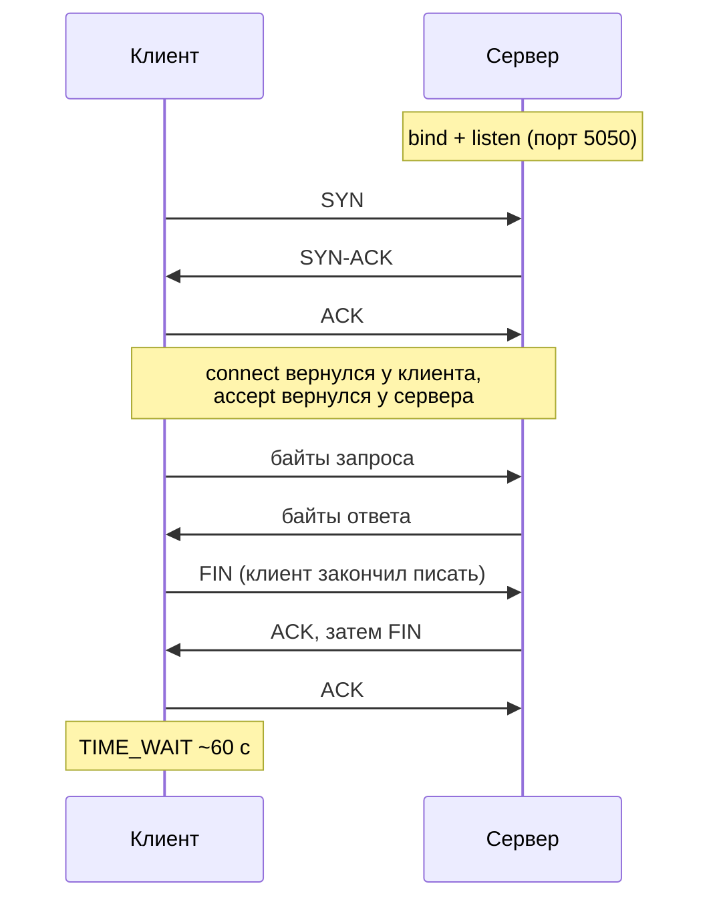
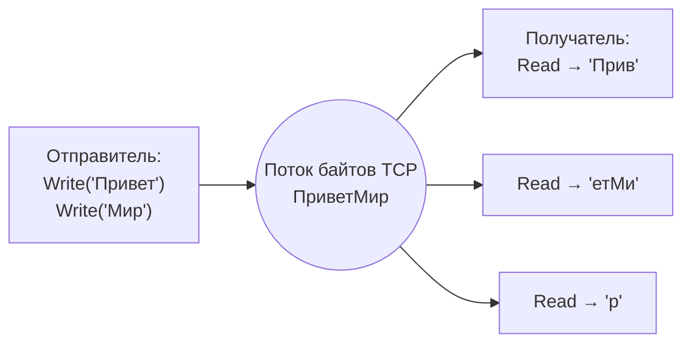

# TCP на практике: сокеты, TcpClient и TcpListener, фрейминг

↑ [[BE 1.1 Сети и протоколы для бэкенда|1.1 Сети и протоколы для бэкенда]] · ← [[BE 1.1.5 Стили API — REST, RPC, GraphQL, WebSocket, SSE|Предыдущая]] · → [[BE 1.1.7 Запрос по TCP руками — nc, telnet, openssl s_client, HTTP и Redis|Следующая]]

<!-- meta:start -->
<div class="meta-strip"><span class="badge must">Обязательно</span><span class="chip">~15 мин чтения</span><span class="chip">Уровень: junior</span></div>
<!-- meta:end -->

> [!info] Зачем это на собесе
> «Как отправить запрос по TCP?» и «Почему сообщение пришло обрезанным или склеенным?» — вопросы, на которых ломаются даже те, кто годами пишет HTTP-контроллеры. Весь HTTP, gRPC, Redis и PostgreSQL лежат на TCP. Кто понимает, что TCP — это поток байтов без границ сообщений, тот понимает и фрейминг, и таймауты, и причины зависших соединений.

## Подтемы
- [ ] Что такое TCP-соединение для программы
- [ ] Жизненный цикл клиента и сервера
- [ ] Поток байтов и проблема границ сообщений
- [ ] Фрейминг: разделитель, длина, фиксированный размер
- [ ] Клиент и сервер на C♯
- [ ] Таймауты, закрытие, ошибки

## Объяснение

### Что такое TCP-соединение для программы
TCP даёт два конца **надёжного упорядоченного потока байтов**. Ядро ОС само делает рукопожатие, нумерацию сегментов, повторную отправку потерянных и контроль перегрузки. Программа видит только сокет: пишет в него байты и читает байты.

Соединение однозначно определяют пять значений: протокол, IP и порт клиента, IP и порт сервера. Один серверный порт обслуживает тысячи клиентов, потому что у каждого клиента отличаются его IP или порт.

```text
клиент 10.0.0.5:51234  ──────────►  сервер 10.0.0.9:5050
клиент 10.0.0.5:51235  ──────────►  сервер 10.0.0.9:5050   (другое соединение)
клиент 10.0.0.7:40000  ──────────►  сервер 10.0.0.9:5050   (другой клиент)
```

### Жизненный цикл
Клиент: `connect` → обмен → `close`. Сервер: `bind` (занять порт) → `listen` (принимать подключения) → `accept` (получить соединение) → обмен → `close`. `accept` для каждого клиента создаёт **новый** сокет, а слушающий остаётся.



В C♯ эти системные вызовы спрятаны за двумя классами:

| Задача | Класс | Ключевые методы |
|---|---|---|
| Подключиться | `TcpClient` | `ConnectAsync`, `GetStream` |
| Слушать | `TcpListener` | `Start`, `AcceptTcpClientAsync` |
| Читать и писать | `NetworkStream` | `ReadAsync`, `WriteAsync` |
| Тонкая настройка | `Socket` (`client.Client`) | `Shutdown`, `SetSocketOption` |

### Главная ловушка: TCP не знает про «сообщения»
Один `Write` на одной стороне не равен одному `Read` на другой. Отправили `"Привет"` и `"Мир"` двумя записями, получатель может прочитать `"ПриветМир"` целиком, `"Прив"` и `"етМир"` или три куска. Сеть режет и склеивает поток как ей удобно (MSS, буферы, алгоритм Нэйгла).



Поэтому `ReadAsync` возвращает **сколько прочиталось** (может быть меньше запрошенного), а **0** значит «собеседник закрыл соединение». Границы сообщений придумывает протокол поверх TCP.

### Фрейминг: как отделить сообщения
| Способ | Идея | Где встречается |
|---|---|---|
| Разделитель | сообщение кончается `\r\n` или `\n` | HTTP-заголовки, SMTP, Redis (RESP), FTP |
| Префикс длины | сначала 4 байта длины, потом тело | Kafka, PostgreSQL, gRPC (5-байтовый заголовок), большинство бинарных протоколов |
| Фиксированная длина | все сообщения по N байт | простые железные протоколы, игры |
| Закрытие соединения | конец данных = `FIN` | старый HTTP/1.0, разовая передача |

Кадр с префиксом длины (big-endian, то есть «сетевой порядок» байтов):

```text
┌───────────────┬──────────────────────────────┐
│ длина, 4 байта│ тело (ровно «длина» байт)    │
│ 00 00 00 0B   │ "второй кадр" (11 байт UTF-8)│
└───────────────┴──────────────────────────────┘
```

Плюс префикса длины: тело может содержать любые байты, включая переводы строк. Минус: нужно проверять максимальную длину, иначе чужой клиент пришлёт `0x7FFFFFFF` и заставит выделить гигабайты.

## Примеры кода

### Эхо-сервер: сообщения по строкам
```csharp
using System.Net;
using System.Net.Sockets;
using System.Text;

var listener = new TcpListener(IPAddress.Loopback, 5050);
listener.Start();
Console.WriteLine("Слушаю 127.0.0.1:5050");

while (true)
{
    var client = await listener.AcceptTcpClientAsync();
    _ = Task.Run(() => HandleAsync(client));   // каждый клиент в своей задаче
}

static async Task HandleAsync(TcpClient client)
{
    using var _ = client;                      // Dispose закроет сокет
    await using var stream = client.GetStream();
    using var reader = new StreamReader(stream, Encoding.UTF8);
    await using var writer = new StreamWriter(stream, new UTF8Encoding(false)) { NewLine = "\n", AutoFlush = true };
    try
    {
        // ReadLineAsync сам собирает кусочки потока в строку до \n
        while (await reader.ReadLineAsync() is { } line)
            await writer.WriteLineAsync($"echo: {line}");
    }
    catch (IOException) { /* клиент оборвал соединение */ }
}
```

### Клиент
```csharp
using var client = new TcpClient();
await client.ConnectAsync("127.0.0.1", 5050);
client.NoDelay = true;                          // отключить алгоритм Нэйгла для мелких сообщений

var stream = client.GetStream();
await stream.WriteAsync(Encoding.UTF8.GetBytes("привет\nмир\n"));

using var reader = new StreamReader(stream, Encoding.UTF8);
Console.WriteLine(await reader.ReadLineAsync());   // echo: привет
Console.WriteLine(await reader.ReadLineAsync());   // echo: мир
```

### Кадры с префиксом длины
```csharp
using System.Buffers.Binary;

static async Task WriteFrameAsync(Stream s, byte[] payload, CancellationToken ct)
{
    var header = new byte[4];
    BinaryPrimitives.WriteInt32BigEndian(header, payload.Length);
    await s.WriteAsync(header, ct);
    await s.WriteAsync(payload, ct);
}

static async Task<byte[]?> ReadFrameAsync(Stream s, CancellationToken ct)
{
    var header = new byte[4];
    try { await s.ReadExactlyAsync(header, ct); }          // читает ровно 4 байта, сколько бы кусков ни пришло
    catch (EndOfStreamException) { return null; }          // чисто закрыли между сообщениями

    var length = BinaryPrimitives.ReadInt32BigEndian(header);
    if (length is < 0 or > 1_000_000)                      // защита от чужих длин
        throw new InvalidDataException($"Недопустимая длина кадра: {length}");

    var body = new byte[length];
    await s.ReadExactlyAsync(body, ct);                    // оборвали посреди кадра → EndOfStreamException
    return body;
}
```
`ReadExactlyAsync` (с .NET 7) как раз решает проблему «Read вернул меньше»: он читает в цикле, пока не наберёт нужное количество байт.

### Как делать неправильно
```csharp
var buf = new byte[1024];
var n = await stream.ReadAsync(buf);           // думаем: «это одно сообщение»
var msg = Encoding.UTF8.GetString(buf, 0, n);  // на деле: кусок, или два сообщения подряд, или половина символа UTF-8
```
Работает на localhost и в тестах, ломается под нагрузкой и в реальной сети.

### Таймаут на чтение
```csharp
using var cts = new CancellationTokenSource(TimeSpan.FromSeconds(5));
try { var n = await stream.ReadAsync(buf, cts.Token); }
catch (OperationCanceledException) { /* собеседник молчит больше 5 секунд */ }
```

### Корректное закрытие
```csharp
client.Client.Shutdown(SocketShutdown.Send);   // «я всё отправил» (отправит FIN), но читать ещё можно
// дочитать ответ до конца (ReadAsync вернёт 0), затем Dispose
```

## Нюансы и подводные камни
- **Частичное чтение.** Никогда не считайте, что `ReadAsync` вернул целое сообщение. Используйте `ReadExactlyAsync`, `StreamReader.ReadLineAsync` или буфер, в который докладываются байты, пока кадр не наберётся.
- **`ReadAsync` вернул 0 — это конец соединения**, а не «пока нет данных». Если цикл не выходит по нулю, получите бесконечный цикл и 100 % CPU.
- **Порядок байтов.** В сети принят big-endian. `BitConverter` использует порядок процессора (обычно little-endian), поэтому для протоколов берите `BinaryPrimitives`.
- **Кодировка.** Длину считайте в байтах, не в символах: «привет» это 6 символов, но 12 байт в UTF-8.
- **Таймауты обязательны.** Без них зависший собеседник держит соединение вечно. Ставьте таймаут на подключение, на чтение, а на сервере ещё и на простой между сообщениями.
- **Алгоритм Нэйгла и `NoDelay`.** Ядро копит мелкие записи и отправляет пачкой. Для интерактивных протоколов с маленькими сообщениями включают `NoDelay = true`.
- **Keep-alive.** Молча пропавшего собеседника (кабель выдернули) без `SocketOptionName.KeepAlive` не заметить: сокет считает соединение живым.
- **Лимиты.** Чужие длины кадров, число соединений и размер очередей всегда ограничивайте.
- **TIME_WAIT и порты.** Активно закрывающая сторона несколько десятков секунд держит порт в TIME_WAIT. Тысячи коротких соединений подряд могут исчерпать эфемерные порты клиента. Решение: переиспользовать соединения (пул, keep-alive).
- **Привязка адреса.** `IPAddress.Loopback` принимает только локальных, `IPAddress.Any` (0.0.0.0) всех. В контейнере слушать надо `Any`, иначе извне не достучаться.
- **Ошибки.** `SocketException` (connection refused, reset, timeout) и `IOException` при обрыве. `ConnectionReset` (RST) означает, что собеседник сбросил соединение, а не закрыл по-хорошему.
- **В продакшене редко нужны голые сокеты.** Для HTTP берите `HttpClient`, для RPC gRPC. Но сокеты нужны для своего протокола, работы с устройствами и отладки.

## Вопросы с ответами
> [!question]- Что такое TCP-сокет?
> Конечная точка соединения, которую ОС отдаёт программе: пара «IP и порт» плюс состояние соединения. Соединение задают пять значений (протокол, IP и порт клиента, IP и порт сервера). Программа пишет в сокет и читает из него поток байтов.

> [!question]- Почему «отправил одно сообщение, а получил два куска» или «два сообщения слиплись»?
> TCP передаёт **поток байтов**, а не сообщения. Границы пишутся протоколом поверх TCP: разделитель (`\r\n`), префикс длины или фиксированный размер. Одному `Write` не обязан соответствовать один `Read`.

> [!question]- Как реализовать обмен сообщениями поверх TCP?
> Выбрать фрейминг, например 4 байта длины в big-endian и тело. Читать заголовок через `ReadExactlyAsync`, проверить длину на максимум, прочитать ровно столько байт. Добавить таймауты и обработку закрытия (`ReadAsync` вернул 0, `EndOfStreamException`).

> [!question]- Что значит, что `ReadAsync` вернул 0?
> Собеседник закрыл свою сторону соединения (прислал FIN), данных больше не будет. Нужно выйти из цикла чтения и закрыть сокет у себя.

> [!question]- Что делают `bind`, `listen` и `accept`?
> `bind` занимает порт, `listen` переводит сокет в режим приёма подключений (ядро само завершает рукопожатия и складывает готовые соединения в очередь), `accept` забирает соединение из очереди и создаёт для него отдельный сокет.

> [!question]- Чем TCP отличается от UDP на уровне кода?
> TCP требует соединения (`connect`/`accept`), гарантирует доставку и порядок, работает потоком. UDP шлёт отдельные датаграммы (`SendTo`/`ReceiveFrom`), границы сообщений сохраняются, но доставку и порядок не гарантирует.

> [!question]- Зачем нужен `NoDelay`?
> Отключает алгоритм Нэйгла, который копит мелкие записи для отправки одной пачкой. С `NoDelay` мелкие сообщения уходят сразу: меньше задержка, больше мелких пакетов. Нужен чатам, играм, RPC с мелкими запросами.

> [!question]- Почему нельзя использовать `BitConverter` для длины в сетевом протоколе?
> Он берёт порядок байтов процессора (чаще little-endian), а в сети принят big-endian. На другой архитектуре числа прочитаются неверно. `BinaryPrimitives.WriteInt32BigEndian` задаёт порядок явно.

## Связанные темы
- Теория: [[BE 1.1.1 Модель OSI и TCP-IP, TCP и UDP|Модель OSI и TCP∕IP, TCP и UDP]]
- Практика руками: [[BE 1.1.7 Запрос по TCP руками — nc, telnet, openssl s_client, HTTP и Redis|Запрос по TCP руками]]
- HTTP поверх TCP: [[BE 1.1.2 HTTP для бэкенда — методы, статусы, заголовки, keep-alive, HTTP-2 и HTTP-3|HTTP для бэкенда]]
- Асинхронность и `Stream`: [[BE Этап 2 · C♯ глубоко и .NET runtime|Этап 2 · C♯ глубоко и .NET runtime]]
- Диагностика сети: [[DO 1.17 Диагностика сети — ping, traceroute, dig, nc, tcpdump|Диагностика сети — ping, traceroute, dig, nc, tcpdump]]
