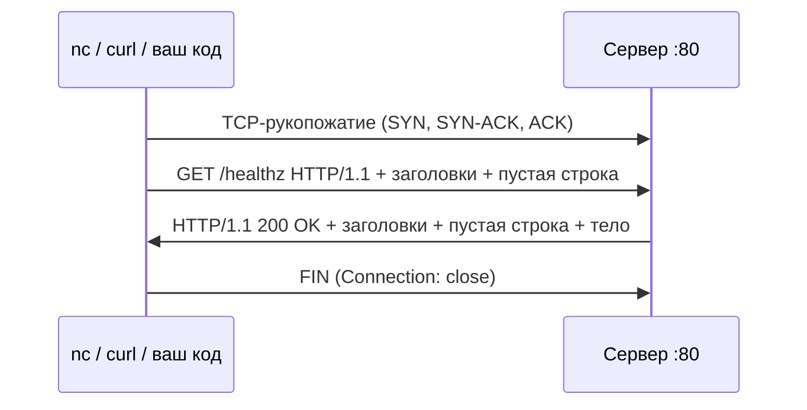
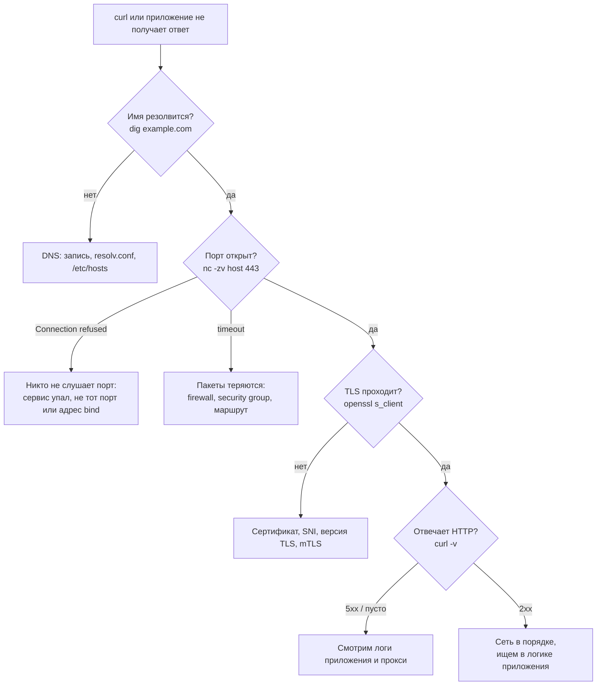

# Запрос по TCP руками: nc, telnet, openssl s_client, HTTP и Redis

↑ [[BE 1.1 Сети и протоколы для бэкенда|1.1 Сети и протоколы для бэкенда]] · ← [[BE 1.1.6 TCP на практике — сокеты, TcpClient и TcpListener, фрейминг|Предыдущая]]

<!-- meta:start -->
<div class="meta-strip"><span class="badge must">Обязательно</span><span class="chip">~15 мин чтения</span><span class="chip">Уровень: junior</span></div>
<!-- meta:end -->

> [!info] Зачем это на собесе
> Кандидата просят показать, что он понимает, что лежит под HTTP: «отправь HTTP-запрос без curl», «как проверить, что порт открыт», «как руками поговорить с Redis». Умение набрать запрос в терминале и прочитать ответ быстро отделяет тех, кто пользуется библиотеками, от тех, кто знает протокол. Это же главный инструмент диагностики на сервере, где нет ничего, кроме `nc` и `bash`.

## Подтемы
- [ ] Из чего состоит запрос HTTP/1.1 на уровне байтов
- [ ] `nc`, `/dev/tcp`, `telnet`, `curl -v`
- [ ] HTTPS и `openssl s_client`
- [ ] Текстовый протокол на примере Redis (RESP)
- [ ] Проверка порта и пошаговая диагностика
- [ ] Частые ловушки

## Объяснение

### HTTP/1.1 — это просто текст поверх TCP
Запрос — несколько строк, которые заканчиваются двумя символами `\r\n` (CRLF), плюс **пустая строка** в конце заголовков. Всё, что между клиентом и сервером: байты в TCP-потоке.

```text
GET /healthz HTTP/1.1␍␊         ← стартовая строка: метод, путь, версия
Host: example.com␍␊              ← заголовок Host обязателен в HTTP/1.1
Connection: close␍␊              ← закрыть соединение после ответа
␍␊                               ← пустая строка: заголовки закончились
```

Ответ устроен так же: строка статуса, заголовки, пустая строка, тело.

```text
HTTP/1.1 200 OK␍␊
Content-Type: application/json␍␊
Content-Length: 15␍␊
␍␊
{"status":"ok"}
```



Где кончается тело ответа, понимаем по заголовку:

| Признак | Как читать тело |
|---|---|
| `Content-Length: N` | ровно N байт после пустой строки |
| `Transfer-Encoding: chunked` | куски: размер в hex, `\r\n`, данные, `\r\n`; конец кусок размером `0` |
| ни того ни другого + `Connection: close` | до закрытия соединения сервером |

Пример `chunked` (реальный ответ ASP.NET Core): `f` это 15 байт тела в hex.
```text
f␍␊
{"status":"ok"}␍␊
0␍␊
␍␊
```

### Способ 1: nc (netcat)
```bash
printf 'GET /healthz HTTP/1.1\r\nHost: localhost\r\nConnection: close\r\n\r\n' | nc localhost 8080
```
`printf` нужен, чтобы получить настоящие `\r\n` (обычный `echo` без `-e` отправит буквально `\r\n`). Если видите, что `nc` повис после ответа, добавьте таймаут: `nc -w 3 host port`.

### Способ 2: только bash, без установленных утилит
```bash
exec 3<>/dev/tcp/127.0.0.1/8080          # открыть TCP-соединение как файловый дескриптор 3
printf 'GET /healthz HTTP/1.1\r\nHost: localhost\r\nConnection: close\r\n\r\n' >&3
cat <&3                                  # читать ответ до закрытия
exec 3>&-                                # закрыть
```
Пригождается в минимальных контейнерах, где нет ни `curl`, ни `nc`. `/dev/tcp` это возможность самого bash, в `sh` и `dash` её нет.

### Способ 3: curl -v показывает то же самое
```bash
curl -v --http1.1 http://localhost:8080/healthz
```
Строки с `>` это то, что отправил curl, строки с `<` это ответ. Очень хорошо для изучения реальных заголовков.

### Способ 4: telnet
```bash
telnet localhost 8080
GET /healthz HTTP/1.1        # после подключения вводим строки руками
Host: localhost
                             # пустая строка (Enter) завершает запрос
```
`telnet` отправляет перевод строки как `\r\n`, поэтому набирать вручную удобно. Минус: часто не установлен, а в новых системах убран.

### HTTPS руками: openssl s_client
Поверх TCP сначала идёт TLS-рукопожатие, и набрать его нельзя. Поэтому для HTTPS используют `openssl s_client`: он делает TLS и отдаёт вам «трубу» в терминал.

```bash
# посмотреть сертификат, версию TLS и шифр
echo | openssl s_client -connect example.com:443 -servername example.com 2>/dev/null \
  | grep -E 'subject|issuer|Protocol|Cipher|Verify return'

# отправить запрос внутри TLS
printf 'GET / HTTP/1.1\r\nHost: example.com\r\nConnection: close\r\n\r\n' \
  | openssl s_client -quiet -connect example.com:443 -servername example.com
```
`-servername` передаёт имя хоста в SNI, без него сервер за общим IP отдаст не тот сертификат. Подробнее про сертификаты: [[BE 1.1.3 TLS, сертификаты, mTLS|TLS, сертификаты, mTLS]].

### Не только HTTP: Redis (RESP)
Многие протоколы такие же текстовые. Redis использует RESP: `*N` количество элементов, `$L` длина строки, данные, всё через `\r\n`.

```text
*3␍␊  $3␍␊ SET␍␊  $3␍␊ key␍␊  $5␍␊ value␍␊
```

```bash
# команда PING в форме массива
printf '*1\r\n$4\r\nPING\r\n' | nc -w1 127.0.0.1 6379
# +PONG

# «inline»-команды (для ручной работы Redis принимает и просто строки)
printf 'SET greeting hello\r\nGET greeting\r\n' | nc -w1 127.0.0.1 6379
# +OK
# $5
# hello
```
Первый символ ответа показывает тип: `+` простая строка, `-` ошибка, `:` число, `$` строка с длиной, `*` массив. Это тот же приём «разделитель плюс длина», что и в [[BE 1.1.6 TCP на практике — сокеты, TcpClient и TcpListener, фрейминг|теме про фрейминг]].

### Проверить, что порт открыт
```bash
nc -zv example.com 443        # -z только подключиться, -v подробно
# Connection to example.com 443 port [tcp/https] succeeded!
nc -zv 127.0.0.1 5999
# nc: connect to 127.0.0.1 port 5999 (tcp) failed: Connection refused
```
```powershell
Test-NetConnection example.com -Port 443    # Windows PowerShell
```
На сервере: `ss -tlnp` покажет, кто слушает порты (`-t` TCP, `-l` слушающие, `-n` числа, `-p` процесс).

### Где искать причину, если не работает


### Посмотреть байты в сети
```bash
sudo tcpdump -i any -A -s0 port 8080        # показать пакеты и их текст
```
`-A` печатает содержимое как ASCII, для HTTP по голому TCP видны запрос и ответ целиком. Для шифрованного трафика виден только TLS. Графический вариант: Wireshark, фильтр `tcp.port == 8080`.

### Тот же запрос на C♯ через TcpClient
```csharp
using System.Net.Sockets;
using System.Text;

using var client = new TcpClient();
await client.ConnectAsync("127.0.0.1", 8080);
var stream = client.GetStream();

var request = "GET /healthz HTTP/1.1\r\nHost: localhost:8080\r\nConnection: close\r\n\r\n";
await stream.WriteAsync(Encoding.ASCII.GetBytes(request));

using var reader = new StreamReader(stream, Encoding.ASCII);
Console.WriteLine(await reader.ReadLineAsync());              // HTTP/1.1 200 OK

var headers = new Dictionary<string, string>(StringComparer.OrdinalIgnoreCase);
while (await reader.ReadLineAsync() is { Length: > 0 } line)  // до пустой строки
{
    var i = line.IndexOf(':');
    headers[line[..i]] = line[(i + 1)..].Trim();
}
// тело: если есть Content-Length, читаем ровно столько символов/байт
if (headers.TryGetValue("Content-Length", out var len))
{
    var body = new char[int.Parse(len)];
    await reader.ReadBlockAsync(body, 0, body.Length);
    Console.WriteLine(new string(body));
}
```
Пример упрощён: нет `chunked`, таймаутов и проверок. В реальном коде для HTTP всегда используйте `HttpClient`, а голый `TcpClient` оставьте для собственных протоколов.

## Нюансы и подводные камни
- **`\r\n`, а не `\n`.** Строгие серверы отвергают запрос с одним `\n` (ответ `400 Bad Request`). Используйте `printf`, а не `echo`.
- **Пустая строка в конце запроса обязательна.** Без неё сервер ждёт продолжения заголовков, и вы видите «зависший» запрос.
- **`Host` обязателен в HTTP/1.1.** Без него сервер может ответить 400. Для серверов за одним IP это ещё и выбор виртуального хоста.
- **`nc -q`, `nc -N` и преждевременное закрытие.** Опции OpenBSD-варианта `nc`, которые закрывают отправку сразу после конца ввода (`-N`, `-q1`), посылают FIN. Проверено: ASP.NET Core (Kestrel) в таком случае считает, что клиент ушёл, и ответа не пишет. Решение: держать вход открытым, `(printf '...'; sleep 1) | nc host port` или `nc -w 3`. Это живой пример **half-close**: соединение закрыто только в одну сторону, а сервер решил, что закрыто совсем.
- **Варианты `nc` отличаются** (OpenBSD, traditional, `ncat` из Nmap): у них разные флаги. Смотрите `nc -h`, на macOS это BSD-вариант.
- **HTTP/2 и HTTP/3 руками не набрать.** Они бинарные. Для диагностики используйте `curl --http2 -v`, а на HTTP/1.1 переходите для понимания.
- **`localhost` может вести на IPv6.** `::1` и `127.0.0.1` это разные адреса: сервис, слушающий только IPv4, откажет на `::1`. Если `localhost` не подключается, попробуйте `127.0.0.1`.
- **Keep-alive.** Без `Connection: close` сервер оставляет соединение открытым и `nc` ждёт следующей порции. Это ожидаемо, а не зависание.
- **Доверять открытому порту не значит, что сервис здоров.** `nc -z` проверяет только рукопожатие: процесс мог зависнуть после `accept`. Для проверки работоспособности нужен настоящий запрос (health check).

## Вопросы с ответами
> [!question]- Как отправить HTTP-запрос без curl?
> Открыть TCP-соединение на порт сервера и записать текст запроса: стартовая строка, заголовки (минимум `Host`), пустая строка, все с окончаниями `\r\n`. Например `printf 'GET / HTTP/1.1\r\nHost: example.com\r\nConnection: close\r\n\r\n' | nc example.com 80` или через `/dev/tcp` в bash.

> [!question]- Как сделать то же самое для HTTPS?
> Нужен TLS поверх TCP, поэтому `nc` не подходит. Используют `openssl s_client -connect host:443 -servername host`: он проводит рукопожатие и позволяет вводить обычный HTTP внутри шифрованного канала.

> [!question]- Как понять, где кончается тело ответа?
> По заголовкам. `Content-Length: N`: читать N байт. `Transfer-Encoding: chunked`: читать куски «размер в hex, данные», пока не придёт кусок размером 0. Если нет ни того ни другого, при `Connection: close` тело идёт до закрытия соединения.

> [!question]- Чем отличаются «Connection refused» и таймаут?
> `Connection refused` значит, что до хоста пакеты дошли, но порт никто не слушает (ОС ответила RST). Таймаут значит, что пакеты пропадают: файрвол, security group или неверный маршрут молча отбрасывают SYN. Диагностика у них разная.

> [!question]- Как проверить, открыт ли порт?
> `nc -zv host port`, `Test-NetConnection host -Port N` в PowerShell или `exec 3<>/dev/tcp/host/port` в bash. Проверка показывает только то, что ядро принимает подключения. Живость сервиса проверяют настоящим запросом.

> [!question]- Почему `nc` ничего не вернул, а curl вернул ответ?
> Возможные причины: в запросе `\n` вместо `\r\n`, нет пустой строки или заголовка `Host`, либо `nc` закрыл отправку сразу после ввода (`-q`, `-N`) и сервер посчитал это обрывом. Решение: `printf` с `\r\n` и держать вход открытым (`sleep`).

> [!question]- Что такое RESP?
> Протокол Redis поверх TCP: текст с разделителями `\r\n`, первый символ задаёт тип (`+`, `-`, `:`, `$`, `*`), строки передаются с префиксом длины `$5`. Поэтому с Redis можно работать через `nc`, хотя на практике берут клиентскую библиотеку.

## Связанные темы
- Как писать клиента и сервер: [[BE 1.1.6 TCP на практике — сокеты, TcpClient и TcpListener, фрейминг|TCP на практике]]
- Формат HTTP: [[BE 1.1.2 HTTP для бэкенда — методы, статусы, заголовки, keep-alive, HTTP-2 и HTTP-3|HTTP для бэкенда]]
- TLS: [[BE 1.1.3 TLS, сертификаты, mTLS|TLS, сертификаты, mTLS]]
- Диагностика на серверах: [[DO 1.17 Диагностика сети — ping, traceroute, dig, nc, tcpdump|Диагностика сети — ping, traceroute, dig, nc, tcpdump]]
- Redis: [[DB 4.1 Redis и MongoDB|Redis и MongoDB]]
