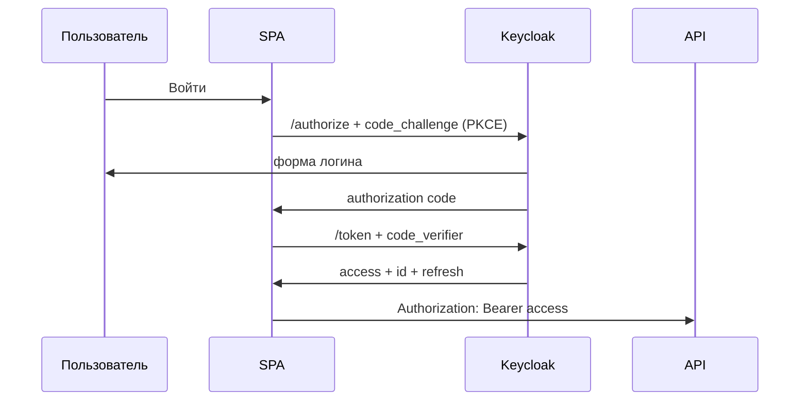

# OAuth 2.0, OpenID Connect и Keycloak на бэкенде

↑ [[BE 3.4 Аутентификация и авторизация|3.4 Аутентификация и авторизация]] · ← [[BE 3.4.2 JWT Bearer — валидация токена, claims, срок жизни|Предыдущая]] · → [[BE 3.4.4 Политики, роли, claims-based и resource-based авторизация|Следующая]]

<!-- meta:start -->
<div class="meta-strip"><span class="badge must">Обязательно</span><span class="chip">~3 мин чтения</span><span class="chip">Уровень: middle</span></div>
<!-- meta:end -->


> [!info] Зачем это на собесе
> «Чем OAuth отличается от OIDC и какой flow вы используете» — стандартный вопрос.

> [!note] Переписано
> Страница в Notion была заготовкой, содержимое написано заново.

## Объяснение

- **OAuth 2.0** — протокол **авторизации**: приложение получает токен доступа к ресурсам от имени пользователя.
- **OpenID Connect (OIDC)** — слой аутентификации поверх OAuth: добавляет `id_token` и `userinfo`.

| Роль | Кто |
|---|---|
| Resource Owner | пользователь |
| Client | приложение |
| Authorization Server | Keycloak, Auth0, Entra ID |
| Resource Server | ваш API |

| Flow | Когда |
|---|---|
| Authorization Code + PKCE | SPA, мобильные и веб-приложения (рекомендуется) |
| Client Credentials | сервис-сервис без пользователя |
| Device Code | ТВ, CLI |
| Refresh Token | обновление access |
| Implicit, Password | устарели, не использовать |



### API как Resource Server

```csharp
builder.Services.AddAuthentication().AddJwtBearer(o =>
{
    o.Authority = builder.Configuration["Keycloak:Authority"];
    o.Audience = "orders-api";
});
```

Роли из Keycloak лежат в `realm_access.roles`/`resource_access` — их нужно замапить в claims (`OnTokenValidated` или `IClaimsTransformation`).

## Нюансы и подводные камни

- PKCE защищает публичных клиентов от перехвата code.
- Client secret нельзя хранить в SPA.
- Проверяйте `aud`: токен для другого API не должен приниматься.
- Scope — что клиенту разрешено; claims — данные о пользователе.
- Настраивайте redirect URI строго, без wildcard.

## Практика

1. Поднимите Keycloak в Docker и настройте realm, client, роли.
2. Защитите API и получите токен через Authorization Code + PKCE.
3. Реализуйте service-to-service вызов через Client Credentials.

## Вопросы с ответами

> [!question]- Чем OIDC отличается от OAuth 2.0?
> OAuth даёт доступ к ресурсам; OIDC добавляет стандартную аутентификацию пользователя (`id_token`).

> [!question]- Зачем PKCE?
> Защищает authorization code от перехвата у публичных клиентов, заменяя client secret проверкой `code_verifier`.

> [!question]- Какой flow для сервис-сервис?
> Client Credentials.

## Связанные темы

- [[N:3ea33104867981f7801ef26a713b2fd5]]
- [[N:3ea33104867981459090e4d09574ee38]]
