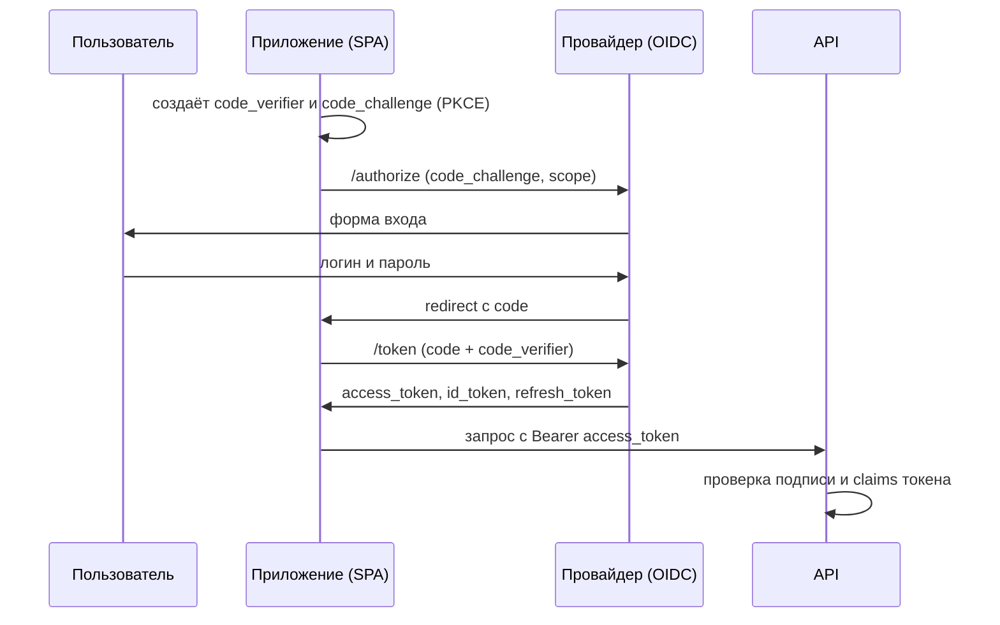
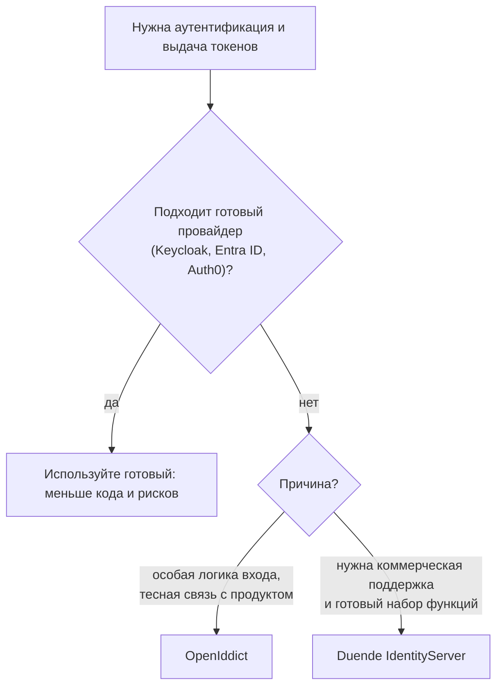

# Свой OIDC-провайдер: OpenIddict, Duende IdentityServer и когда Keycloak

↑ [[BE 3.4 Аутентификация и авторизация|3.4 Аутентификация и авторизация]] · ← [[BE 3.4.6 Хранение паролей, ASP.NET Core Identity, API-ключи|Предыдущая]]

<!-- meta:start -->
<div class="meta-strip"><span class="badge must">Обязательно</span><span class="chip">~11 мин чтения</span><span class="chip">Уровень: senior</span></div>
<!-- meta:end -->

> [!info] Зачем это на собесе
> «Нужно выдавать токены нашим приложениям, писать ли свой сервер авторизации?» Правильный первый ответ: «Использовать готовый провайдер (Keycloak, Entra ID, Auth0)». Но знать, что такое OpenIddict и IdentityServer, и когда свой провайдер оправдан, ждут от senior-разработчика .NET.

## Подтемы
- [ ] Роли в OAuth 2.0 и OpenID Connect
- [ ] Потоки: code + PKCE, client credentials, refresh
- [ ] OpenIddict
- [ ] Duende IdentityServer
- [ ] Keycloak и облачные провайдеры
- [ ] Когда писать свой

## Объяснение

### Роли
- **Authorization server** (провайдер): аутентифицирует пользователя и выдаёт токены.
- **Client**: приложение, которому нужен доступ (SPA, мобильное приложение, сервис).
- **Resource server**: API, которое проверяет токены.
- **OpenID Connect (OIDC)** добавляет к OAuth 2.0 идентификацию пользователя: `id_token`, endpoint `userinfo`, стандартные claims. Основы: [[BE 3.4.3 OAuth 2.0, OpenID Connect и Keycloak на бэкенде|OAuth 2.0, OIDC и Keycloak]].

### Какие потоки использовать
| Поток | Для чего | Заметки |
|---|---|---|
| **Authorization Code + PKCE** | пользователь входит через SPA, мобильное или серверное приложение | рекомендуемый для интерактивного входа |
| **Client Credentials** | сервис обращается к API от своего имени | нет пользователя |
| **Refresh Token** | обновление access-токена без повторного входа | храните безопасно, ротируйте |
| Implicit, Resource Owner Password | устаревшие | не используйте |


PKCE защищает код авторизации от перехвата: клиент доказывает, что именно он начал поток (через `code_verifier`), поэтому секрет клиента в SPA не нужен.

### OpenIddict
Фреймворк для создания OIDC-сервера на ASP.NET Core (лицензия Apache 2.0). Реализует протоколы OAuth 2.0 и OIDC, токены, хранилища приложений и токенов (например, EF Core). **Интерфейса входа у него нет**: страницы логина, согласия, регистрации вы пишете сами (часто на ASP.NET Core Identity). Подходит, когда провайдер должен быть частью вашего приложения и тесно интегрирован с вашей моделью пользователей.

### Duende IdentityServer
Коммерческий продукт (наследник IdentityServer4), тоже фреймворк для OIDC на ASP.NET Core: много готовых возможностей, поддержка. Лицензия платная для организаций выше определённого порога, для разработки и небольших проектов условия отличаются, проверяйте актуальную лицензию.

### Keycloak и облачные провайдеры
| Вариант | Особенности |
|---|---|
| **Keycloak** | готовый сервер с интерфейсом, пользователи, роли, SSO, федерация, админ-консоль ([[DO 8.5 Keycloak в инфраструктуре — развёртывание, realm-импорт, темы, БД|Keycloak в инфраструктуре]]) |
| Microsoft Entra ID, Auth0, Okta | управляемые сервисы, не нужно поддерживать |
| Authentik, Ory (Hydra, Kratos) | альтернативы с открытым кодом |
| OpenIddict, Duende | библиотеки для встраивания в .NET-приложение |

### Когда писать свой сервер

Аутентификация это зона высоких рисков: ошибки в своём сервере приводят к уязвимостям. Свой провайдер оправдан только при реальной необходимости и с командой, понимающей протоколы.

## Примеры

### Сервер: client credentials на OpenIddict
```csharp
using System.Security.Claims;
using Microsoft.AspNetCore;
using Microsoft.EntityFrameworkCore;
using Microsoft.IdentityModel.Tokens;
using OpenIddict.Abstractions;
using OpenIddict.Server.AspNetCore;
using static OpenIddict.Abstractions.OpenIddictConstants;

var builder = WebApplication.CreateBuilder(args);

builder.Services.AddDbContext<AuthDb>(o =>
{
    o.UseNpgsql(builder.Configuration.GetConnectionString("Auth"));
    o.UseOpenIddict();                                 // таблицы приложений, токенов, авторизаций
});

builder.Services.AddOpenIddict()
    .AddCore(o => o.UseEntityFrameworkCore().UseDbContext<AuthDb>())
    .AddServer(o =>
    {
        o.SetTokenEndpointUris("/connect/token");
        o.AllowClientCredentialsFlow();                // машина-машина
        o.AddDevelopmentEncryptionCertificate().AddDevelopmentSigningCertificate();   // только для разработки
        o.UseAspNetCore().EnableTokenEndpointPassthrough();
    })
    .AddValidation(o =>
    {
        o.UseLocalServer();
        o.UseAspNetCore();
    });

builder.Services.AddAuthentication(OpenIddict.Validation.AspNetCore.OpenIddictValidationAspNetCoreDefaults.AuthenticationScheme);
builder.Services.AddAuthorization();

var app = builder.Build();
app.UseAuthentication();
app.UseAuthorization();

app.MapPost("/connect/token", (HttpContext ctx) =>
{
    var request = ctx.GetOpenIddictServerRequest() ?? throw new InvalidOperationException();
    if (!request.IsClientCredentialsGrantType()) return Results.BadRequest();

    var identity = new ClaimsIdentity(TokenValidationParameters.DefaultAuthenticationType, Claims.Name, Claims.Role);
    identity.SetClaim(Claims.Subject, request.ClientId);
    identity.SetScopes(request.GetScopes());
    return Results.SignIn(new ClaimsPrincipal(identity), properties: null, OpenIddictServerAspNetCoreDefaults.AuthenticationScheme);
});

app.MapGet("/api/data", () => "secret").RequireAuthorization();
app.Run();

public class AuthDb(DbContextOptions<AuthDb> o) : DbContext(o);
```
Пакеты `OpenIddict.AspNetCore` и `OpenIddict.EntityFrameworkCore`. Клиента (приложение) нужно зарегистрировать в хранилище (`IOpenIddictApplicationManager`) с идентификатором, секретом и разрешёнными потоками и scope. Сертификаты для подписи и шифрования в продакшене должны быть настоящими, а не «development».

### Получение токена клиентом
```bash
curl -X POST https://auth.example.com/connect/token \
  -d grant_type=client_credentials \
  -d client_id=billing -d client_secret=*** -d scope=api
```

## Нюансы и подводные камни
- **Не пишите криптографию и протокол сами.** Используйте проверенную библиотеку и следуйте рекомендациям (PKCE, короткие access-токены).
- **Ключи подписи.** Хранить, ротировать и публиковать через JWKS; «development»-сертификаты в продакшене недопустимы.
- **Срок жизни токенов.** Короткий access-токен (минуты), refresh-токен с ротацией и отзывом.
- **Redirect URI.** Регистрируйте точные адреса, без подстановочных знаков, иначе возможна кража кода.
- **Безопасное хранение токенов в SPA.** Избегайте `localStorage` для долгоживущих токенов, рассмотрите BFF-схему с cookie.
- **Проверка в API.** Проверяйте подпись, издателя (`iss`), аудиторию (`aud`), срок и scope, см. [[BE 3.4.2 JWT Bearer — валидация токена, claims, срок жизни|JWT Bearer]].
- **Лицензия Duende** и условия поддержки меняются, проверяйте актуальные.

## Вопросы с ответами
> [!question]- Что такое OpenID Connect и чем он отличается от OAuth 2.0?
> OAuth 2.0 описывает делегирование доступа к ресурсам через access-токены. OIDC поверх него добавляет идентификацию пользователя: `id_token`, endpoint `userinfo`, стандартные claims и сценарии входа.

> [!question]- Зачем нужен PKCE?
> Защищает поток Authorization Code от перехвата кода: клиент создаёт случайный `code_verifier` и передаёт его хэш (`code_challenge`) при запросе кода, а при обмене кода на токен передаёт сам `code_verifier`. Перехватчик кода без верификатора токен не получит.

> [!question]- Чем OpenIddict отличается от Keycloak?
> OpenIddict это библиотека для встраивания OIDC-сервера в ASP.NET Core без интерфейса входа, вы пишете страницы сами. Keycloak это готовый сервер с админ-консолью, пользователями, ролями и федерацией.

> [!question]- Когда стоит писать свой сервер авторизации?
> Когда готовые провайдеры не подходят (особая логика входа, тесная интеграция с продуктом) и есть экспертиза в протоколах. В остальных случаях безопаснее и дешевле использовать Keycloak, Entra ID или Auth0.

> [!question]- Какой поток использовать для сервис-сервис?
> Client Credentials: сервис получает токен от своего имени по идентификатору и секрету клиента (или сертификату), без участия пользователя.

> [!question]- Почему implicit flow не рекомендуется?
> Токен возвращается в адресной строке браузера, его проще перехватить. Вместо него используют Authorization Code с PKCE.

## Связанные темы
- OAuth, OIDC, Keycloak: [[BE 3.4.3 OAuth 2.0, OpenID Connect и Keycloak на бэкенде|OAuth 2.0, OIDC и Keycloak]]
- JWT: [[BE 3.4.2 JWT Bearer — валидация токена, claims, срок жизни|JWT Bearer]]
- Пароли и Identity: [[BE 3.4.6 Хранение паролей, ASP.NET Core Identity, API-ключи|Хранение паролей, ASP.NET Core Identity]]
- Keycloak в инфраструктуре: [[DO 8.5 Keycloak в инфраструктуре — развёртывание, realm-импорт, темы, БД|Keycloak в инфраструктуре]]
- SSO на фронтенде: [[FE 5.5 Аутентификация и доступ — Keycloak, SSO, ACL|Аутентификация и доступ]]
