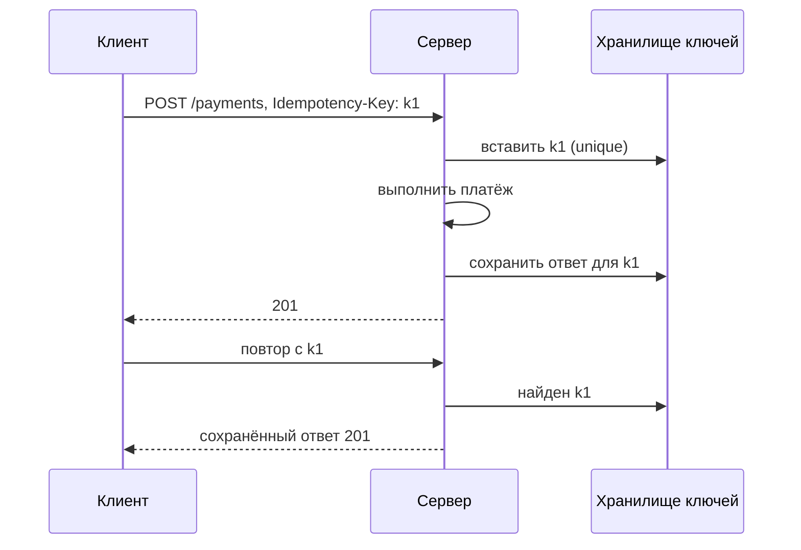

# Идемпотентность и Idempotency-Key

↑ [[BE 5.1 Проектирование REST API|5.1 Проектирование REST API]] · ← [[BE 5.1.2 Пагинация, фильтрация, сортировка|Предыдущая]] · → [[BE 5.1.4 Версионирование и обратная совместимость|Следующая]]

<!-- meta:start -->
<div class="meta-strip"><span class="badge must">Обязательно</span><span class="chip">~3 мин чтения</span><span class="chip">Уровень: middle</span></div>
<!-- meta:end -->


> [!info] Зачем это на собесе
> Ключевая тема для платежей и повторов: «клиент не получил ответ и повторил запрос — что произойдёт?»

> [!note] Переписано
> Страница в Notion была заготовкой, содержимое написано заново.

## Объяснение

Сеть ненадёжна: клиент может не получить ответ и повторить `POST`. Без защиты создаётся два заказа/платежа.

**Idempotency-Key** — клиент генерирует уникальный ключ (GUID) для операции и передаёт в заголовке; сервер гарантирует, что операция выполнится один раз, а повторные вызовы получат тот же результат.



```csharp
public async Task<IResult> Handle(string key, CreatePayment cmd, CancellationToken ct)
{
    var existing = await store.GetAsync(key, ct);
    if (existing is not null) return existing.ToResult();       // повтор: тот же ответ

    if (!await store.TryLockAsync(key, ct)) return Results.Conflict("in progress");   // параллельный повтор

    var result = await payments.ExecuteAsync(cmd, ct);
    await store.SaveAsync(key, result, ct);
    return result.ToResult();
}
```

Гарантия достигается unique-индексом на ключ и атомарностью «выполнить + сохранить результат» (одна транзакция или outbox).

## Нюансы и подводные камни

- Ключ привязывайте к пользователю и хэшу тела: тот же ключ с другим телом → 422.
- Срок хранения ключей ограничен (обычно 24 часа).
- Параллельные повторы: блокировка по ключу или unique-нарушение → 409.
- Для естественно идемпотентных операций (PUT, DELETE) ключ не нужен.
- Идемпотентность потребителя очередей — отдельная тема (Inbox), см. [[N:3ea331048679819a8d47e8140fca5d08]].

## Практика

1. Реализуйте middleware/filter идемпотентности с таблицей ключей в PostgreSQL.
2. Отправьте два одновременных запроса с одним ключом и проверьте результат.
3. Опишите поведение при падении сервера между платежом и сохранением ответа.

## Вопросы с ответами

> [!question]- Зачем Idempotency-Key?
> Чтобы повтор запроса не выполнял операцию дважды.

> [!question]- Какие методы идемпотентны по стандарту?
> GET, PUT, DELETE, HEAD, OPTIONS; POST и PATCH — нет.

> [!question]- Что делать при повторе с тем же ключом, но другим телом?
> Отклонить (422/409): ключ уже использован для другой операции.

## Связанные темы

- [[N:3ea33104867981a0aa5dd213d5619bb3]]
- [[N:3ea33104867981a78f21d0e71de5ad83]]
