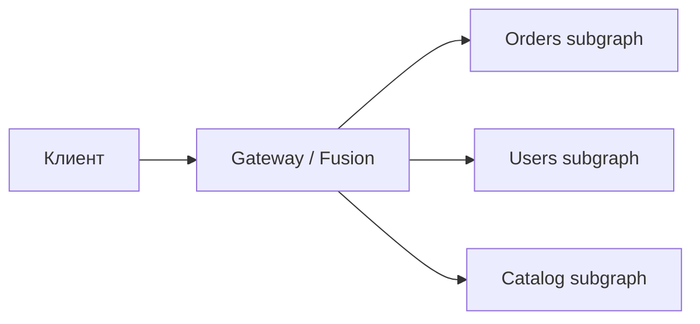

# Federation и gateway: Hot Chocolate Fusion

↑ [[BE 5.3 GraphQL на бэкенде и Federation|5.3 GraphQL на бэкенде и Federation]] · ← [[BE 5.3.3 Проблема N+1 и DataLoader|Предыдущая]] · → [[BE 5.3.5 Безопасность GraphQL — глубина, сложность, персистентные запросы|Следующая]]

<!-- meta:start -->

Обязательно~3 мин чтенияУровень: middle

<!-- meta:end -->

> [!info] Зачем это на собесе
> Как объединить схемы нескольких микросервисов в один граф для клиентов.

> [!note] Переписано
> Страница в Notion была заготовкой, содержимое написано заново.

## Объяснение

Каждый сервис владеет частью графа (заказы, клиенты, каталог), а **gateway** объединяет их в единую схему и раздаёт запрос нужным сервисам.

| Решение | Особенности |
|---|---|
| Apollo Federation | стандарт де-факто: `@key`, `@extends`, router |
| Hot Chocolate Fusion | .NET-нативный gateway, композиция схем в fusion-конфигурацию |
| Schema stitching | старый подход, ручное связывание |

Ключевые идеи:

- **Entity**: тип, разделяемый между сервисами и идентифицируемый ключом (`User @key(fields: "id")`).
- Сервис заказов ссылается на пользователя по id, а сервис пользователей «дополняет» тип полями.
- Gateway строит **план запроса**: какие сервисы вызвать и в каком порядке, объединяя результаты.
- Схемы композируются на этапе сборки (CI), gateway получает готовую конфигурацию.

## Нюансы и подводные камни

- Один запрос клиента порождает несколько внутренних: следите за latency и N+1 между сервисами (батчинг по ключам).
- Владение полями должно быть чётким; конфликты имён ломают композицию.
- Авторизация и трассировка должны проходить через gateway (пробрасывайте токен и trace id).
- Изменения схемы подграфа проверяйте на совместимость в CI до релиза.
- Не делайте gateway «умным»: бизнес-логика остаётся в сервисах.

## Практика

1. Поднимите два подграфа и gateway на Fusion, свяжите `Order.customer`.
2. Проверьте план выполнения и число внутренних запросов.
3. Добавьте проверку композиции схемы в CI.

## Вопросы с ответами

> [!question]- Что такое federation?
> Модель, где несколько независимых GraphQL-сервисов образуют единый граф под общим gateway.

> [!question]- Чем плох один монолитный GraphQL-сервер для многих команд?
> Связывает релизы команд; federation позволяет им независимо владеть частями схемы.

## Связанные темы

- [[N:3ea331048679815caa34c14a7c942c60]]
- [[N:3ea3310486798105bb21fdc37191b769]]
