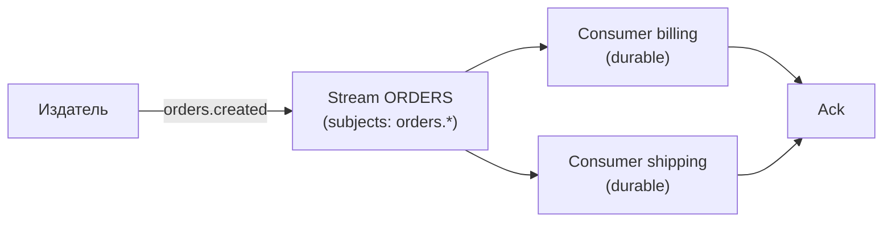
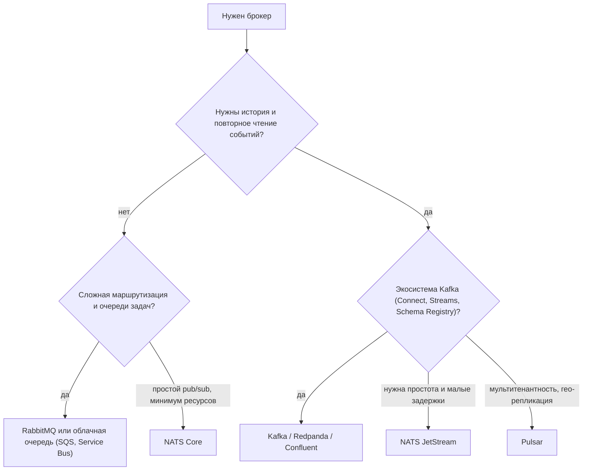

# Альтернативы Kafka и RabbitMQ: NATS JetStream, Redpanda, Pulsar и облачные очереди

↑ [[BE 5.4 Очереди и брокеры — Kafka, RabbitMQ|5.4 Очереди и брокеры: Kafka, RabbitMQ]] · ← [[BE 5.4.10 MassTransit и абстракции над брокерами|Предыдущая]]

<!-- meta:start -->
<div class="meta-strip"><span class="badge should">Желательно</span><span class="chip">~9 мин чтения</span><span class="chip">Уровень: senior</span></div>
<!-- meta:end -->

> [!info] Зачем это на собесе
> «Почему Kafka, а не NATS?» и «Чем Redpanda отличается от Kafka?» Интервьюер проверяет, выбираете ли вы брокер под задачу: модель доставки, хранение и повторное чтение, порядок, масштаб и цена эксплуатации. Kafka и RabbitMQ не единственные разумные варианты.

## Подтемы
- [ ] Что сравниваем: очередь, лог событий, pub/sub
- [ ] NATS и JetStream
- [ ] Redpanda
- [ ] Apache Pulsar
- [ ] Облачные сервисы: SQS/SNS, Service Bus, Pub/Sub
- [ ] Как выбрать

## Объяснение

### Два класса систем
- **Очередь сообщений** (RabbitMQ, SQS): сообщение доставляется потребителю и после подтверждения удаляется. Подходит для задач и команд («отправить письмо»).
- **Лог событий** (Kafka, Redpanda, Pulsar, JetStream): события дописываются в упорядоченный журнал и хранятся заданное время. Несколько потребителей читают независимо и могут перечитать историю. Подходит для событий, потоков данных и восстановления состояния.

Подробнее о различиях: [[BE 5.4.6 Kafka или RabbitMQ — когда что|Kafka или RabbitMQ]] и [[BE 5.4.7 Гарантии доставки — at-most-once, at-least-once, exactly-once|гарантии доставки]].

### NATS и JetStream
**NATS** — лёгкий брокер на Go в одном бинарнике. В режиме Core это быстрый pub/sub и request-reply **без хранения**: сообщение получает только тот, кто подписан в момент публикации (at-most-once). **JetStream** добавляет хранение: именованные **streams** записывают сообщения по темам (subjects), а **consumers** читают их с подтверждениями (at-least-once), есть повторная доставка, дедупликация по `Nats-Msg-Id`, хранилища ключ-значение и объектов.


Сильные стороны: простота эксплуатации, очень низкие задержки, лёгкие соединения, иерархия тем с подстановками (`orders.*`, `orders.>`), request-reply из коробки, работа на границе (edge) и в нескольких кластерах. Слабее Kafka в экосистеме коннекторов и потоковой обработки.

### Redpanda
Совместим с **API Kafka**: существующие клиенты и инструменты работают без изменений. Написан на C++ в виде одного бинарника, без JVM и отдельного ZooKeeper, использует собственный Raft. Обещает меньшие задержки и проще эксплуатацию. Лицензия Community Edition относится к source-available (BSL), проверяйте условия.

### Apache Pulsar
Отделяет вычисления от хранения: **брокеры** без состояния и слой хранения **BookKeeper**. Поддерживает мультитенантность, гео-репликацию, tiered storage, и как очередь (shared-подписки), и как лог (failover/exclusive). Функциональный, но сложный в эксплуатации.

### Облачные сервисы
| Сервис | Модель | Заметки |
|---|---|---|
| AWS SQS | очередь | простая, без серверов, стандартная и FIFO очереди |
| AWS SNS | pub/sub | рассылка в очереди и HTTP, часто SNS плюс SQS |
| AWS Kinesis, Azure Event Hubs | лог событий | управляемые потоки, Event Hubs поддерживает протокол Kafka |
| Azure Service Bus | очередь и топики | транзакции, сессии, dead-letter |
| Google Pub/Sub | pub/sub | глобальный управляемый сервис |
| Confluent Cloud, MSK | управляемый Kafka | тот же протокол, оплата за сервис |

### Сравнение
| | Kafka | RabbitMQ | NATS JetStream | Redpanda | Pulsar |
|---|---|---|---|---|---|
| Модель | лог | очередь | pub/sub и лог | лог (API Kafka) | лог и очередь |
| Хранение и перечитывание | да | нет (стримы отдельно) | да (JetStream) | да | да |
| Порядок | внутри партиции | в очереди | внутри stream / consumer | внутри партиции | внутри ключа / партиции |
| Эксплуатация | средняя (KRaft без ZooKeeper с Kafka 4.0) | проще | очень просто | просто | сложно |
| Экосистема | самая большая | богатая маршрутизация | растёт | совместима с Kafka | своя |

### Как выбрать


## Примеры

### NATS JetStream в .NET
```csharp
using NATS.Client.Core;
using NATS.Client.JetStream;
using NATS.Client.JetStream.Models;

await using var nats = new NatsConnection(new NatsOpts { Url = "nats://localhost:4222" });
var js = new NatsJSContext(nats);

// Stream хранит сообщения по темам orders.*
await js.CreateStreamAsync(new StreamConfig("ORDERS", ["orders.*"]));

// публикация с подтверждением записи в stream
var ack = await js.PublishAsync("orders.created", new OrderCreated(42, 199.9m));
ack.EnsureSuccess();

// durable-потребитель: позиция хранится на сервере
var consumer = await js.CreateOrUpdateConsumerAsync("ORDERS",
    new ConsumerConfig("billing") { AckPolicy = ConsumerConfigAckPolicy.Explicit });

await foreach (var msg in consumer.ConsumeAsync<OrderCreated>())
{
    Console.WriteLine($"order {msg.Data?.Id}");
    await msg.AckAsync();           // без подтверждения сообщение будет доставлено повторно
}

public record OrderCreated(int Id, decimal Total);
```
Пакет `NATS.Net`. Потребитель должен быть идемпотентным: при повторной доставке обработка повторяется ([[BE 5.4.8 Transactional Outbox и Inbox, идемпотентные консьюмеры|идемпотентные консьюмеры]]).

### Запуск NATS с JetStream
```bash
docker run -d --name nats -p 4222:4222 -p 8222:8222 nats:latest -js -m 8222
```
Флаг `-js` включает JetStream, `-m 8222` мониторинг по HTTP.

### Запуск Redpanda для разработки
```bash
docker run -d --name redpanda -p 9092:9092 \
  docker.redpanda.com/redpandadata/redpanda:latest \
  redpanda start --overprovisioned --smp 1 --memory 1G --reserve-memory 0M --node-id 0 --check=false
```
Клиенты подключаются как к Kafka: `bootstrap.servers=localhost:9092`. Параметры запуска зависят от версии образа, смотрите документацию.

## Нюансы и подводные камни
- **Гарантии доставки различаются.** NATS Core не хранит сообщения; для надёжности нужен JetStream с подтверждениями.
- **Порядок сообщений.** Он гарантируется не глобально, а в пределах партиции, ключа или stream: проектируйте ключи.
- **Идемпотентность обязательна** при любой доставке «минимум один раз».
- **Kafka API не значит Kafka целиком.** Redpanda и другие совместимые системы могут иначе вести себя в редких сценариях (транзакции, Connect): проверяйте нужные функции.
- **Облачные очереди и лимиты.** Размер сообщения, время видимости, порядок (FIFO), стоимость запросов: читайте ограничения сервиса.
- **Не усложняйте.** Если хватает Postgres-очереди или RabbitMQ, второй брокер в инфраструктуре лишняя нагрузка на команду.
- **Схемы сообщений.** Версионируйте и проверяйте совместимость независимо от брокера ([[BE 5.4.4 Kafka в .NET — Confluent.Kafka, сериализация, Schema Registry|Schema Registry]]).

## Вопросы с ответами
> [!question]- Чем NATS Core отличается от JetStream?
> NATS Core это быстрый pub/sub без хранения: сообщение получают только активные подписчики, доставка at-most-once. JetStream добавляет streams и consumers с хранением, подтверждениями и повторной доставкой.

> [!question]- Чем Redpanda отличается от Kafka?
> Redpanda реализует API Kafka, но написан на C++ в одном бинарнике без JVM и ZooKeeper и использует собственный Raft. Клиенты и инструменты Kafka работают с ним без изменений. Условия лицензии другие, стоит проверять.

> [!question]- Когда Pulsar?
> Когда нужны мультитенантность, гео-репликация, tiered storage и сочетание очередей и лога в одной системе, и команда готова эксплуатировать брокеры и BookKeeper.

> [!question]- Чем очередь отличается от лога событий?
> В очереди сообщение удаляется после подтверждения и достаётся одному потребителю группы. В логе события хранятся заданный срок, их читают несколько независимых потребителей и могут перечитать историю.

> [!question]- Когда SQS вместо Kafka?
> Когда нужна простая управляемая очередь задач без администрирования и без истории событий. Kafka выбирают для потоков событий, повторного чтения и обработки потоков данных.

> [!question]- Как выбрать брокер?
> Определить модель (очередь или лог), требования к повторному чтению, порядку и гарантиям, объём и задержки, экосистему и стоимость эксплуатации. Часто RabbitMQ или облачная очередь для задач и Kafka или JetStream для событий.

## Связанные темы
- Kafka и очереди: [[BE 5.4.1 Зачем асинхронный обмен — очереди, pub-sub, события|Зачем асинхронный обмен]]
- Kafka или RabbitMQ: [[BE 5.4.6 Kafka или RabbitMQ — когда что|Kafka или RabbitMQ]]
- Гарантии доставки: [[BE 5.4.7 Гарантии доставки — at-most-once, at-least-once, exactly-once|Гарантии доставки]]
- Абстракции над брокерами: [[BE 5.4.10 MassTransit и абстракции над брокерами|MassTransit]]
