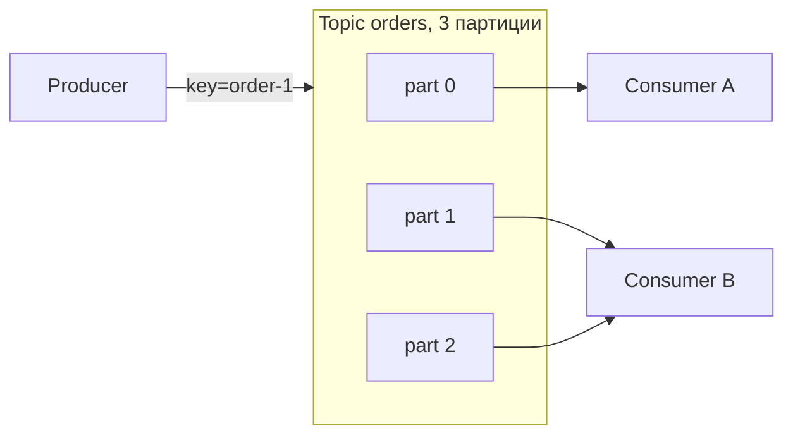

# Kafka: топики, партиции, offset, consumer groups

↑ [[BE 5.4 Очереди и брокеры — Kafka, RabbitMQ|5.4 Очереди и брокеры: Kafka, RabbitMQ]] · ← [[BE 5.4.1 Зачем асинхронный обмен — очереди, pub-sub, события|Предыдущая]] · → [[BE 5.4.3 Kafka — producer, acks, идемпотентность, порядок сообщений|Следующая]]

<!-- meta:start -->

Обязательно~3 мин чтенияУровень: middle

<!-- meta:end -->

> [!info] Зачем это на собесе
> Основа Kafka: партиции определяют порядок и параллелизм. Это спрашивают всегда.

> [!note] Переписано
> Страница в Notion была заготовкой, содержимое написано заново.

## Объяснение

Kafka — распределённый **журнал событий** (commit log). Сообщения хранятся на диске заданное время и могут читаться многократно.

| Понятие | Смысл |
|---|---|
| Topic | именованный поток сообщений |
| Partition | упорядоченный неизменяемый лог; единица параллелизма и масштабирования |
| Offset | порядковый номер сообщения в партиции |
| Key | ключ сообщения: одинаковые ключи попадают в одну партицию |
| Broker / Cluster | серверы Kafka |
| Replication factor | число копий партиции (leader + followers) |
| Consumer group | набор потребителей, делящих партиции топика |
| Retention | сколько хранить (время/размер) или compaction |

Правила:

- **Порядок гарантируется только внутри партиции.** Для порядка событий одного заказа используйте `key = orderId`.
- В группе одну партицию читает **один** потребитель; потребителей больше, чем партиций, — лишние простаивают.
- Разные группы читают независимо (каждая со своим offset): так работает pub/sub.
- Offset коммитится потребителем: после коммита при перезапуске чтение продолжится с этого места.
- Rebalance: при изменении состава группы партиции перераспределяются (на время чтение останавливается).

## Нюансы и подводные камни

- Число партиций сложно уменьшить, а рост меняет распределение ключей: закладывайте с запасом.
- «Горячий ключ» перегружает одну партицию.
- Слишком много партиций → нагрузка на брокеры и долгий rebalance.
- Log compaction хранит последнее значение по ключу (для «состояния»).
- Retention удаляет старые данные независимо от того, прочитаны они или нет.

## Практика

1. Создайте топик из 3 партиций, отправьте сообщения с разными ключами, посмотрите распределение.
2. Запустите двух потребителей в группе и наблюдайте rebalance.
3. Сбросьте offset группы и перечитайте историю (`kafka-consumer-groups`).

## Вопросы с ответами

> [!question]- Где гарантируется порядок в Kafka?
> Внутри одной партиции; между партициями порядка нет.

> [!question]- Что такое consumer group?
> Набор потребителей, между которыми делятся партиции топика; каждая партиция читается одним членом группы.

> [!question]- Что делает offset?
> Указывает позицию чтения в партиции; коммит offset определяет, откуда продолжить после перезапуска.

## Связанные темы

- [[N:3ea33104867981a88b97d7b7124a6163]]
- [[N:3ea33104867981b59f88f3e0f044e0fc]]
