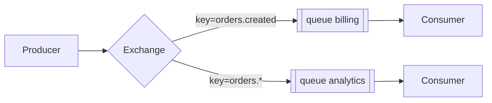

# RabbitMQ: exchanges, queues, routing, ack

↑ [[BE 5.4 Очереди и брокеры — Kafka, RabbitMQ|5.4 Очереди и брокеры: Kafka, RabbitMQ]] · ← [[BE 5.4.4 Kafka в .NET — Confluent.Kafka, сериализация, Schema Registry|Предыдущая]] · → [[BE 5.4.6 Kafka или RabbitMQ — когда что|Следующая]]

<!-- meta:start -->
<div class="meta-strip"><span class="badge must">Обязательно</span><span class="chip">~3 мин чтения</span><span class="chip">Уровень: middle</span></div>
<!-- meta:end -->


> [!info] Зачем это на собесе
> RabbitMQ — классический брокер для задач и маршрутизации; нужно знать модель exchange → queue.

> [!note] Переписано
> Страница в Notion была заготовкой, содержимое написано заново.

## Объяснение

Продюсер публикует в **exchange**, тот по правилам маршрутизации (binding) раскладывает сообщения по **очередям**, потребители читают из очередей.

| Тип exchange | Маршрутизация |
|---|---|
| direct | по точному routing key |
| fanout | во все связанные очереди |
| topic | по шаблону (`orders.*.created`, `#`) |
| headers | по заголовкам |



Ключевые механизмы:

- **Ack/Nack**: потребитель подтверждает обработку; без ack сообщение возвращается в очередь.
- **Prefetch (QoS)**: сколько неподтверждённых сообщений держит потребитель.
- **Durable + persistent**: очередь и сообщения переживают перезапуск брокера.
- **Publisher confirms**: брокер подтверждает приём продюсеру.
- **TTL, DLX (dead letter exchange), приоритеты, delayed messages**.
- **Quorum queues**: реплицируемые очереди на Raft (рекомендуются вместо classic mirrored).

```csharp
var factory = new ConnectionFactory { HostName = "rabbit", DispatchConsumersAsync = true };
using var conn = await factory.CreateConnectionAsync();
using var ch = await conn.CreateChannelAsync();
await ch.QueueDeclareAsync("billing", durable: true, exclusive: false, autoDelete: false);
await ch.BasicQosAsync(0, 10, false);
var consumer = new AsyncEventingBasicConsumer(ch);
consumer.ReceivedAsync += async (_, ea) =>
{
    await Handle(ea.Body);
    await ch.BasicAckAsync(ea.DeliveryTag, false);
};
await ch.BasicConsumeAsync("billing", autoAck: false, consumer);
```

## Нюансы и подводные камни

- `autoAck: true` — потеря при сбое обработчика.
- Канал не потокобезопасен: один канал на поток/потребителя.
- Без ограничения очередь растёт неограниченно и «съедает» память.
- Порядок гарантируется только при одном потребителе на очередь без requeue.
- Сообщения удаляются после подтверждения — переиграть историю нельзя (в отличие от Kafka).

## Практика

1. Настройте topic exchange с двумя очередями и разными шаблонами.
2. Реализуйте ack/nack и DLX для необработанных сообщений.
3. Сравните throughput с разным prefetch.

## Вопросы с ответами

> [!question]- Чем exchange отличается от очереди?
> Exchange маршрутизирует сообщения, очередь их хранит.

> [!question]- Что произойдёт без ack?
> Сообщение считается недоставленным и вернётся в очередь при закрытии канала/таймауте.

> [!question]- Как сделать pub/sub в RabbitMQ?
> Fanout/topic exchange и отдельная очередь у каждого подписчика.

## Связанные темы

- [[N:3ea3310486798150bf0bdb0160fa893a]]
- [[N:3ea331048679819392dadf05bb41e310]]
