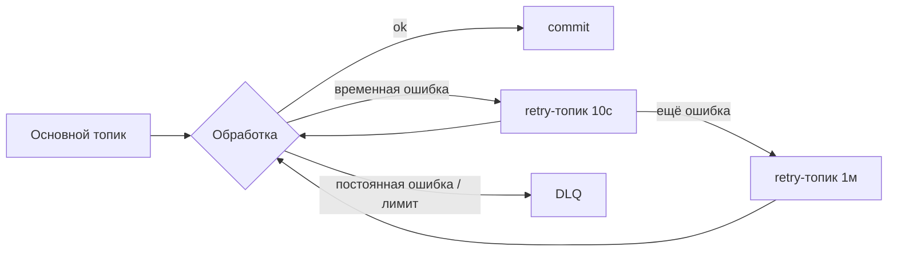

# Dead letter queue, retry, poison messages

↑ [[BE 5.4 Очереди и брокеры — Kafka, RabbitMQ|5.4 Очереди и брокеры: Kafka, RabbitMQ]] · ← [[BE 5.4.8 Transactional Outbox и Inbox, идемпотентные консьюмеры|Предыдущая]] · → [[BE 5.4.10 MassTransit и абстракции над брокерами|Следующая]]

<!-- meta:start -->
<div class="meta-strip"><span class="badge must">Обязательно</span><span class="chip">~3 мин чтения</span><span class="chip">Уровень: middle</span></div>
<!-- meta:end -->


> [!info] Зачем это на собесе
> Что делать с сообщением, которое не обрабатывается, чтобы оно не блокировало очередь.

> [!note] Переписано
> Страница в Notion была заготовкой, содержимое написано заново.

## Объяснение

**Poison message** — сообщение, которое всегда вызывает ошибку (битый JSON, нарушение бизнес-правил). Если бесконечно повторять, оно блокирует партицию/очередь.

Стратегия обработки ошибок:

| Тип ошибки | Действие |
|---|---|
| Временная (сеть, таймаут, deadlock БД) | повтор с задержкой и экспоненциальным backoff + jitter |
| Постоянная (валидация, десериализация) | сразу в DLQ, без повторов |
| Исчерпан лимит повторов | в DLQ |



- **DLQ (dead letter queue/topic)** — отдельная очередь для необработанных сообщений с причиной ошибки в заголовках; их разбирают вручную, чинят и перепроигрывают (redrive).
- В RabbitMQ: DLX + TTL для retry-очередей; в Kafka: отдельные retry-топики и DLQ-топик (нет встроенного DLQ).
- Мониторинг: алерт на рост DLQ, метрика лага.

```csharp
try { await HandleAsync(msg, ct); consumer.Commit(cr); }
catch (TransientException) when (attempt < 5) { await RepublishToRetryAsync(cr, attempt + 1); consumer.Commit(cr); }
catch (Exception ex) { await PublishToDlqAsync(cr, ex); consumer.Commit(cr); }
```

## Нюансы и подводные камни

- Retry на месте блокирует остальные сообщения партиции — используйте retry-топики.
- Повторяемое сообщение нарушает порядок; учитывайте это в дизайне.
- Сохраняйте в DLQ исходное сообщение, причину, стек, счётчик попыток.
- Redrive должен быть идемпотентным и управляемым (не автоматом без контроля).
- Не глотайте ошибки: отсутствие DLQ = тихая потеря данных.

## Практика

1. Настройте retry-топики и DLQ для потребителя Kafka.
2. Отправьте «ядовитое» сообщение и убедитесь, что поток не блокируется.
3. Сделайте инструмент для просмотра и redrive DLQ.

## Вопросы с ответами

> [!question]- Что такое poison message?
> Сообщение, которое стабильно приводит к ошибке обработки и блокирует очередь при повторах.

> [!question]- Зачем retry-топики?
> Чтобы отложенные повторы не блокировали основной поток и не нарушали остальную обработку.

> [!question]- Что делать с DLQ?
> Алертить, разбирать причины, исправлять и переигрывать сообщения.

## Связанные темы

- [[N:3ea331048679819a8d47e8140fca5d08]]
- [[N:3ea33104867981b7972aceb8b1dde4cf]]
