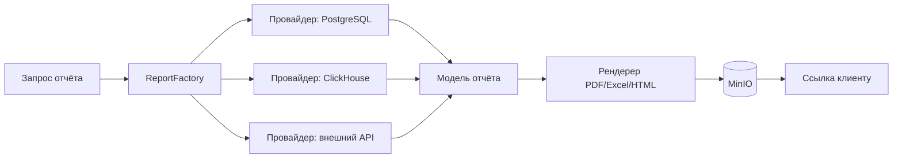

# Фабрика отчётов и сбор данных из разных источников

↑ [[BE 5.6 Генерация документов и отчётов|5.6 Генерация документов и отчётов]] · ← [[BE 5.6.1 Генерация PDF на сервере — FastReport, QuestPDF, шаблоны|Предыдущая]] · → [[BE 5.6.3 Хранение и отдача файлов через MinIO|Следующая]]

<!-- meta:start -->
<div class="meta-strip"><span class="badge should">Желательно</span><span class="chip">~3 мин чтения</span><span class="chip">Уровень: middle</span></div>
<!-- meta:end -->


> [!info] Зачем это на собесе
> Архитектурный вопрос: как спроектировать сервис отчётов, собирающий данные из нескольких систем.

> [!note] Переписано
> Страница в Notion была заготовкой, содержимое написано заново.

## Объяснение

**Фабрика отчётов** — компонент, который по типу отчёта выбирает провайдеры данных и рендерер, а затем формирует документ.



Разделение ответственности:

| Часть | Задача |
|---|---|
| Определение отчёта | параметры, права доступа, формат |
| Провайдеры данных | получение данных из источников (параллельно, с таймаутами) |
| Агрегатор | объединение и расчёт итогов |
| Рендерер | вывод в формат; один набор данных → PDF/XLSX/CSV |
| Оркестрация | асинхронная задача, статус, повторы, отмена |

```csharp
public interface IReportDefinition { string Type { get; } Task<ReportModel> BuildAsync(ReportRequest r, CancellationToken ct); }
public interface IReportRenderer { string Format { get; } Task RenderAsync(ReportModel m, Stream output, CancellationToken ct); }

public class ReportService(IEnumerable<IReportDefinition> defs, IEnumerable<IReportRenderer> renderers)
{
    public async Task RunAsync(ReportRequest r, Stream output, CancellationToken ct)
    {
        var model = await defs.Single(d => d.Type == r.Type).BuildAsync(r, ct);
        await renderers.Single(x => x.Format == r.Format).RenderAsync(model, output, ct);
    }
}
```

Долгие отчёты: `POST /reports` → `202 Accepted` + `Location: /reports/{id}`; клиент опрашивает статус или получает уведомление (SignalR/вебхук).

## Нюансы и подводные камни

- Отчёты на боевой БД нагружают её: читайте с реплики или из аналитического хранилища (ClickHouse).
- Согласованность данных из разных источников: фиксируйте момент среза.
- Права: пользователь видит только свои данные (фильтры на уровне провайдера).
- Ограничения: лимит на объём и время; отмена по токену.
- Кэшируйте готовые отчёты по параметрам.

## Практика

1. Реализуйте фабрику с двумя определениями и тремя рендерерами.
2. Сделайте асинхронный API отчёта со статусом и ссылкой на файл.
3. Ограничьте параллелизм сборки отчётов и добавьте отмену.

## Вопросы с ответами

> [!question]- Как устроить сервис отчётов?
> Отделить определения и провайдеры данных от рендереров, выполнять генерацию асинхронно и хранить результат в объектном хранилище.

> [!question]- Почему отчёты не стоит строить на основной БД?
> Тяжёлые запросы мешают OLTP; используют реплику или OLAP-хранилище.

## Связанные темы

- [[N:3ea3310486798186b924e9e6527d4deb]]
- [[N:3ea33104867981dd851ddc18dbf209d9]]
