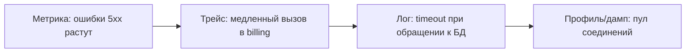

# Три столпа observability: логи, метрики, трейсы

↑ [[BE 7.2 Observability — логи, метрики, трейсинг, OpenTelemetry|7.2 Observability: логи, метрики, трейсинг, OpenTelemetry]] · → [[BE 7.2.2 Структурные логи — Serilog, корреляция, уровни, что не логировать|Следующая]]

<!-- meta:start -->

Желательно~3 мин чтенияУровень: senior

<!-- meta:end -->

> [!info] Зачем это на собесе
> «Как вы понимаете, что происходит в проде?» — стартовый вопрос по эксплуатации.

> [!note] Переписано
> Страница в Notion была заготовкой, содержимое написано заново.

## Объяснение

**Мониторинг** отвечает на заранее известные вопросы («жив ли сервис»). **Observability** позволяет исследовать неизвестные проблемы по данным, которые система отдаёт.

| Столп | Что | Плюс | Минус |
|---|---|---|---|
| Логи | события с контекстом | детали конкретного случая | объём, дорого искать без структуры |
| Метрики | числовые ряды во времени | дёшевы, агрегируются, алерты | нет деталей отдельного запроса |
| Трейсы | путь одного запроса через сервисы | видно, где потеряно время | нужны инструментация и выборка |
| Профили (4-й столп) | где тратятся CPU/память | причина на уровне кода | отдельная инфраструктура |

Как они работают вместе: алерт по **метрике** (рост ошибок) → **трейс** проблемного запроса (какой сервис медленный) → **логи** этого запроса по `trace_id` → **профиль** (какой метод).

Ключ ко всему — **корреляция**: единый `trace_id` в логах, метриках (exemplars) и трейсах.

## Нюансы и подводные камни

- Высокая кардинальность меток (`userId` в метке метрики) убивает хранилище метрик.
- Логи без структуры нельзя агрегировать.
- Трейсы всех запросов стоят дорого: применяйте выборку (sampling).
- Данные наблюдаемости — тоже данные: не пишите в них секреты и персональную информацию.
- Инструмент не заменяет процесс: алерты должны быть о симптомах для пользователя.

## Практика

1. Пройдите путь «алерт → метрика → трейс → лог» на тестовой поломке.
2. Добавьте `trace_id` во все логи.
3. Найдите метрику с высокой кардинальностью и исправьте.

## Вопросы с ответами

> [!question]- Чем observability отличается от мониторинга?
> Мониторинг проверяет известные состояния; observability позволяет исследовать произвольные вопросы по телеметрии.

> [!question]- Зачем trace_id в логах?
> Чтобы связать все логи одного запроса между сервисами и с трейсом.

## Связанные темы

- [[N:3ea33104867981a7824ce4d2a5cd6c82]]
- [[N:3ea33104867981edac43cf84838e178a]]
