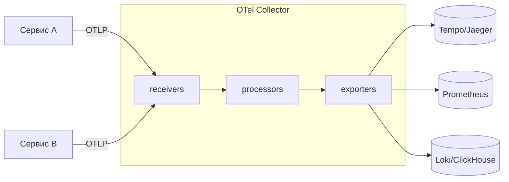

# OTLP и OpenTelemetry Collector: receivers, processors, exporters

↑ [[BE 7.2 Observability — логи, метрики, трейсинг, OpenTelemetry|7.2 Observability: логи, метрики, трейсинг, OpenTelemetry]] · ← [[BE 7.2.4 Распределённый трейсинг — trace context, W3C traceparent, проброс через gRPC и HTTP|Предыдущая]] · → [[BE 7.2.6 Хранение и визуализация — ClickHouse, Grafana, Prometheus, Jaeger-Tempo|Следующая]]

<!-- meta:start -->
<div class="meta-strip"><span class="badge should">Желательно</span><span class="chip">~4 мин чтения</span><span class="chip">Уровень: senior</span></div>
<!-- meta:end -->


> [!info] Зачем это на собесе
> Как устроен конвейер сбора телеметрии и почему сервисы не шлют данные напрямую в хранилище.

> [!note] Переписано
> Страница в Notion была заготовкой, содержимое написано заново.

## Объяснение

Collector — независимый процесс-«шлюз» телеметрии. Сервисы отправляют OTLP на Collector, а он обрабатывает и передаёт данные в хранилища.



```yaml
receivers:
  otlp: { protocols: { grpc: {}, http: {} } }
processors:
  memory_limiter: { check_interval: 1s, limit_mib: 512 }
  batch: {}
  tail_sampling:
    policies:
      - { name: errors, type: status_code, status_code: { status_codes: [ERROR] } }
      - { name: slow, type: latency, latency: { threshold_ms: 1000 } }
      - { name: rest, type: probabilistic, probabilistic: { sampling_percentage: 5 } }
exporters:
  otlp/tempo: { endpoint: tempo:4317, tls: { insecure: true } }
  prometheus: { endpoint: 0.0.0.0:8889 }
service:
  pipelines:
    traces:  { receivers: [otlp], processors: [memory_limiter, tail_sampling, batch], exporters: [otlp/tempo] }
    metrics: { receivers: [otlp], processors: [memory_limiter, batch], exporters: [prometheus] }
```

Зачем Collector:

- Сервисы не знают о бэкенде хранения — можно менять его без перекомпиляции.
- Централизованные обработка: батчинг, ретраи, фильтрация, маскирование, семплирование по хвосту (tail sampling).
- Развёртывание: агент (sidecar/DaemonSet) рядом с приложением и/или центральный шлюз.

## Нюансы и подводные камни

- Tail sampling требует, чтобы все span-ы трейса попали на один экземпляр Collector.
- Без `memory_limiter` Collector может упасть по памяти.
- Очередь и retry в exporter'е — компромисс между потерей данных и задержкой.
- Collector — единая точка отказа: резервирование и мониторинг самого Collector.

## Практика

1. Поднимите Collector в Docker и пропустите через него трейсы и метрики.
2. Добавьте процессор, удаляющий атрибуты с персональными данными.
3. Настройте tail sampling: все ошибки и медленные запросы + 5% остальных.

## Вопросы с ответами

> [!question]- Зачем Collector, если SDK умеет экспортировать напрямую?
> Развязывает приложение и хранилище, позволяет обрабатывать, семплировать и маршрутизировать данные централизованно.

> [!question]- Что такое tail sampling?
> Решение об оставлении трейса принимается после его завершения (по ошибкам, задержке), а не при старте.

## Связанные темы

- [[N:3ea3310486798148be44dd7a434f317a]]
- [[N:3ea33104867981869027f9a72bdd9a33]]
