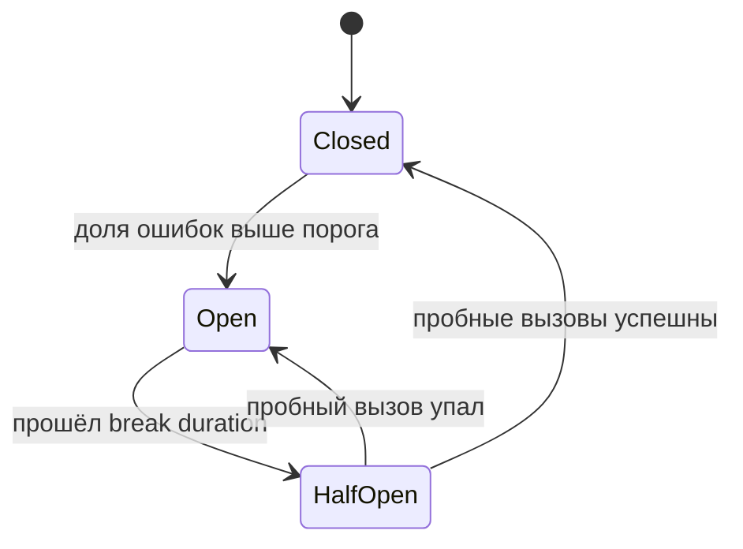

# Circuit breaker, bulkhead, fallback

↑ [[BE 7.3 Надёжность и отказоустойчивость|7.3 Надёжность и отказоустойчивость]] · ← [[BE 7.3.1 Таймауты, retry с backoff и jitter|Предыдущая]] · → [[BE 7.3.3 Polly и Microsoft.Extensions.Resilience|Следующая]]

<!-- meta:start -->
<div class="meta-strip"><span class="badge should">Желательно</span><span class="chip">~3 мин чтения</span><span class="chip">Уровень: senior</span></div>
<!-- meta:end -->


> [!info] Зачем это на собесе
> Паттерны изоляции сбоев: «что будет с вашим сервисом, если зависимость упала?»

> [!note] Переписано
> Страница в Notion была заготовкой, содержимое написано заново.

## Объяснение

**Circuit breaker** — предохранитель вокруг вызова зависимости.



| Состояние | Поведение |
|---|---|
| Closed | вызовы проходят, ошибки считаются |
| Open | вызовы сразу отклоняются без обращения к сервису |
| Half-open | пропускаются пробные вызовы для проверки восстановления |

**Bulkhead** (переборка) — отдельные пулы ресурсов для разных зависимостей/клиентов: сбой или медленная зависимость исчерпает только свой лимит параллелизма (`SemaphoreSlim`, `ConcurrencyLimiter`), а не все потоки.

**Fallback** — запасной результат: закэшированное значение, значение по умолчанию, упрощённая функциональность, очередь на повтор, понятная ошибка.

```csharp
try { return await pricing.GetAsync(id, ct); }
catch (BrokenCircuitException) { return await cache.GetStaleAsync(id) ?? Price.Unknown; }   // деградация вместо отказа
```

Дополнительно: **timeout**, **load shedding** (осознанный отказ части запросов при перегрузке), **health-based routing**.

## Нюансы и подводные камни

- Порог breaker нужно подбирать по трафику: при малом числе запросов срабатывает ложно (`MinimumThroughput`).
- Fallback тоже может упасть или скрыть проблему: метрики и алерты на срабатывания.
- Открытый breaker при пиковой нагрузке отдаёт ошибки быстро — это норма, но нужен мониторинг.
- Bulkhead без лимитов очереди даёт бесконечное ожидание.
- Состояние breaker локально для инстанса.

## Практика

1. Обёрните внешний вызов в circuit breaker и сымитируйте падение сервиса.
2. Реализуйте fallback с устаревшим значением из кэша.
3. Изолируйте два клиента разными пулами (bulkhead).

## Вопросы с ответами

> [!question]- Что делает circuit breaker?
> Отклоняет вызовы к заведомо неработающей зависимости, экономя ресурсы и давая ей восстановиться.

> [!question]- Что такое bulkhead?
> Изоляция ресурсов по зависимостям, чтобы сбой одной не вывел из строя всё приложение.

## Связанные темы

- [[N:3ea33104867981d99cced09dcdfa95e9]]
- [[N:3ea331048679811aa59dd143aea4d4c6]]
