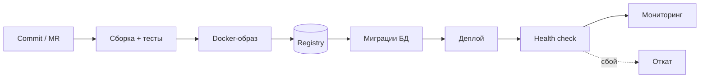

# Путь кода до прода: сборка, образ, registry, миграции, деплой

↑ [[BE 7.6 DevOps для бэкенд-разработчика — деплой наших систем и CI-CD|7.6 DevOps для бэкенд-разработчика: деплой наших систем и CI/CD]] · → [[BE 7.6.2 Dockerfile для .NET-микросервисов — общий core-образ, multi-stage, как у нас|Следующая]]

<!-- meta:start -->

По желанию~3 мин чтенияУровень: senior

<!-- meta:end -->

> [!info] Зачем это на собесе
> Бэкендера часто спрашивают, как его код попадает в прод и что происходит при сбое релиза.

> [!note] Переписано
> Страница в Notion была заготовкой, содержимое написано заново.

## Объяснение

| Этап | Что происходит | Артефакт |
|---|---|---|
| Сборка | restore, build, unit-тесты, линтеры | бинарники, отчёты |
| Качество/безопасность | SAST, сканирование зависимостей и образа | отчёты |
| Образ | `docker build`, тег по коммиту/версии | образ |
| Публикация | push в registry | образ с тегом |
| Миграции | применение изменений схемы | обновлённая БД |
| Деплой | обновление контейнеров/подов | запущенная версия |
| Проверка | health checks, smoke-тесты | статус релиза |
| Наблюдение | метрики и логи после выкладки | сигналы для отката |

Принципы:

- **Один артефакт на все окружения** (immutable image): различается только конфигурация.
- **Тег = коммит/версия**, не `latest`.
- **Повторяемость**: всё в коде (Dockerfile, pipeline, compose, IaC).
- **Небольшие частые релизы** безопаснее редких больших.
- **Обратная совместимость** кода и схемы БД для откатов и rolling-обновления.

## Нюансы и подводные камни

- Сборка «на машине разработчика» не воспроизводима.
- Сборка образа отдельно для каждого окружения приводит к «на stage работало».
- Миграции должны переживать одновременную работу старой и новой версий.
- Нужны быстрый откат и способ узнать, что именно запущено (версия в `/health` или метаданных).

## Практика

1. Нарисуйте путь кода вашего проекта от коммита до прода и найдите ручные шаги.
2. Добавьте версию (коммит) в ответ `/health` и метрики.
3. Проверьте, что один и тот же образ работает в stage и prod с разной конфигурацией.

## Вопросы с ответами

> [!question]- Что такое immutable artifact?
> Один раз собранный образ, который без изменений проходит все окружения; различия — только конфигурация.

> [!question]- Почему не тег latest?
> Он неоднозначен и не позволяет воспроизвести или откатить конкретную версию.

## Связанные темы

- [[N:3ea33104867981548b3aef7030878932]]
- [[N:3ea33104867981e1abd5d922b6e1e213]]
