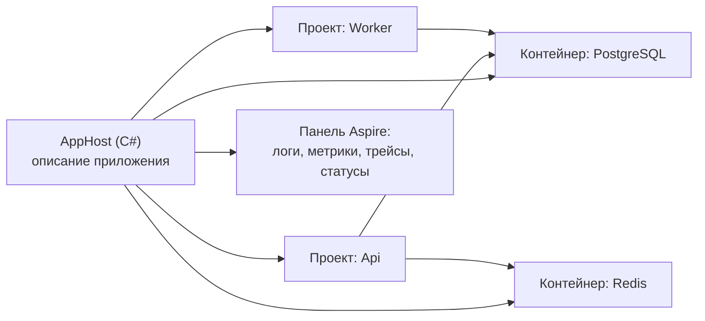

# Aspire: оркестрация локальной разработки и деплой

↑ [[BE 7.6 DevOps для бэкенд-разработчика — деплой наших систем и CI-CD|7.6 DevOps для бэкенд-разработчика]] · ← [[BE 7.6.8 Выкладка, откат и разбор инцидентов глазами бэкендера|Предыдущая]]

<!-- meta:start -->
<div class="meta-strip"><span class="badge should">Желательно</span><span class="chip">~7 мин чтения</span><span class="chip">Уровень: middle</span></div>
<!-- meta:end -->

> [!info] Зачем это на собесе
> «Как вы поднимаете десять сервисов, базу, кэш и очередь у себя на машине?» Обычно это `docker compose` и README на три страницы. Aspire решает ту же задачу кодом на C♯ и сразу добавляет телеметрию и панель. Это новый стандартный инструмент экосистемы .NET, о нём всё чаще спрашивают.

## Подтемы
- [ ] Зачем Aspire и что это
- [ ] AppHost, ресурсы и ссылки
- [ ] Service discovery и ServiceDefaults
- [ ] Панель и телеметрия
- [ ] Интеграции (PostgreSQL, Redis, RabbitMQ и другие)
- [ ] Публикация и ограничения

## Объяснение

### Проблема
Современное приложение состоит из нескольких сервисов и зависимостей: API, воркер, PostgreSQL, Redis, брокер. Чтобы запустить всё локально, нужны compose-файл, строки подключения, порядок старта и ручная настройка телеметрии. Строки подключения дублируются в разных местах, а у каждого разработчика «работает по-своему».

### Что такое Aspire
**Aspire** (ранее называлась .NET Aspire) — набор инструментов и библиотек для описания распределённого приложения. Центральный элемент: проект **AppHost** на C♯, который описывает **ресурсы** (ваши проекты, контейнеры, базы данных) и связи между ними. При запуске Aspire поднимает всё, передаёт приложениям адреса и строки подключения и показывает панель управления.



### AppHost
```csharp
var builder = DistributedApplication.CreateBuilder(args);

var postgres = builder.AddPostgres("postgres").WithDataVolume();
var db = postgres.AddDatabase("appdb");
var cache = builder.AddRedis("cache");

builder.AddProject<Projects.Api>("api")
    .WithReference(db)              // строка подключения "appdb" попадёт в конфигурацию Api
    .WithReference(cache)
    .WaitFor(db)                    // запускать API после готовности базы
    .WithExternalHttpEndpoints();

builder.Build().Run();
```
Методы `AddPostgres`, `AddRedis` и другие находятся в пакетах интеграций (`Aspire.Hosting.PostgreSQL`, `Aspire.Hosting.Redis`). `Projects.Api` генерируется из ссылки на проект.

### Service discovery и ServiceDefaults
Проекты сервисов подключают общий проект **ServiceDefaults**, который добавляет: настройку OpenTelemetry (трассировка, метрики, логи), проверки здоровья, устойчивость HTTP-клиентов (повторы, таймауты) и **service discovery**. Сервисы обращаются друг к другу по логическому имени (`http://api`), а Aspire подставляет реальный адрес.

### Панель
Панель показывает ресурсы и их состояние, консольные логи, структурированные логи, метрики и распределённые трейсы в одном месте. Это бесплатный аналог связки Prometheus, Grafana и Jaeger для локальной отладки ([[BE 7.2 Observability — логи, метрики, трейсинг, OpenTelemetry|Observability на бэкенде]]).

### Интеграции
Готовые пакеты для PostgreSQL, SQL Server, MongoDB, Redis, RabbitMQ, Kafka, Elasticsearch, Keycloak, MinIO и других: поднимают контейнер с нужными настройками и передают данные подключения приложению. Клиентские пакеты (`Aspire.Npgsql`, `Aspire.StackExchange.Redis`) подключаются в самом сервисе одной строкой.

### Публикация
Aspire не заменяет продакшен-оркестратор. Описание AppHost можно превратить в манифест и использовать для развёртывания: генерировать файлы Docker Compose, манифесты Kubernetes или публиковать в облако (Azure Container Apps через `azd`). Продакшен-настройки, секреты и сети всё равно определяются отдельно ([[BE 7.6.3 Как поднимается Clinic — docker compose, Makefile, порядок запуска, healthcheck|как мы поднимаем Clinic]]).

### Aspire или Docker Compose
| | Docker Compose | Aspire |
|---|---|---|
| Описание | YAML | C♯ |
| Свои проекты .NET | через Dockerfile и сборку | запускаются напрямую, без образа, с отладчиком |
| Телеметрия и панель | настраивать отдельно | встроено |
| Service discovery и строки подключения | вручную | автоматически |
| Независимость от языка | да | ориентирован на .NET (поддерживает и другие языки как ресурсы) |
| Продакшен | привычный формат | экспорт в Compose, Kubernetes, облако |

## Примеры

### Подключение клиентских интеграций в сервисе
```csharp
var builder = WebApplication.CreateBuilder(args);

builder.AddServiceDefaults();                  // OpenTelemetry, health checks, resilience, service discovery
builder.AddNpgsqlDataSource("appdb");          // строка подключения приходит от AppHost по имени ресурса
builder.AddRedisClient("cache");

var app = builder.Build();
app.MapDefaultEndpoints();                     // /health и /alive
app.MapGet("/", () => "ok");
app.Run();
```

### Запуск
```bash
dotnet run --project AppHost     # поднимает контейнеры, проекты и открывает панель Aspire
```

## Нюансы и подводные камни
- **Aspire для разработки и сборки манифестов, не замена Kubernetes.** В продакшене нужны свои настройки.
- **Нужен Docker или совместимая среда** для контейнерных ресурсов.
- **Версии пакетов держите согласованными** (хост и интеграции одной мажорной версии).
- **Секреты.** Параметры вроде паролей передавайте через параметры и user-secrets, не в коде AppHost.
- **WaitFor и готовность.** Порядок запуска не заменяет корректной обработки недоступности зависимостей в приложении.
- **Данные контейнеров.** Без `WithDataVolume` данные базы пропадают при пересоздании контейнера.
- **Проекты не на .NET** тоже можно подключать как ресурсы, но удобство меньше.

## Вопросы с ответами
> [!question]- Что такое Aspire?
> Набор инструментов для описания и запуска распределённых приложений .NET: проект AppHost на C♯ описывает сервисы и зависимости, Aspire поднимает их, передаёт строки подключения и даёт панель с логами, метриками и трейсами.

> [!question]- Чем Aspire отличается от Docker Compose?
> Compose описывает контейнеры в YAML. Aspire описывает приложение на C♯, запускает проекты .NET без образов, автоматически связывает сервисы и строки подключения и включает телеметрию. Из AppHost можно получить артефакты для развёртывания.

> [!question]- Что делает ServiceDefaults?
> Общий проект с настройками для сервисов: OpenTelemetry, health checks, устойчивость HTTP-клиентов и service discovery, чтобы все сервисы вели себя единообразно.

> [!question]- Можно ли выкатывать приложение в продакшен через Aspire?
> Aspire не оркестратор продакшена. AppHost умеет публиковать описание приложения (Compose, Kubernetes, Azure Container Apps), но продакшен-конфигурацию, секреты и сети определяют отдельно.

> [!question]- Зачем WaitFor?
> Чтобы сервис стартовал после готовности зависимости (например, базы данных). Это упрощает запуск, но приложение всё равно должно корректно переживать временную недоступность зависимостей.

## Связанные темы
- Docker Compose: [[DO 2.9 docker-compose — сервисы, depends_on, healthcheck, profiles, extends, env-файлы|docker-compose]]
- Observability: [[BE 7.2 Observability — логи, метрики, трейсинг, OpenTelemetry|Observability на бэкенде]]
- Трейсинг: [[DO 7.9 Распределённый трейсинг — Tempo, Jaeger, sampling|Распределённый трейсинг]]
- Запуск Clinic: [[BE 7.6.3 Как поднимается Clinic — docker compose, Makefile, порядок запуска, healthcheck|Как поднимается Clinic]]
