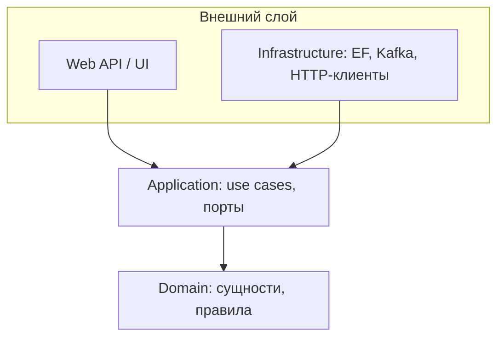

# Clean Architecture, Onion, Hexagonal (Ports & Adapters)

↑ [[BE 8.2 Архитектурные стили и DDD|8.2 Архитектурные стили и DDD]] · ← [[BE 8.2.1 Слоистая архитектура и её проблемы|Предыдущая]] · → [[BE 8.2.3 Vertical Slice Architecture|Следующая]]

<!-- meta:start -->
<div class="meta-strip"><span class="badge must">Обязательно</span><span class="chip">~3 мин чтения</span><span class="chip">Уровень: senior</span></div>
<!-- meta:end -->


> [!info] Зачем это на собесе
> Ждут объяснения «правила зависимостей» и как это выглядит в .NET-проекте.

> [!note] Переписано
> Страница в Notion была заготовкой, содержимое написано заново.

## Объяснение

Общая идея трёх стилей: **бизнес-логика в центре и ни от чего не зависит**; инфраструктура (БД, HTTP, брокер) зависит от неё через интерфейсы.



| Стиль | Формулировка |
|---|---|
| Hexagonal (Ports & Adapters, Cockburn) | ядро определяет **порты** (интерфейсы); **адаптеры** (HTTP, БД) реализуют их |
| Onion (Palermo) | концентрические слои, зависимости внутрь |
| Clean (Martin) | Entities → Use Cases → Interface Adapters → Frameworks; **Dependency Rule** |

Структура решения .NET:

```text
src/
  Orders.Domain/          # сущности, value objects, доменные события; без зависимостей
  Orders.Application/     # use cases (команды/запросы), порты: IOrderRepository, IPaymentGateway
  Orders.Infrastructure/  # EF Core, репозитории, клиенты, брокер — реализует порты
  Orders.Api/             # контроллеры/endpoint-ы, композиционный корень (DI)
tests/
```

Правила: `Domain` ни от кого не зависит; `Application` зависит от `Domain`; `Infrastructure` и `Api` — от `Application`. Приложение собирается в `Api` (composition root).

## Нюансы и подводные камни

- Для простого CRUD избыточно: 4 проекта ради `GET/POST`.
- Формальное разделение без поведения в домене — анемичная модель в красивой обёртке.
- Протекание: сущности EF с атрибутами и `virtual`-навигациями просачиваются в домен — решайте осознанно.
- Интерфейс ради интерфейса: порт нужен на границе с внешним миром, а не для каждого класса.
- Проверяйте зависимости архитектурными тестами.

## Практика

1. Разнесите небольшое приложение на Domain/Application/Infrastructure/Api.
2. Добавьте архитектурный тест, запрещающий зависимость Domain от Infrastructure.
3. Замените адаптер (in-memory вместо БД) в тестах Application.

## Вопросы с ответами

> [!question]- В чём суть Dependency Rule?
> Зависимости в исходном коде направлены только внутрь, к домену; внутренние слои ничего не знают о внешних.

> [!question]- Что такое порты и адаптеры?
> Порт — интерфейс, определяемый ядром; адаптер — его реализация для конкретной технологии.

## Связанные темы

- [[N:3ea33104867981389cc2e7e356bb96a2]]
- [[N:3ea3310486798122b6d0c40f6364b6bd]]
