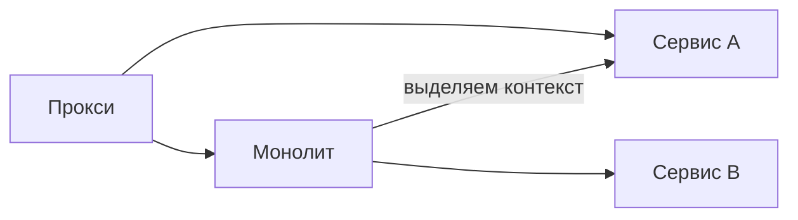

# Монолит или микросервисы: когда что

↑ [[BE 8.3 Микросервисы и распределённые системы|8.3 Микросервисы и распределённые системы]] · → [[BE 8.3.2 Декомпозиция сервисов и database per service|Следующая]]

<!-- meta:start -->

Желательно~3 мин чтенияУровень: senior

<!-- meta:end -->

> [!info] Зачем это на собесе
> Зрелый ответ — «зависит», с критериями. Микросервисы не цель, а инструмент под организационные и нагрузочные ограничения.

> [!note] Переписано
> Страница в Notion была заготовкой, содержимое написано заново.

## Объяснение

| Критерий | Монолит (модульный) | Микросервисы |
|---|---|---|
| Развёртывание | один артефакт | независимое по сервису |
| Масштабирование | целиком | по сервисам |
| Технологии | единый стек | разные стеки |
| Транзакции | локальные ACID | распределённые (саги, eventual consistency) |
| Сложность эксплуатации | низкая | высокая: сеть, наблюдаемость, деплой, версионирование API |
| Скорость разработки | высокая на старте | выше при большом числе команд |
| Отказоустойчивость | падает всё | изоляция сбоев (при правильном дизайне) |
| Отладка | проще | распределённый трейсинг |
| Стоимость | ниже | выше (инфраструктура, платформенная команда) |

Когда микросервисы оправданы:

- Несколько автономных команд, мешающих друг другу в одном коде и релизах.
- Разные профили нагрузки и масштабирования у частей системы.
- Разные требования к технологиям или надёжности.
- Чёткие bounded contexts.

Когда рано: маленькая команда, неясные границы, молодой продукт, нет культуры автоматизации (CI/CD, наблюдаемость).

Практика: **Monolith First / Modular Monolith** → выделять сервисы по мере надобности (Strangler Fig).

## Нюансы и подводные камни

- **Распределённый монолит**: сервисы связаны синхронными вызовами и деплоятся вместе — все минусы обоих подходов.
- «Микро» не про размер: сервис по границе бизнес-возможности.
- Общая БД между сервисами уничтожает независимость.
- Недооценка платформенных затрат (CI/CD, мониторинг, service mesh).
- Закон Конвея: архитектура повторяет структуру команд.

## Практика

1. Оцените свой проект по критериям и обоснуйте выбор в ADR.
2. Найдите в модульном монолите первый кандидат на выделение и его данные.

## Вопросы с ответами

> [!question]- Когда не стоит переходить на микросервисы?
> Когда мало команд, границы доменов неясны или нет зрелой автоматизации и наблюдаемости.

> [!question]- Что такое distributed monolith?
> Набор сервисов, тесно связанных данными и вызовами, деплоящихся синхронно.

## Связанные темы

- [[N:3ea33104867981e4b04ddaf9890413ce]]
- [[N:3ea33104867981f789c6c296ce694c5b]]
