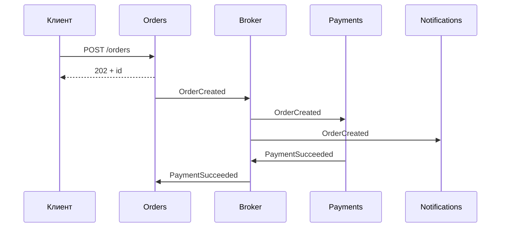

# Синхронное и асинхронное взаимодействие сервисов

↑ [[BE 8.3 Микросервисы и распределённые системы|8.3 Микросервисы и распределённые системы]] · ← [[BE 8.3.3 API Gateway, BFF, service discovery|Предыдущая]] · → [[BE 8.3.5 Распределённые транзакции — Saga (оркестрация и хореография), 2PC|Следующая]]

<!-- meta:start -->

Желательно~3 мин чтенияУровень: senior

<!-- meta:end -->

> [!info] Зачем это на собесе
> Ключ к устойчивости: где вызывать напрямую, где событиями.

> [!note] Переписано
> Страница в Notion была заготовкой, содержимое написано заново.

## Объяснение

| Стиль | Технологии | Плюсы | Минусы |
|---|---|---|---|
| Синхронный | REST, gRPC | простота, немедленный ответ | временная связанность, каскадные отказы, накопление задержек |
| Асинхронный | события/команды в брокере | развязка, буфер, устойчивость | eventual consistency, сложнее отладка |

Правила выбора:

- **Запрос данных** для ответа пользователю — синхронно (с таймаутом, кэшем, fallback).
- **Побочные процессы** (уведомления, аналитика, пересчёты) — асинхронно, событиями.
- **Команды между сервисами** с долгим выполнением — через очередь/сагу, ответ 202.
- Избегайте длинных синхронных цепочек A → B → C → D: доступность = произведение доступностей (0,99⁴ ≈ 0,96).

Способы снижения связанности:

| Приём | Как |
|---|---|
| Event-carried state transfer | событие несёт данные, потребитель хранит локальную копию |
| Локальные read-модели | запросы не выходят в сеть |
| Кэш и circuit breaker | переживание сбоя зависимости |
| Outbox | надёжная публикация событий |
| Versioned contracts | совместимая эволюция |

## Нюансы и подводные камни

- «Асинхронный RPC» (ожидание ответа из очереди) сохраняет связанность.
- Порядок и дубли сообщений: идемпотентность.
- События не должны раскрывать внутреннюю модель: публичные контракты.
- Синхронные вызовы внутри обработчиков сообщений тормозят потребителей.

## Практика

1. Перерисуйте цепочку синхронных вызовов на смесь sync и событий.
2. Посчитайте доступность цепочки из 4 сервисов по 99,9%.
3. Реализуйте локальную копию справочника по событиям.

## Вопросы с ответами

> [!question]- Что такое временная связанность?
> Зависимость, при которой вызывающий работает только пока доступен вызываемый.

> [!question]- Когда выбирать события вместо вызова?
> Когда результат не нужен для немедленного ответа и требуется развязка по времени и нагрузке.

## Связанные темы

- [[N:3ea33104867981cfa283cc1de55bd7d1]]
- [[N:3ea33104867981069260ff778b348f80]]
