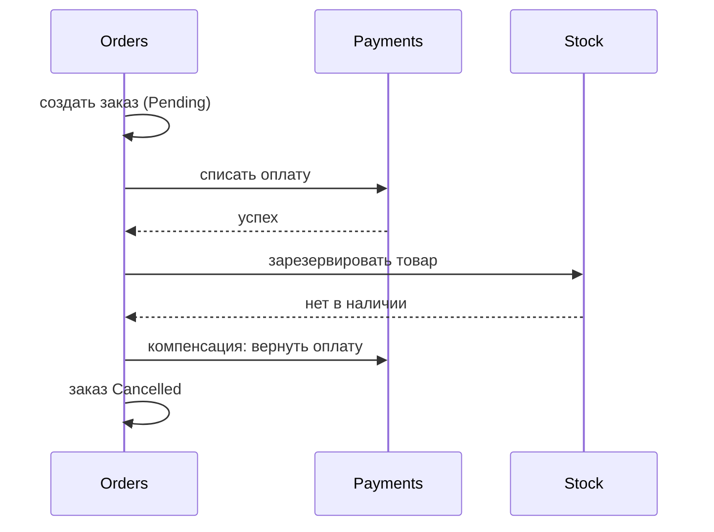

# Распределённые транзакции: Saga (оркестрация и хореография), 2PC

↑ [[BE 8.3 Микросервисы и распределённые системы|8.3 Микросервисы и распределённые системы]] · ← [[BE 8.3.4 Синхронное и асинхронное взаимодействие сервисов|Предыдущая]] · → [[BE 8.3.6 Eventual consistency, CAP и PACELC|Следующая]]

<!-- meta:start -->
<div class="meta-strip"><span class="badge should">Желательно</span><span class="chip">~3 мин чтения</span><span class="chip">Уровень: senior</span></div>
<!-- meta:end -->


> [!info] Зачем это на собесе
> Ключевой вопрос микросервисов: «как обеспечить согласованность без общей транзакции».

> [!note] Переписано
> Страница в Notion была заготовкой, содержимое написано заново.

## Объяснение

**2PC (Two-Phase Commit)**: координатор просит участников подготовиться (prepare), затем подтвердить (commit). Даёт атомарность, но блокирует ресурсы, зависит от координатора и плохо масштабируется; в облачных микросервисах не используется (MSDTC).

**Saga** — последовательность локальных транзакций; при сбое выполняются **компенсирующие** действия.



| Вид | Как | Плюсы/минусы |
|---|---|---|
| Хореография | сервисы реагируют на события друг друга, координатора нет | простота для 2–3 шагов; сложно понять общий поток |
| Оркестрация | оркестратор (state machine) управляет шагами | явный процесс, проще отладка; дополнительный компонент |

```csharp
// Оркестрация: MassTransit state machine
Initially(When(OrderSubmitted).Then(...).TransitionTo(AwaitingPayment).Publish(ctx => new ChargePayment(ctx.Saga.OrderId)));
During(AwaitingPayment,
    When(PaymentSucceeded).TransitionTo(Reserving).Publish(...),
    When(PaymentFailed).TransitionTo(Cancelled));
During(Reserving, When(StockReservationFailed).Publish(ctx => new RefundPayment(...)).TransitionTo(Cancelled));
```

Свойства саг: **нет изоляции** (промежуточные состояния видны), нужны **семантические блокировки** («Pending»), **идемпотентные шаги и компенсации**, надёжная публикация (outbox), таймауты.

## Нюансы и подводные камни

- Компенсация не всегда возможна («письмо отправлено»): продумывайте порядок — необратимые шаги в конце.
- Шаг может выполниться повторно — идемпотентность обязательна.
- Долгие саги требуют хранения состояния и мониторинга «зависших» процессов.
- Понимайте, что «отмена» — тоже бизнес-событие.
- Не ищите ACID там, где допустима eventual consistency.

## Практика

1. Реализуйте сагу заказа с оплатой и резервом, включая компенсацию.
2. Сымитируйте сбой на каждом шаге и проверьте итоговое состояние.
3. Добавьте мониторинг зависших саг по таймауту.

## Вопросы с ответами

> [!question]- Почему не 2PC в микросервисах?
> Блокирует ресурсы, создаёт единую точку отказа и не масштабируется; связывает сервисы и БД технически.

> [!question]- Оркестрация или хореография?
> Хореография — для коротких простых потоков; оркестрация — для сложных процессов с явным управлением.

> [!question]- Что такое компенсирующая транзакция?
> Действие, семантически отменяющее эффект выполненного шага.

## Связанные темы

- [[N:3ea33104867981a697b2ca3e5ba807ec]]
- [[N:3ea331048679814b8cded192367036e3]]
