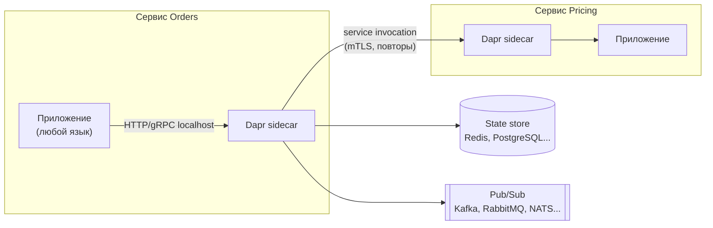
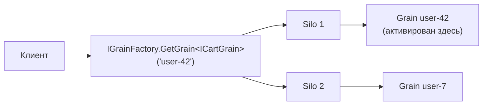

# Dapr и Orleans: sidecar-блоки и виртуальные акторы

↑ [[BE 8.3 Микросервисы и распределённые системы|8.3 Микросервисы и распределённые системы]] · ← [[BE 8.3.8 Общий код между сервисами — shared kernel, NuGet-пакеты, базовые образы|Предыдущая]]

<!-- meta:start -->
<div class="meta-strip"><span class="badge should">Желательно</span><span class="chip">~11 мин чтения</span><span class="chip">Уровень: senior</span></div>
<!-- meta:end -->

> [!info] Зачем это на собесе
> «Как вы реализуете состояние, pub/sub и вызовы между сервисами, чтобы не привязываться к брокеру и базе?» и «Что такое модель акторов?» Dapr и Orleans это два разных ответа: Dapr выносит инфраструктурные блоки в sidecar и работает с любым языком, Orleans даёт модель виртуальных акторов внутри .NET.

## Подтемы
- [ ] Dapr: building blocks и sidecar
- [ ] Компоненты и переносимость
- [ ] Orleans: grains и виртуальные акторы
- [ ] Когда что выбирать
- [ ] Альтернативы и риски

## Объяснение

### Dapr
**Dapr** (Distributed Application Runtime, проект CNCF) запускает рядом с каждым сервисом **sidecar**, который предоставляет через HTTP или gRPC типовые блоки распределённых систем. Приложение говорит с sidecar на `localhost`, а тот общается с реальной инфраструктурой.



| Блок | Что делает |
|---|---|
| Service invocation | вызов другого сервиса по имени с mTLS, повторами и трассировкой |
| State management | хранение ключ-значение в подключаемом хранилище |
| Pub/Sub | публикация и подписка через подключаемый брокер |
| Bindings | входящие и исходящие связи с внешними системами |
| Secrets, Configuration | доступ к секретам и настройкам |
| Actors, Workflows | акторы и долгие оркестрации |

### Компоненты и переносимость
Конкретное хранилище или брокер задаются **компонентом** (YAML), а не кодом. Сменить Redis на PostgreSQL для состояния или RabbitMQ на Kafka можно, поменяв компонент, код приложения остаётся тем же.

```yaml
apiVersion: dapr.io/v1alpha1
kind: Component
metadata:
  name: statestore
spec:
  type: state.redis
  version: v1
  metadata:
    - name: redisHost
      value: redis:6379
```

### Orleans
**Orleans** — фреймворк виртуальных акторов для .NET (от Microsoft Research). **Grain** это объект с идентификатором и состоянием, который платформа создаёт по требованию, размещает на одном из серверов кластера и активирует или выгружает автоматически. Вы вызываете grain по ключу, не заботясь о том, где он находится.


Ключевые свойства:
- **Один поток на grain:** вызовы одного grain обрабатываются по очереди, гонок данных внутри нет.
- **Виртуальность:** grain существует логически всегда, физически активируется по запросу.
- **Состояние** сохраняется в подключаемое хранилище, есть таймеры и reminders, потоки событий.
- Подходит для сущностей с состоянием и высокой конкурентностью: корзины, игровые сессии, чаты, устройства IoT.

### Dapr Actors и Orleans
Dapr тоже умеет акторов, но Orleans глубже интегрирован с .NET и проще для сложной логики на C♯. Dapr выбирают, когда нужен переносимый набор блоков на многих языках.

### Сравнение и выбор
| | Dapr | Orleans |
|---|---|---|
| Идея | sidecar с готовыми блоками | виртуальные акторы в процессе приложения |
| Языки | любые | .NET |
| Состояние | через state store | grain с состоянием |
| Накладные расходы | дополнительный sidecar, сетевой хоп | вызовы внутри кластера |
| Подходит | полиглот-микросервисы, переносимость инфраструктуры | сущности с состоянием, высокая конкурентность |

### Альтернативы и риски
- **Akka.NET, Proto.Actor** — другие модели акторов.
- **MassTransit, библиотеки и обычный код** ([[BE 5.4.10 MassTransit и абстракции над брокерами|абстракции над брокерами]]) дешевле, если инфраструктура у вас одна и стабильна.
- **Риски Dapr:** лишний слой и задержка, ограничения абстракции (общий интерфейс скрывает возможности конкретного брокера), эксплуатация sidecar.
- **Риски Orleans:** необычная модель, нужно мыслить grain'ами; ограничения на блокирующие вызовы и размер состояния.

## Примеры

### Dapr: состояние, pub/sub и вызов сервиса
```csharp
using Dapr.Client;

var builder = WebApplication.CreateBuilder(args);
builder.Services.AddDaprClient();
var app = builder.Build();

app.MapPost("/orders", async (Order order, DaprClient dapr) =>
{
    await dapr.SaveStateAsync("statestore", $"order-{order.Id}", order);                    // состояние
    await dapr.PublishEventAsync("pubsub", "orders", order);                                // pub/sub
    var price = await dapr.InvokeMethodAsync<Order, decimal>(HttpMethod.Post, "pricing", "calculate", order);  // вызов сервиса pricing
    return Results.Ok(new { order.Id, price });
});
app.Run();

public record Order(int Id, decimal Total);
```
Пакет `Dapr.AspNetCore`. Локальный запуск: `dapr run --app-id orders --app-port 5000 -- dotnet run`.

### Orleans: корзина как grain
```csharp
using Microsoft.Extensions.DependencyInjection;
using Microsoft.Extensions.Hosting;
using Orleans;

var host = Host.CreateDefaultBuilder(args)
    .UseOrleans(silo => silo.UseLocalhostClustering().AddMemoryGrainStorageAsDefault())
    .Build();
await host.StartAsync();

var client = host.Services.GetRequiredService<IGrainFactory>();
var cart = client.GetGrain<ICartGrain>("user-42");     // один экземпляр на ключ
await cart.AddAsync("milk");
Console.WriteLine(await cart.CountAsync());            // 1

await host.StopAsync();

public interface ICartGrain : IGrainWithStringKey
{
    Task AddAsync(string item);
    Task<int> CountAsync();
}

public class CartGrain : Grain, ICartGrain
{
    private readonly List<string> _items = [];
    public Task AddAsync(string item) { _items.Add(item); return Task.CompletedTask; }
    public Task<int> CountAsync() => Task.FromResult(_items.Count);
}
```
Пакеты `Microsoft.Orleans.Server`, `Microsoft.Orleans.Sdk`. В продакшене используют постоянное хранилище и кластеризацию (например, Redis, PostgreSQL) вместо локальной.

## Нюансы и подводные камни
- **Абстракция не бесплатна.** Dapr скрывает отличия брокеров и хранилищ, но самые полезные возможности конкретной технологии могут оказаться недоступными.
- **Sidecar это ещё один процесс.** Добавляет задержку, потребляет ресурсы и требует мониторинга.
- **Grain не должен блокироваться.** Длительные синхронные операции блокируют очередь вызовов grain.
- **Размер состояния и частота записи.** Большое состояние и частые записи в grain убивают производительность.
- **Идентификатор grain.** Продумайте ключи: по ним распределяется нагрузка, горячий ключ станет узким местом.
- **Не усложняйте.** Для типичного CRUD-сервиса ни Dapr, ни Orleans не нужны.
- **Совместимость версий.** Dapr, Orleans и их компоненты быстро развиваются, фиксируйте версии.

## Вопросы с ответами
> [!question]- Что такое Dapr?
> Runtime, который запускается рядом с приложением в виде sidecar и предоставляет через HTTP/gRPC блоки распределённых систем: вызов сервисов, состояние, pub/sub, секреты, акторы. Конкретная инфраструктура подключается компонентами в YAML.

> [!question]- В чём польза компонентов Dapr?
> Код приложения обращается к общему API блока, а реализация (Redis, PostgreSQL, Kafka, RabbitMQ) меняется конфигурацией без правки кода.

> [!question]- Что такое модель акторов и виртуальный актор в Orleans?
> Актор это объект с состоянием, обрабатывающий сообщения по одному, без общей памяти и блокировок. В Orleans grain виртуален: он логически существует всегда, а платформа создаёт его на нужном узле по запросу и выгружает, когда он не нужен.

> [!question]- Когда Orleans лучше обычного сервиса с БД?
> Для множества независимых сущностей с состоянием и высокой конкурентностью (игровые сессии, корзины, устройства), где обращение «в базу на каждый запрос» слишком дорого, а последовательная обработка вызовов сущности упрощает логику.

> [!question]- Какие минусы у Dapr?
> Дополнительный sidecar и сетевой хоп, зависимость от абстракций (скрывают особенности брокеров), больше компонентов для эксплуатации и мониторинга.

## Связанные темы
- Микросервисы: [[BE 8.3.1 Монолит или микросервисы — когда что|Монолит или микросервисы]]
- Взаимодействие сервисов: [[BE 8.3.4 Синхронное и асинхронное взаимодействие сервисов|Синхронное и асинхронное взаимодействие]]
- Распределённые блокировки и лидерство: [[BE 8.3.7 Распределённые блокировки, лидерство, часы|Распределённые блокировки, лидерство, часы]]
- Service mesh: [[DO 5.19 Service mesh — Istio, Linkerd, Cilium и когда он нужен|Service mesh]]
