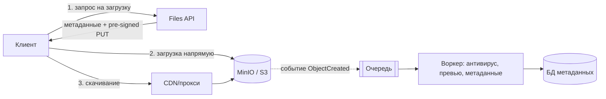

# Кейс: хранение документов и файлов (MinIO)

↑ [[BE 8.4 Backend System Design|8.4 Backend System Design]] · ← [[BE 8.4.9 Кейс — аналитика событий (Kafka + ClickHouse)|Предыдущая]]

<!-- meta:start -->

Обязательно~3 мин чтенияУровень: senior

<!-- meta:end -->

> [!info] Зачем это на собесе
> Задача на хранение больших бинарных данных, права доступа и доставку.

> [!note] Переписано
> Страница в Notion была заготовкой, содержимое написано заново.

## Объяснение

**Требования**: загрузка и скачивание файлов (от КБ до ГБ), версии документов, права доступа, предпросмотр, антивирус, срок хранения, аудит, высокая надёжность данных.

Решения:

| Вопрос | Решение |
|---|---|
| Хранение | объектное хранилище (S3/MinIO); в БД только метаданные (id, ключ, размер, тип, владелец, версия, хэш) |
| Загрузка | pre-signed URL / multipart для больших файлов, докачка; файл не проходит через приложение |
| Скачивание | pre-signed GET с коротким сроком либо прокси с проверкой прав; CDN для публичных |
| Права | проверка в API; ключи объектов не угадываются (GUID) |
| Версионирование | versioning bucket или версии в метаданных |
| Надёжность | erasure coding/репликация, несколько узлов/зон, бэкапы |
| Целостность | хэш (SHA-256), проверка после загрузки |
| Безопасность | шифрование в покое и в транзите, антивирус, ограничение типов/размеров, изоляция |
| Дедупликация | по хэшу содержимого (content-addressable) |
| Жизненный цикл | lifecycle: перенос в холодное хранилище, удаление |
| Метаданные для поиска | отдельный индекс (Elasticsearch) |
| Аудит | журнал доступа к документам |

Готовые предпросмотры: генерируются воркером по событию, кэшируются.

## Нюансы и подводные камни

- Загрузка через приложение упирается в память и пропускную способность.
- Файл появился в хранилище, но метаданные не записались (и наоборот): согласуйте через события/сверку и очистку «сирот».
- Публичные ссылки без срока и проверки утекают.
- Имена файлов клиента — только как метаданные.
- Ограничения размера и время жизни pre-signed ссылок.

## Практика

1. Реализуйте загрузку через pre-signed multipart URL и обработку события `ObjectCreated`.
2. Добавьте проверку хэша и антивирус в воркер.
3. Настройте lifecycle для временных файлов и версионирование.

## Вопросы с ответами

> [!question]- Как загружать большие файлы?
> Multipart-загрузка напрямую в хранилище по pre-signed URL, минуя приложение, с докачкой по частям.

> [!question]- Где хранить метаданные?
> В реляционной БД с ключом объекта; сами файлы — в объектном хранилище.

## Связанные темы

- [[N:3ea33104867981848d19c53bf747c96f]]
- [[N:3ea3310486798147b462ffb4f50ae8e3]]
