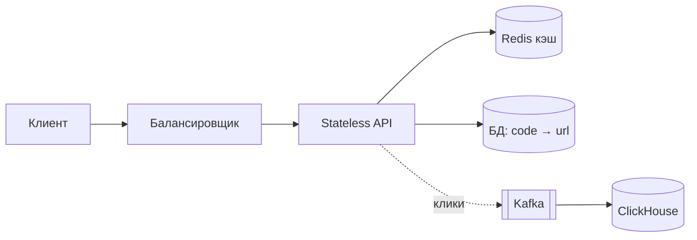

# Кейс: URL shortener

↑ [[BE 8.4 Backend System Design|8.4 Backend System Design]] · ← [[BE 8.4.3 Масштабирование — вертикальное, горизонтальное, stateless-сервисы|Предыдущая]] · → [[BE 8.4.5 Кейс — rate limiter|Следующая]]

<!-- meta:start -->
<div class="meta-strip"><span class="badge must">Обязательно</span><span class="chip">~3 мин чтения</span><span class="chip">Уровень: senior</span></div>
<!-- meta:end -->


> [!info] Зачем это на собесе
> Классическая задача. Показывает генерацию ключей, кэш и оценку нагрузки.

> [!note] Переписано
> Страница в Notion была заготовкой, содержимое написано заново.

## Объяснение

**Требования**: создать короткую ссылку, редирект по ней, опционально свой алиас, срок жизни, статистика кликов. Нефункциональные: редирект быстро (< 50 мс), высокая доступность, чтения ≫ записей (100:1), данные хранятся годами.

**Оценка**: 100 млн ссылок в месяц → ~40 записей/с, ~4 000 RPS чтений (пик 20 000). Хранение ≈ 3 ТБ за 5 лет.

**API**:

```http
POST /links   { "url": "https://…", "alias": "my-link", "ttl": "30d" }  → 201 { "short": "https://sho.rt/aB3xY9" }
GET  /{code}  → 301/302 Location: https://…
```

**Генерация кода** (7 символов Base62 ≈ 62⁷ ≈ 3,5 трлн комбинаций):

| Способ | Плюсы | Минусы |
|---|---|---|
| Хэш URL (MD5 → первые 7 символов) | одинаковый URL — одинаковый код | коллизии, нужна проверка |
| Счётчик + Base62 | без коллизий, коротко | предсказуемо; счётчик — единая точка (диапазоны на инстанс) |
| Случайный ID + проверка уникальности | непредсказуемо | повторные попытки при коллизии |
| Заранее сгенерированные ключи (Key Generation Service) | быстро, без коллизий | отдельный сервис |

**Схема**:



- Хранилище: key-value (DynamoDB/Cassandra) или PostgreSQL с индексом по `code`; шардирование по хэшу кода.
- Кэш Redis для горячих кодов (LRU): попадание > 90%.
- 301 (постоянный) кэшируется браузером и снижает нагрузку, но теряет статистику; 302 — точнее считает клики.
- Клики отправляются асинхронно в Kafka → агрегация в ClickHouse.
- Удаление просроченных ссылок — фоновая задача/TTL.

## Нюансы и подводные камни

- Защита от злоупотреблений: фишинг-ссылки, rate limiting, проверка URL.
- Предсказуемые коды позволяют перебирать чужие ссылки.
- Коллизии хэша при высокой нагрузке.
- Единая точка отказа в генераторе счётчика.
- Кэширование негативных результатов (несуществующие коды).

## Практика

1. Реализуйте генерацию Base62 из диапазонов счётчика.
2. Оцените hit-rate кэша на реальном распределении запросов.
3. Опишите деградацию при падении Redis и БД.

## Вопросы с ответами

> [!question]- Как гарантировать уникальность кода?
> Счётчик с выдачей диапазонов инстансам или проверка уникальности при случайной генерации.

> [!question]- 301 или 302?
> 301 кэшируется и разгружает сервис, 302 позволяет считать клики; выбор по требованиям.

## Связанные темы

- [[N:3ea331048679819193bff686992609a1]]
- [[N:3ea331048679817fb9bed993a82314dc]]
