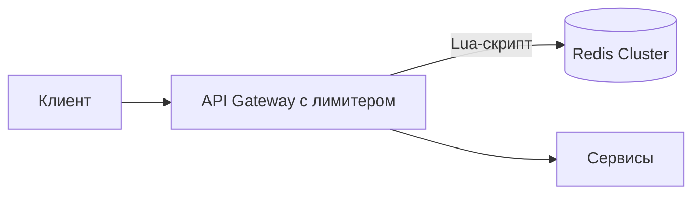

# Кейс: rate limiter

↑ [[BE 8.4 Backend System Design|8.4 Backend System Design]] · ← [[BE 8.4.4 Кейс — URL shortener|Предыдущая]] · → [[BE 8.4.6 Кейс — система уведомлений|Следующая]]

<!-- meta:start -->
<div class="meta-strip"><span class="badge must">Обязательно</span><span class="chip">~3 мин чтения</span><span class="chip">Уровень: senior</span></div>
<!-- meta:end -->


> [!info] Зачем это на собесе
> Задача на алгоритмы ограничения и распределённую консистентность счётчиков.

> [!note] Переписано
> Страница в Notion была заготовкой, содержимое написано заново.

## Объяснение

**Требования**: ограничивать число запросов клиента (по ключу/пользователю/IP) за период, работать в кластере, добавлять минимальную задержку (< 1–2 мс), быть отказоустойчивым (при падении лимитера — «fail open» или «fail closed» по политике), давать клиенту понятный ответ (429 + `Retry-After`).

Алгоритмы (см. [[N:3ea331048679813d96e3e4f7c0faab14]]):

| Алгоритм | Память на клиента | Точность | Особенности |
|---|---|---|---|
| Fixed window | счётчик | низкая на границе окна | просто |
| Sliding window log | список меток времени | высокая | много памяти |
| Sliding window counter | 2 счётчика | хорошая | компромисс |
| Token bucket | токены + время | хорошая | допускает всплески |
| Leaky bucket | очередь | сглаживает | |

**Распределённая схема**:



```lua
-- Token bucket в Redis (атомарно в Lua)
local tokens = tonumber(redis.call('HGET', KEYS[1], 'tokens') or ARGV[1])
local ts = tonumber(redis.call('HGET', KEYS[1], 'ts') or ARGV[3])
tokens = math.min(ARGV[1], tokens + (ARGV[3] - ts) * ARGV[2])   -- пополнение
local allowed = tokens >= 1
if allowed then tokens = tokens - 1 end
redis.call('HSET', KEYS[1], 'tokens', tokens, 'ts', ARGV[3]); redis.call('EXPIRE', KEYS[1], 3600)
return allowed and 1 or 0
```

Решения:

- Ключ = `клиент:эндпоинт`, TTL для очистки.
- Атомарность через Lua или `INCR` + `EXPIRE`.
- Шардирование Redis по ключу; локальный кэш счётчиков для снижения задержки (точность за скорость).
- Правила хранятся в конфигурации с горячим обновлением.
- Гибридный подход: локальный лимитер (грубый) + глобальный (точный).
- Заголовки `X-RateLimit-Limit/Remaining/Reset`.

## Нюансы и подводные камни

- Гонки при read-modify-write без атомарности.
- Синхронизация часов между узлами: используйте время Redis.
- Fail open рискует перегрузкой, fail closed — недоступностью.
- Горячие ключи (один крупный клиент) перегружают шард.
- Лимиты по IP несправедливы за NAT.

## Практика

1. Реализуйте token bucket на Redis Lua и проверьте гонки нагрузочным тестом.
2. Добавьте локальный кэш и оцените потерю точности.
3. Определите политику fail open/closed для разных эндпоинтов.

## Вопросы с ответами

> [!question]- Как обеспечить атомарность счётчика в Redis?
> Lua-скрипт или атомарные команды (`INCR`), выполняющиеся на сервере целиком.

> [!question]- Fail open или fail closed?
> Зависит от риска: публичные API часто fail open, чувствительные операции (логин, платежи) — fail closed.

## Связанные темы

- [[N:3ea33104867981489216f9ec1360eaa7]]
- [[N:3ea331048679818e9185d04f5704e45a]]
