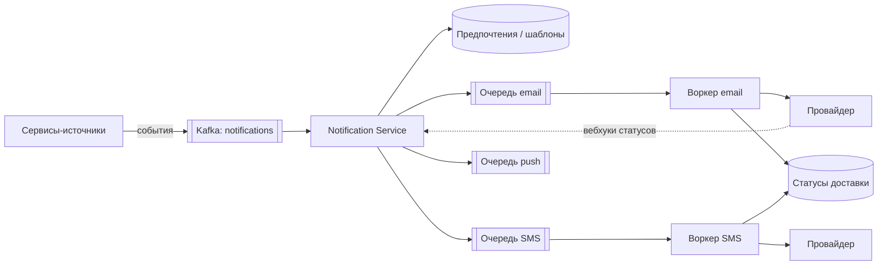

# Кейс: система уведомлений

↑ [[BE 8.4 Backend System Design|8.4 Backend System Design]] · ← [[BE 8.4.5 Кейс — rate limiter|Предыдущая]] · → [[BE 8.4.7 Кейс — сервис записи к врачу - бронирование слотов|Следующая]]

<!-- meta:start -->

Обязательно~3 мин чтенияУровень: senior

<!-- meta:end -->

> [!info] Зачем это на собесе
> Пример асинхронной системы с очередями, повторами, шаблонами и предпочтениями пользователя.

> [!note] Переписано
> Страница в Notion была заготовкой, содержимое написано заново.

## Объяснение

**Требования**: отправка уведомлений по каналам (email, SMS, push, in-app), триггеры от событий и рассылки, шаблоны и локализация, предпочтения пользователя и «не беспокоить», доставка «хотя бы раз» без дублей для пользователя, приоритеты (2FA-код срочный, маркетинг — нет), статусы и аналитика.

Ключевые решения:

| Вопрос | Решение |
|---|---|
| Развязка источников | события в Kafka, единый контракт `NotificationRequested` |
| Надёжность | outbox у источника, at-least-once + дедупликация по `notification_id` |
| Повторы | retry с backoff, DLQ; смена провайдера при сбое (failover) |
| Приоритеты | отдельные очереди/топики и пулы воркеров |
| Ограничения провайдеров | rate limiting на канал, батчинг |
| Шаблоны | версионируемые шаблоны + подстановка данных, локализация |
| Предпочтения | каналы, расписание, отказ от рассылки (обязательно для маркетинга) |
| Планировщик | отложенные уведомления (delayed queue, планировщик) |
| Статусы | sent/delivered/failed/opened, вебхуки провайдеров |
| Идемпотентность | ключ на событие, чтобы не отправить дважды |
| Безопасность | не логировать содержимое (коды, персональные данные), защита от спама |

Масштабирование: партиции по `user_id`, автоскейл воркеров по длине очереди.

## Нюансы и подводные камни

- Дубли пользователю неприемлемы (два SMS с кодом): дедупликация по идентификатору.
- Провайдеры недоступны/ограничены: очередь и retry, мультипровайдерность.
- Массовые рассылки не должны задерживать срочные: раздельные очереди.
- Учитывайте часовые пояса и законодательство (согласия, отписка).
- Порядок уведомлений важен не всегда: не платите за строгий порядок без нужды.

## Практика

1. Спроектируйте очереди и приоритеты для 2FA и маркетинга.
2. Реализуйте дедупликацию и повторы с DLQ.
3. Опишите метрики: доля доставки, задержка отправки, длина очередей.

## Вопросы с ответами

> [!question]- Как не отправить уведомление дважды?
> Идемпотентный идентификатор уведомления и проверка обработанных (Inbox) при at-least-once.

> [!question]- Как отделить срочные уведомления от массовых?
> Разные очереди/топики и независимые пулы воркеров с приоритетами.

## Связанные темы

- [[N:3ea331048679817fb9bed993a82314dc]]
- [[N:3ea3310486798124b64ff3911a0b7c51]]
