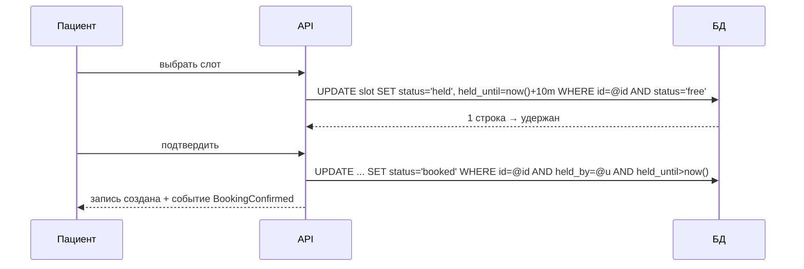

# Кейс: сервис записи к врачу / бронирование слотов

↑ [[BE 8.4 Backend System Design|8.4 Backend System Design]] · ← [[BE 8.4.6 Кейс — система уведомлений|Предыдущая]] · → [[BE 8.4.8 Кейс — генерация отчётов и тяжёлые фоновые задачи|Следующая]]

<!-- meta:start -->
<div class="meta-strip"><span class="badge must">Обязательно</span><span class="chip">~3 мин чтения</span><span class="chip">Уровень: senior</span></div>
<!-- meta:end -->

> [!info] Зачем это на собесе
> Задача на конкурентность: два пользователя не должны занять один слот.

## Объяснение

**Требования**: показать расписание врача, забронировать слот, отменить/перенести, напоминания, не допустить двойной брони, выдерживать пики (открытие записи), уметь работать по часовым поясам.

Модель:

```text
schedule(id, doctor_id, date, start, end, capacity)
slot(id, doctor_id, start_time, end_time, status)          -- free / held / booked
booking(id, slot_id, patient_id, status, created_at)
UNIQUE (slot_id) WHERE status IN ('held','booked')          -- защита от двойной брони
```

**Защита от двойного бронирования**:

| Способ | Пример |
|---|---|
| Уникальный индекс | `CREATE UNIQUE INDEX ... ON booking(slot_id) WHERE status <> 'cancelled'`; нарушение = «слот занят» |
| Условное обновление | `UPDATE slot SET status='booked' WHERE id=@id AND status='free'` (проверить число затронутых строк) |
| Оптимистичная блокировка | версия строки |
| `SELECT ... FOR UPDATE` | пессимистичная блокировка слота |
| Redis-лок на слот | доп. защита при частых конфликтах; не единственная |

**Удержание слота (hold)**: пользователь выбирает слот → он «удерживается» на 5–10 минут (TTL), затем подтверждение/оплата; фоновая задача возвращает просроченные удержания.



Прочее: расписание кэшируется (Redis) с инвалидацией по изменению; напоминания — планировщик и очередь уведомлений (см. [[N:3ea331048679818e9185d04f5704e45a]]); аудит и персональные данные пациентов (шифрование, аудит доступа); часовые пояса хранятся как UTC + зона клиники; интеграция с МИС (см. FHIR).

## Нюансы и подводные камни

- Проверка «слот свободен» отдельным SELECT перед INSERT — классическая гонка.
- Пики при открытии записи: очередь ожидания, rate limiting.
- Двусторонняя интеграция с внешней системой расписаний: конфликты и сверка.
- Отмена и перенос — тоже конкурентные операции.
- Права: пациент видит только свои записи.

## Практика

1. Реализуйте бронирование с уникальным индексом и проверьте гонку 100 параллельных запросов.
2. Добавьте удержание слота с TTL и фоновую очистку.
3. Опишите поведение при одновременных бронировании и отмене.

## Вопросы с ответами

> [!question]- Как исключить двойную бронь?
> Уникальное ограничение в БД и условное обновление статуса; кэши и блокировки — только дополнение.

> [!question]- Зачем удержание слота?
> Даёт пользователю время завершить действие, не блокируя слот навсегда.

## Связанные темы

- [[N:3ea331048679818e9185d04f5704e45a]]
- [[N:3ea331048679812d8303e168b42af02e]]
