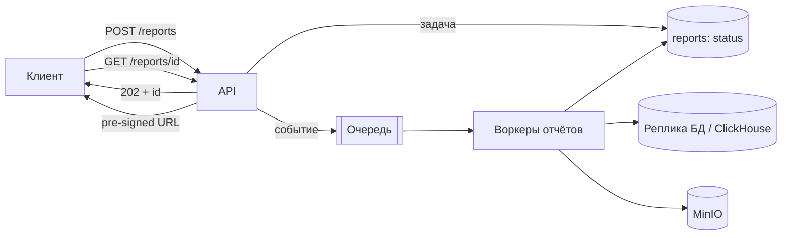

# Кейс: генерация отчётов и тяжёлые фоновые задачи

↑ [[BE 8.4 Backend System Design|8.4 Backend System Design]] · ← [[BE 8.4.7 Кейс — сервис записи к врачу - бронирование слотов|Предыдущая]] · → [[BE 8.4.9 Кейс — аналитика событий (Kafka + ClickHouse)|Следующая]]

<!-- meta:start -->

Обязательно~3 мин чтенияУровень: senior

<!-- meta:end -->

> [!info] Зачем это на собесе
> Как проектировать долгие операции, не блокируя API.

> [!note] Переписано
> Страница в Notion была заготовкой, содержимое написано заново.

## Объяснение

**Требования**: пользователь запрашивает отчёт (часто минуты и гигабайты данных), система не должна падать от пиков, нужен статус выполнения, отмена, история, безопасная выдача результата.

Решения:

| Вопрос | Решение |
|---|---|
| Асинхронность | `POST` → `202 Accepted` + `Location`; клиент опрашивает или получает уведомление |
| Очередь | брокер, приоритеты, ограничение параллелизма |
| Изоляция | отдельные воркеры и реплика/OLAP-источник: OLTP не страдает |
| Надёжность | статусы в БД (`queued/running/done/failed`), повтор при падении воркера, идемпотентный ключ |
| Большие данные | потоковая генерация, чанки, файлы в объектное хранилище, а не в память |
| Отмена/таймаут | `CancellationToken`, дедлайн задачи |
| Выдача | pre-signed URL со сроком действия, права доступа |
| Кэш | одинаковые параметры → готовый результат (по хэшу параметров) |
| Справедливость | лимит задач на пользователя/тенанта, приоритеты |
| Очистка | TTL файлов отчётов |
| Наблюдаемость | длительность, длина очереди, доля ошибок |

Идентификация «зависших» задач: heartbeat воркера и повторная постановка при его пропадании.

## Нюансы и подводные камни

- Тяжёлые запросы к основной БД замедляют весь сервис.
- Потеря задач при перезапуске воркера без подтверждения.
- Пользователь запускает один отчёт много раз: дедупликация.
- Неограниченный размер результата: лимиты и предупреждения.
- Утечка данных через публичные ссылки на файлы.

## Практика

1. Реализуйте асинхронный API отчётов со статусами и pre-signed URL.
2. Добавьте heartbeat и повторную постановку зависших задач.
3. Ограничьте параллелизм и объём на пользователя.

## Вопросы с ответами

> [!question]- Почему отчёт нельзя строить в HTTP-запросе?
> Долго и ресурсоёмко: таймауты, блокировка потоков, нестабильность; лучше очередь и асинхронный статус.

> [!question]- Как не потерять задачу при падении воркера?
> Статус в БД и подтверждение обработки в брокере после завершения, повторная постановка по heartbeat.

## Связанные темы

- [[N:3ea3310486798124b64ff3911a0b7c51]]
- [[N:3ea33104867981848d19c53bf747c96f]]
