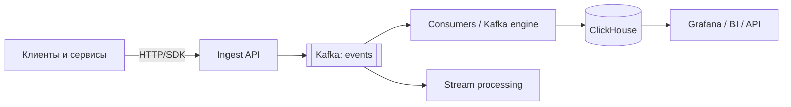

# Кейс: аналитика событий (Kafka + ClickHouse)

↑ [[BE 8.4 Backend System Design|8.4 Backend System Design]] · ← [[BE 8.4.8 Кейс — генерация отчётов и тяжёлые фоновые задачи|Предыдущая]] · → [[BE 8.4.10 Кейс — хранение документов и файлов (MinIO)|Следующая]]

<!-- meta:start -->
<div class="meta-strip"><span class="badge must">Обязательно</span><span class="chip">~3 мин чтения</span><span class="chip">Уровень: senior</span></div>
<!-- meta:end -->


> [!info] Зачем это на собесе
> Пример потоковой аналитики: сбор миллионов событий и быстрые агрегаты.

> [!note] Переписано
> Страница в Notion была заготовкой, содержимое написано заново.

## Объяснение

**Требования**: принимать события (клики, действия, метрики) с высокой скоростью (сотни тысяч/с), хранить месяцы и годы, отвечать на агрегатные запросы за секунды, дашборды, допускается небольшая задержка (секунды).



Решения:

| Вопрос | Решение |
|---|---|
| Приём | stateless ingest-API, валидация, батчирование, ответ 202 |
| Буфер | Kafka: переживает пики и сбои хранилища, replay |
| Загрузка | пакетная вставка большими блоками (ClickHouse не любит построчные INSERT): Kafka engine + materialized view или консьюмер с батчами по 10–100 тыс. |
| Схема | широкая таблица событий: `event_time, user_id, session_id, type, props (JSON)`; `MergeTree`, `PARTITION BY toYYYYMM(event_time)`, `ORDER BY (type, user_id, event_time)` |
| Дедупликация | `ReplacingMergeTree` или id события; идемпотентная вставка |
| Агрегаты | materialized views/проекции для типовых запросов (по часам, дням) |
| Хранение | TTL, tiered storage (холодные данные на дешёвом диске), сжатие |
| Кардинальность | LowCardinality(String), осторожно с `props` |
| Приватность | не хранить лишние персональные данные, псевдонимизация |
| Надёжность | репликация (`ReplicatedMergeTree`), шарды по `user_id` |

```sql
CREATE TABLE events (
  event_time DateTime, user_id UInt64, type LowCardinality(String), props String
) ENGINE = MergeTree PARTITION BY toYYYYMM(event_time) ORDER BY (type, user_id, event_time)
TTL event_time + INTERVAL 13 MONTH;

SELECT toStartOfHour(event_time) h, count() FROM events WHERE type = 'click' AND event_time > now() - INTERVAL 1 DAY GROUP BY h ORDER BY h;
```

## Нюансы и подводные камни

- Частые мелкие вставки создают много «частей» и перегружают слияния.
- Точные `UPDATE`/`DELETE` в ClickHouse дороги: моделируйте append-only.
- Поздние и дублирующиеся события: окна по времени события и дедупликация.
- Схема событий версионируется (Schema Registry).
- Ключ сортировки определяет производительность запросов — проектируйте под них.

## Практика

1. Настройте поток Kafka → ClickHouse и измерьте пропускную способность.
2. Создайте materialized view почасовых агрегатов.
3. Добавьте TTL и сравните размер до и после сжатия.

## Вопросы с ответами

> [!question]- Почему Kafka перед ClickHouse?
> Буфер для пиков и сбоев, возможность replay и независимые потребители.

> [!question]- Почему ClickHouse не любит построчные вставки?
> Каждая вставка создаёт часть данных; мелкие вставки перегружают фоновые слияния.

## Связанные темы

- [[N:3ea331048679812d8303e168b42af02e]]
- [[N:3ea3310486798150b845ea09c4cf422c]]
