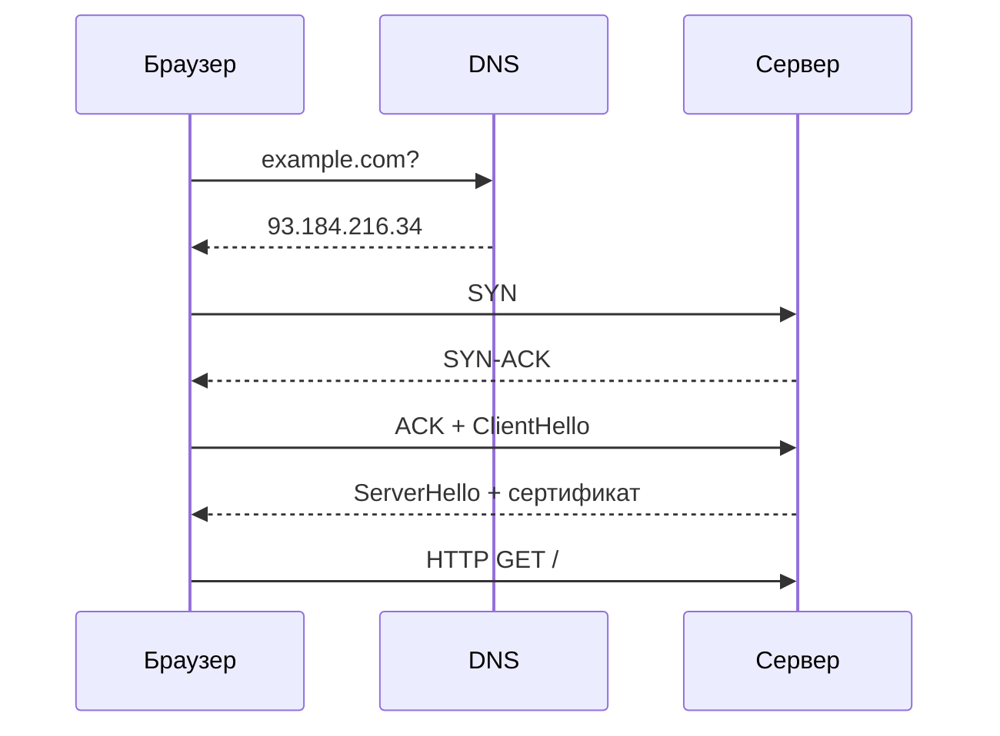

# DNS, TCP, TLS

↑ [[FE 1.1 Как работает веб и браузер|1.1 Как работает веб и браузер]] · → [[FE 1.1.2 HTTP-HTTPS — методы, статусы, заголовки, HTTP-2 и HTTP-3|Следующая]]

<!-- meta:start -->
<div class="meta-strip"><span class="badge should">Желательно</span><span class="chip">~3 мин чтения</span><span class="chip">Уровень: junior</span></div>
<!-- meta:end -->


> [!info] Зачем это на собесе
> Базовый вопрос «что происходит, когда вы открываете сайт» начинается с DNS, TCP и TLS. Нужно уметь объяснить каждый шаг и его стоимость.

> [!note] Переписано
> Страница в Notion была заготовкой, содержимое написано заново.

## Объяснение

Перед первым HTTP-запросом браузер устанавливает соединение:

| Шаг | Что делает | Стоимость |
|---|---|---|
| DNS | превращает имя `example.com` в IP-адрес (кэш браузера → ОС → рекурсивный резолвер → корневые/TLD/авторитативные серверы) | 1 RTT и больше без кэша |
| TCP (3-way handshake) | `SYN → SYN-ACK → ACK`, надёжное упорядоченное соединение | 1 RTT |
| TLS 1.3 | согласование шифров и ключей, проверка сертификата | 1 RTT (0-RTT при возобновлении) |
| HTTP-запрос | сам запрос и ответ | 1 RTT + время сервера |



Ускорение: `dns-prefetch`, `preconnect`, keep-alive и HTTP/2 (одно соединение на много запросов), HTTP/3 (QUIC поверх UDP: нет head-of-line blocking на уровне транспорта, быстрее установка).

```html
<link rel="preconnect" href="https://cdn.example.com" crossorigin>
<link rel="dns-prefetch" href="https://api.example.com">
```

## Нюансы и подводные камни

- Каждый новый домен — новый DNS + TCP + TLS: не дробите ресурсы на десятки доменов.
- DNS-кэш определяется TTL записи; смена IP не мгновенна.
- HTTPS обязателен: без него недоступны Service Worker, Geolocation и др.
- Сертификат проверяется по цепочке доверия и SAN; ошибка → предупреждение браузера.
- HSTS заставляет браузер использовать только HTTPS.

## Практика

1. Откройте DevTools → Network → Timing и найдите DNS, Connect, SSL.
2. Добавьте `preconnect` к API-домену и сравните время первого запроса.
3. Проверьте сертификат сайта (замок → сведения) и цепочку доверия.

## Вопросы с ответами

> [!question]- Зачем TCP handshake?
> Синхронизирует последовательности и подтверждает готовность обеих сторон к обмену.

> [!question]- Чем TLS 1.3 лучше 1.2?
> Быстрее (1 RTT), убраны устаревшие шифры, обязательная прямая секретность.

> [!question]- Что такое preconnect?
> Подсказка браузеру заранее выполнить DNS, TCP и TLS к домену.

## Связанные темы

- [[N:3ea331048679817ab843d2d18cee2479]]
- [[N:3ea33104867981f3bab7cc9fe3d82992]]
