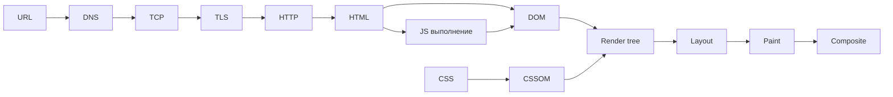

# Что происходит при вводе URL

↑ [[FE 1.1 Как работает веб и браузер|1.1 Как работает веб и браузер]] · ← [[FE 1.1.4 CORS и Same-Origin Policy|Предыдущая]]

<!-- meta:start -->

Желательно~3 мин чтенияУровень: junior

<!-- meta:end -->

> [!info] Зачем это на собесе
> Классический вопрос, объединяющий сеть, браузер и рендеринг. Хороший ответ — структурный, с глубиной по запросу.

> [!note] Переписано
> Страница в Notion была заготовкой, содержимое написано заново.

## Объяснение

1. **Разбор URL**: схема, хост, порт, путь, запрос, фрагмент. Проверка HSTS, кэша, `service worker`.
2. **DNS-разрешение** имени в IP (см. [[N:3ea3310486798116a40fe7fca0db88e4]]).
3. **TCP + TLS** — соединение и шифрование.
4. **HTTP-запрос** на сервер; возможно через CDN, балансировщик, reverse proxy.
5. **Ответ**: код, заголовки, HTML. Возможны редиректы.
6. **Парсинг HTML → DOM**. Встречаемые `<link rel=stylesheet>` блокируют рендер, `<script>` блокирует парсер (если не `async`/`defer`/`module`).
7. **CSSOM** строится из CSS.
8. **Render tree** = DOM + CSSOM (без `display: none`).
9. **Layout (reflow)** — расчёт размеров и позиций.
10. **Paint** — отрисовка в слои; **Composite** — GPU объединяет слои (`transform`, `opacity` не вызывают layout).
11. **Выполнение JS**, события `DOMContentLoaded`, `load`; последующие запросы (API, картинки, шрифты).

Метрики: TTFB, FCP, LCP, CLS, INP; критический путь рендеринга — минимальный набор ресурсов до первого кадра.

## Нюансы и подводные камни

- Синхронный скрипт в `<head>` блокирует парсинг и первый рендер.
- Шрифты и изображения без размеров вызывают сдвиги макета (CLS).
- CSS блокирует рендеринг; JS блокирует парсинг; ресурсы фоновых запросов не блокируют.
- SPA: HTML почти пуст, контент строит JS — поздний LCP без SSR/prerender.
- Кэш и Service Worker могут ответить без сети.

## Практика

1. Запишите Performance-профиль загрузки страницы и найдите этапы парсинга, layout, paint.
2. Найдите блокирующие ресурсы через Lighthouse.
3. Расскажите ответ вслух за 2 минуты и за 5 минут.

## Вопросы с ответами

> [!question]- Что такое critical rendering path?
> Последовательность шагов от получения HTML до первой отрисовки: DOM, CSSOM, render tree, layout, paint.

> [!question]- Что блокирует рендеринг?
> CSS блокирует рендер, синхронный JS блокирует парсинг HTML.

> [!question]- Чем reflow отличается от repaint?
> Reflow пересчитывает геометрию, repaint — только внешний вид; reflow дороже.

## Связанные темы

- [[N:3ea33104867981018b3ad263fdb490a3]]
- [[N:3ea33104867981dcb25cf3f6b7eeba03]]
