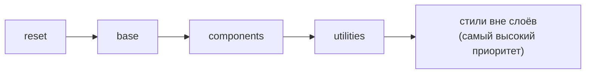

# Современный CSS: nesting, :has(), @layer, subgrid, color-mix и View Transitions

↑ [[FE 1.3 CSS и SASS|1.3 CSS и SASS]] · ← [[FE 1.3.12 Вёрстка на время|Предыдущая]]

<!-- meta:start -->
<div class="meta-strip"><span class="badge should">Желательно</span><span class="chip">~10 мин чтения</span><span class="chip">Уровень: middle</span></div>
<!-- meta:end -->

> [!info] Зачем это на собесе
> Всё больше из того, ради чего раньше подключали SASS и JavaScript, умеет сам CSS: вложенность, родительские селекторы, управление каскадом, смешивание цветов, анимации переходов между страницами. Вопрос «что нового в CSS?» проверяет, следите ли вы за платформой и можете ли заменить тяжёлый инструмент нативной возможностью.

## Подтемы
- [ ] Вложенность (nesting)
- [ ] Селектор `:has()`, `:is()`, `:where()`
- [ ] Каскадные слои `@layer`
- [ ] Subgrid
- [ ] `color-mix()` и современные цвета
- [ ] Единицы `dvh`, `svh`, `lvh` и `text-wrap`
- [ ] View Transitions
- [ ] Поддержка браузерами и fallback

## Объяснение

### Вложенность (nesting)
Раньше вложенные правила требовали SASS. Теперь их понимает браузер:

```css
.card {
  padding: 1rem;

  & .title { font-weight: 700; }     /* .card .title */
  &:hover { color: red; }            /* .card:hover */

  @media (width >= 600px) {          /* медиа-запрос внутри правила */
    padding: 2rem;
  }
}
```
Символ `&` обозначает родительский селектор. Вложенные `@media` и `@container` остаются рядом с компонентом. Разница с SASS: nesting работает во время выполнения и не склеивает имена (нет `&-suffix`).

### Селекторы `:has()`, `:is()`, `:where()`
- **`:has()`** выбирает элемент **по содержимому** (родительский селектор):

```css
.form:has(input:invalid) { outline: 2px solid red; }   /* форма с невалидным полем */
.card:has(img) { display: grid; }                      /* карточка с картинкой */
label:has(+ input:required)::after { content: " *"; }  /* метка перед обязательным полем */
```
- **`:is(a, b)`** сокращает список селекторов, специфичность равна наибольшей в списке.
- **`:where(a, b)`** то же, но **специфичность нулевая**: удобно для базовых стилей, которые легко переопределить ([[FE 1.3.3 Каскад, специфичность, наследование|каскад и специфичность]]).

### Каскадные слои `@layer`
Слои задают **порядок приоритета групп стилей независимо от специфичности**. Слой, объявленный позже, побеждает слой, объявленный раньше, даже если селектор в первом слое «сильнее».

```css
@layer reset, base, components, utilities;   /* порядок задан один раз */

@layer base       { a { color: blue; } }
@layer components { .btn { color: white; } }
@layer utilities  { .text-red { color: red; } }
```
Стили **вне слоёв** побеждают стили в слоях. Слои решают проблему «войны специфичности» при подключении сторонних библиотек: положите их в нижний слой, а свои стили выше.



### Subgrid
Вложенная сетка может **использовать линии родительской**, а не строить свои. Так выравниваются элементы внутри независимых карточек:

```css
.parent { display: grid; grid-template-columns: repeat(3, 1fr); }
.child  { grid-column: span 3; display: grid; grid-template-columns: subgrid; }
```
Типичный случай: в карточках заголовок, текст и кнопка выстраиваются по строкам одинаково, даже если тексты разной длины ([[FE 1.3.6 Grid|Grid]]).

### Цвета: `color-mix()` и современные пространства
```css
:root { --brand: #3366ff; }
.btn:hover { background: color-mix(in srgb, var(--brand) 85%, black); }   /* темнее на 15 % */
.badge     { background: color-mix(in oklch, var(--brand) 20%, white); }  /* светлый тон */
```
Функция смешивает цвета прямо в CSS, поэтому палитру можно строить из одной переменной без SASS-функций. Пространство `oklch` даёт более равномерные по восприятию оттенки. Связано с [[FE 1.3.8 CSS-переменные|CSS-переменными]].

### Единицы и типографика
| Возможность | Что делает |
|---|---|
| `dvh`, `svh`, `lvh` | высота области просмотра с учётом динамической панели браузера на телефонах: `dvh` меняется, `svh` минимальная, `lvh` максимальная |
| `text-wrap: balance` | выравнивает длину строк в коротком тексте (заголовки) |
| `text-wrap: pretty` | избегает «висячих» одиночных слов в конце абзаца |
| `aspect-ratio` | задаёт пропорции блока |
| `@container` | адаптация по размеру контейнера, а не окна ([[FE 1.3.7 Адаптивность — media и container queries, единицы измерения|адаптивность]]) |

`100vh` на мобильных часто перекрывается панелью адреса; `100dvh` решает проблему.

### View Transitions
API для плавных анимированных переходов между состояниями DOM и страницами. Браузер делает снимок «до» и «после» и анимирует разницу.

```js
function navigate(update) {
  if (!document.startViewTransition) return update();      // fallback: без анимации
  document.startViewTransition(update);                     // update() меняет DOM
}
```
```css
::view-transition-old(root) { animation: fade-out .2s; }
::view-transition-new(root) { animation: fade-in .2s; }

.hero-image { view-transition-name: hero; }                 /* элемент «перелетает» между состояниями */
```
Подробнее об анимациях: [[FE 1.3.9 Анимации и transitions|анимации и transitions]]. В SPA на Vue переходы запускают в роутере вокруг смены маршрута.

### Поддержка браузерами
Большинство возможностей доступны в современных версиях Chrome, Edge, Safari и Firefox, но не все одновременно и не все давно. Проверяйте на [caniuse.com](https://caniuse.com) и в таблицах MDN, а для новых свойств используйте **прогрессивное улучшение**:

```css
.card { background: #eee; }                                   /* базовое значение для всех */
@supports (background: color-mix(in srgb, red, blue)) {
  .card { background: color-mix(in srgb, var(--brand) 10%, white); }
}
```

## Примеры

### Компонент без SASS
```css
@layer components {
  .card {
    --pad: 1rem;
    display: grid;
    padding: var(--pad);
    background: color-mix(in srgb, var(--brand, #36f) 8%, white);

    & h3 { text-wrap: balance; }
    &:has(img) { grid-template-columns: 120px 1fr; }
    &:hover { box-shadow: 0 4px 12px rgb(0 0 0 / .12); }

    @container (width >= 480px) { --pad: 1.5rem; }
  }
}
```

### Вложенные слои и сторонние стили
```css
@layer vendor, app;
@import url("ui-kit.css") layer(vendor);      /* библиотека в нижнем слое */
@layer app { .btn { border-radius: 8px; } }   /* ваши стили побеждают без !important */
```

## Нюансы и подводные камни
- **Не все возможности есть везде.** Проверяйте поддержку, добавляйте `@supports` и запасные значения.
- **`:has()` может быть дорогим** на огромных деревьях: избегайте очень общих селекторов вроде `:has(*)` на корне.
- **Слои меняют привычную специфичность.** Стили без слоя всегда побеждают слоёвые; `!important` в слоях работает в обратном порядке (важные правила ранних слоёв выигрывают).
- **Nesting не заменяет SASS полностью.** Нет миксинов, функций и циклов; но переменные, вложенность и цвета нативно покрываются.
- **View Transitions и доступность.** Уважайте `prefers-reduced-motion` и отключайте анимацию для тех, кто её не хочет.
- **`color-mix` и контраст.** Проверяйте контраст смешанных цветов ([[FE 1.2.5 Доступность (a11y) и ARIA|доступность]]).

## Вопросы с ответами
> [!question]- Что делает селектор `:has()`?
> Выбирает элемент по его содержимому или соседям, то есть это «родительский селектор». Например, `.form:has(input:invalid)` стилизует форму с невалидным полем.

> [!question]- Чем `:is()` отличается от `:where()`?
> Оба принимают список селекторов. Специфичность `:is()` равна наибольшей в списке, у `:where()` всегда нулевая, поэтому такие правила легко переопределить.

> [!question]- Что такое `@layer` и зачем он нужен?
> Каскадные слои задают порядок приоритета групп стилей независимо от специфичности: поздний слой побеждает ранний. Позволяют подключать чужие стили в нижний слой и не воевать со специфичностью.

> [!question]- Чем нативный CSS nesting отличается от SASS?
> Он работает в браузере на лету, использует `&` и допускает вложенные `@media` и `@container`. У SASS есть ещё миксины, функции, циклы и склейка имён.

> [!question]- Что такое subgrid?
> Вложенная сетка, которая использует линии родительской сетки. Нужна, чтобы выравнивать внутренности независимых карточек по общим строкам или колонкам.

> [!question]- Почему `100vh` проблемен на телефонах и что использовать?
> Динамическая панель браузера меняет видимую высоту, и `100vh` может выходить за экран. `100dvh` учитывает текущую высоту, `100svh` минимальную.

> [!question]- Как работает View Transitions API?
> `document.startViewTransition(update)` делает снимок до и после изменения DOM и анимирует разницу через псевдоэлементы `::view-transition-*`. Элементы с одинаковым `view-transition-name` анимируются как один объект.

## Связанные темы
- Каскад: [[FE 1.3.3 Каскад, специфичность, наследование|Каскад, специфичность, наследование]]
- Grid: [[FE 1.3.6 Grid|Grid]]
- Адаптивность и container queries: [[FE 1.3.7 Адаптивность — media и container queries, единицы измерения|Адаптивность]]
- CSS-переменные: [[FE 1.3.8 CSS-переменные|CSS-переменные]]
- SASS: [[FE 1.3.11 SASS-SCSS — переменные, миксины, функции, @use и @forward|SASS и SCSS]]
