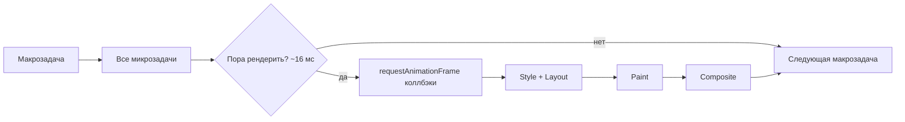

# Event Loop браузера

↑ [[FE 2.1 JavaScript — продвинутый|2.1 JavaScript: продвинутый]] · ← [[FE 2.1.5 Event Loop — микро- и макрозадачи|Предыдущая]] · → [[FE 2.1.7 Map, Set, WeakMap, WeakSet|Следующая]]

<!-- meta:start -->
<div class="meta-strip"><span class="badge must">Обязательно</span><span class="chip">~3 мин чтения</span><span class="chip">Уровень: middle</span></div>
<!-- meta:end -->


> [!info] Зачем это на собесе
> Как event loop связан с рендерингом: `requestAnimationFrame`, layout thrashing, «подвисания» интерфейса.

> [!note] Переписано
> Страница в Notion была заготовкой, содержимое написано заново.

## Объяснение

Один цикл в браузере (упрощённо):



| API | Когда выполняется |
|---|---|
| `setTimeout` | макрозадача после задержки |
| `requestAnimationFrame` | перед следующей отрисовкой (~60 Гц) |
| `requestIdleCallback` | в простое, для низкоприоритетной работы |
| `queueMicrotask` / Promise | до рендера, сразу после задачи |
| `scheduler.postTask`, `scheduler.yield` | приоритетные задачи, уступка потоку |
| События ввода | макрозадачи с высоким приоритетом |

Бюджет кадра — ~16 мс: JS, style, layout, paint должны уложиться, иначе пропуски кадров (jank). INP измеряет отзывчивость на ввод.

**Layout thrashing**: чередование чтения (`offsetHeight`, `getBoundingClientRect`) и записи стилей в цикле заставляет браузер пересчитывать layout многократно.

```js
// Плохо
for (const el of els) { el.style.width = el.offsetWidth + 10 + "px"; }     // read/write чередуются
// Хорошо: сначала читаем всё, затем пишем
const widths = els.map(el => el.offsetWidth);
els.forEach((el, i) => el.style.width = widths[i] + 10 + "px");
requestAnimationFrame(() => { /* визуальные изменения синхронно с кадром */ });
```

Выносите тяжёлое: Web Workers, `OffscreenCanvas`, разбиение на чанки, `content-visibility: auto`, виртуализация списков.

## Нюансы и подводные камни

- Фоновые вкладки: таймеры и `rAF` замедляются/останавливаются.
- Долгие задачи (> 50 мс) — «long tasks», ухудшают INP.
- `alert/confirm` блокируют цикл.
- `rAF` вызывается перед paint, но не гарантирует рендер каждого кадра.

## Практика

1. Найдите long tasks в Performance и разбейте функцию на части.
2. Устраните layout thrashing в примере.
3. Реализуйте плавную анимацию через `requestAnimationFrame`.

## Вопросы с ответами

> [!question]- Когда браузер рендерит страницу?
> Между макрозадачами, после выполнения микрозадач, обычно ~60 раз в секунду, если есть что рисовать.

> [!question]- Что такое layout thrashing?
> Повторные принудительные пересчёты layout из-за чередования чтения геометрии и записи стилей.

## Связанные темы

- [[N:3ea33104867981b2b063f7aa36540971]]
- [[N:3ea33104867981bbab02d2b18bd7ffe9]]
