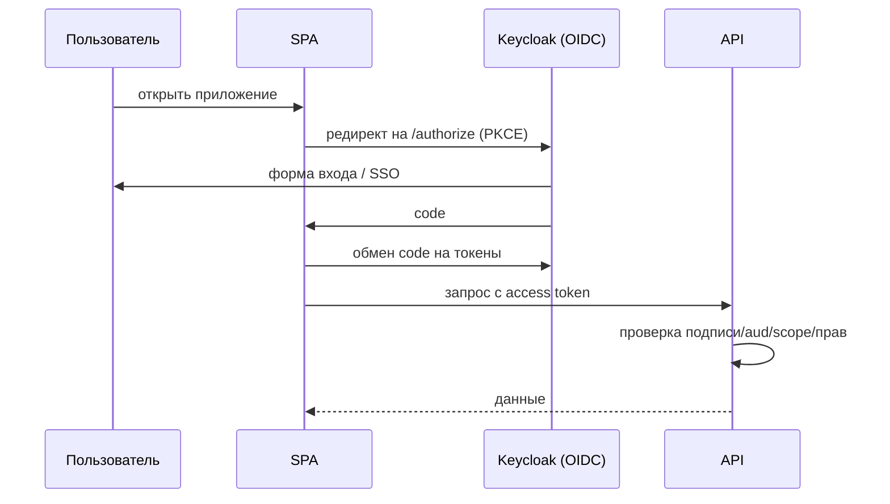

# Аутентификация и авторизация: различия

↑ [[FE 5.5 Аутентификация и доступ — Keycloak, SSO, ACL|5.5 Аутентификация и доступ: Keycloak, SSO, ACL]] · → [[FE 5.5.2 Сессии, cookies и токены|Следующая]]

<!-- meta:start -->

Обязательно~3 мин чтенияУровень: middle

<!-- meta:end -->

> [!info] Зачем это на собесе
> Базовый вопрос безопасности; нужно чётко разделять «кто вы» и «что вам можно».

> [!note] Переписано
> Страница в Notion была заготовкой, содержимое написано заново.

## Объяснение

| | Аутентификация (authN) | Авторизация (authZ) |
|---|---|---|
| Вопрос | Кто вы? | Что вам разрешено? |
| Способы | пароль, MFA, SSO, biometrics, passkeys | роли, права, политики, владение ресурсом |
| Результат | идентичность (пользователь, claims) | решение allow/deny |
| Где проверяется | провайдер идентичности + сервер | сервер (обязательно), клиент — для UX |

Принципы безопасности:

- **Клиент не является доверенной стороной.** Скрытие кнопки — UX; реальная проверка на сервере для каждого запроса.
- Принцип наименьших привилегий, deny by default.
- Не изобретайте свою криптографию и схемы: используйте проверенные протоколы (OIDC) и провайдеров (Keycloak, Auth0, Entra ID).
- Многофакторная аутентификация и защита от перебора (rate limiting, lockout).
- Короткоживущие токены, отзыв, аудит.

Типовая схема SPA + API:

Ответственность фронтенда: инициировать вход/выход, безопасно хранить/обновлять токены, добавлять их в запросы, обрабатывать 401/403, управлять UX по правам (маршруты, меню, кнопки).

## Нюансы и подводные камни

- Проверка прав только на клиенте — уязвимость (запрос обходит UI).
- Путаница 401 и 403.
- «Роли» в JWT на клиенте можно прочитать, но нельзя доверять им для защиты.
- Хранение паролей и токенов «как получится».

## Практика

1. Нарисуйте схему входа вашего приложения и отметьте, где проверяются права.
2. Проверьте, что API отклоняет запрос без токена и с чужими правами.

## Вопросы с ответами

> [!question]- Разница аутентификации и авторизации?
> Аутентификация устанавливает личность, авторизация решает, что этой личности разрешено.

> [!question]- Почему проверки на фронтенде недостаточны?
> Клиентский код можно обойти; сервер обязан проверять права при каждом запросе.

## Связанные темы

- [[N:cbd9f4bed053472fbe6ce5ef68d5cd7b]]
- [[N:3ea3310486798172bf0eddbc19555afa]]
