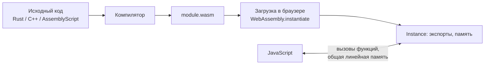

# WebAssembly: когда нужен, как загрузить и вызвать из JS

↑ [[FE 7.4 Browser API|7.4 Browser API]] · ← [[FE 7.4.10 PWA и Service Workers|Предыдущая]] · → [[FE 7.4.12 WebRTC — P2P-соединение, сигнализация, STUN и TURN|Следующая]]

<!-- meta:start -->
<div class="meta-strip"><span class="badge should">Желательно</span><span class="chip">~9 мин чтения</span><span class="chip">Уровень: senior</span></div>
<!-- meta:end -->

> [!info] Зачем это на собесе
> «Что такое WebAssembly и заменит ли он JavaScript?» Честный ответ: нет, он дополняет JS там, где нужны тяжёлые вычисления или готовые библиотеки на других языках. Ждут, что вы понимаете модель (модуль, память, импорты и экспорты), цену перехода между JS и Wasm и варианты применения.

## Подтемы
- [ ] Что такое WebAssembly
- [ ] Загрузка и вызов из JS
- [ ] Память и обмен данными
- [ ] Из чего компилировать
- [ ] Когда помогает, а когда нет
- [ ] Wasm вне браузера

## Объяснение

### Что это
**WebAssembly (Wasm)** — компактный бинарный формат инструкций для виртуальной машины браузера. Код на C, C++, Rust, Go, C♯ (Blazor) или AssemblyScript компилируется в `.wasm`, браузер проверяет его и исполняет почти на скорости нативного кода в песочнице. Работает **рядом** с JavaScript, а не вместо него: JS вызывает функции Wasm и наоборот.



### Загрузка и вызов
```js
// Современный способ: потоковая компиляция во время загрузки
const { instance } = await WebAssembly.instantiateStreaming(fetch('/app.wasm'), {
  env: { log: (x) => console.log('из wasm:', x) },     // импорты: что модуль может вызывать в JS
});

console.log(instance.exports.add(2, 40));              // 42
```
Сервер должен отдавать файл с типом `application/wasm`, иначе `instantiateStreaming` не сработает (запасной вариант: `fetch().then(r => r.arrayBuffer())` и `WebAssembly.instantiate`).

Минимальный модуль можно записать байтами, чтобы увидеть, что это просто двоичный файл:

```js
const bytes = new Uint8Array([0,97,115,109,1,0,0,0,1,7,1,96,2,127,127,1,127,3,2,1,0,7,7,1,3,97,100,100,0,0,10,9,1,7,0,32,0,32,1,106,11]);
const { instance } = await WebAssembly.instantiate(bytes);
instance.exports.add(2, 40);   // 42
```
Начало `0,97,115,109` это `\0asm`, «магическое число» формата.

### Память и обмен данными
Wasm умеет напрямую работать только с числами (`i32`, `i64`, `f32`, `f64`). Строки, массивы и объекты передаются через **линейную память**: плоский буфер байтов, к которому есть доступ и из Wasm, и из JS.

```js
const mem = new Uint8Array(instance.exports.memory.buffer);   // вид на память модуля
const text = new TextEncoder().encode('привет');
mem.set(text, ptr);                 // записали байты по адресу ptr
instance.exports.process(ptr, text.length);
```
Каждый переход JS ↔ Wasm и копирование данных стоят времени. Поэтому выигрывает схема «передать данные один раз, посчитать много, забрать результат», а не множество мелких вызовов. Инструменты (`wasm-bindgen` для Rust, `Emscripten` для C/C++) генерируют обвязку и прячут ручную работу с памятью.

### Из чего компилировать
| Язык и инструмент | Особенности |
|---|---|
| Rust (`wasm-pack`, `wasm-bindgen`) | популярный выбор, маленький размер, безопасная работа с памятью |
| C, C++ (Emscripten) | перенос существующих библиотек (кодеки, физика, SQLite) |
| AssemblyScript | синтаксис TypeScript, низкий порог входа |
| C♯ (Blazor WebAssembly) | запускает .NET-рантайм в браузере, большой размер начальной загрузки ([[FE 7.5.1 CSR, SSR, SSG, ISR — как работают и когда что выбирать|CSR и SSR]]) |
| Go (TinyGo) | компактнее стандартного Go |

### Когда помогает, а когда нет
- **Помогает:** вычислительно тяжёлые задачи (обработка изображений и видео, кодеки, криптография, физика, парсинг больших файлов, CAD, игры), перенос готовых нативных библиотек, предсказуемая скорость без JIT-разогрева.
- **Не помогает:** типичная работа с DOM (Wasm не имеет прямого доступа к DOM, всё идёт через JS), сетевые запросы, обычная логика интерфейса. Современный JavaScript уже очень быстр благодаря JIT.
- **Цена:** размер загрузки, сложность сборки и отладки, переходы через границу JS ↔ Wasm.

Измеряйте, а не предполагайте. В простом тесте рекурсивного `fib(35)` на AssemblyScript выигрыш над JavaScript был скромным (десятки процентов), а для типичных интерфейсных задач его нет вовсе.

### Тяжёлые вычисления не в основном потоке
Чтобы не блокировать интерфейс, Wasm-модуль запускают в **Web Worker** ([[FE 7.4.7 Web Workers|Web Workers]]), а при необходимости используют общую память и атомарные операции (`SharedArrayBuffer` требует специальных заголовков безопасности cross-origin isolation).

### Wasm вне браузера
Через **WASI** (WebAssembly System Interface) модули запускаются на сервере и в облаке (Wasmtime, WasmEdge, Spin, Cloudflare Workers): быстрый старт, изоляция, переносимость. Это отдельное направление: легковесная альтернатива контейнерам для некоторых задач.

## Примеры

### Сборка AssemblyScript и запуск
```bash
npm init -y
npm i -D assemblyscript
mkdir -p assembly
```
```ts
// assembly/index.ts
export function add(a: i32, b: i32): i32 {
  return a + b;
}

export function fib(n: i32): i32 {
  return n < 2 ? n : fib(n - 1) + fib(n - 2);
}
```
```bash
npx asc assembly/index.ts -o build/app.wasm --optimize
```
```js
// Node.js или браузер
import { readFileSync } from 'node:fs';
const { instance } = await WebAssembly.instantiate(readFileSync('build/app.wasm'));
console.log(instance.exports.add(2, 40));   // 42
console.log(instance.exports.fib(35));      // 9227465
```

### Подключение в Vue-приложении
```ts
// src/wasm/useWasm.ts
import { ref, onMounted } from 'vue'

export function useWasm() {
  const exports = ref<WebAssembly.Exports | null>(null)
  onMounted(async () => {
    const { instance } = await WebAssembly.instantiateStreaming(fetch('/app.wasm'))
    exports.value = instance.exports
  })
  return { exports }
}
```
Vite отдаёт `.wasm` как статический файл из `public/` с правильным типом.

## Нюансы и подводные камни
- **Неверный `Content-Type`.** Без `application/wasm` потоковая загрузка падает.
- **Нет доступа к DOM.** Любая работа с DOM идёт через JS-обвязку.
- **Строки и объекты.** Копируются через память; следите за кодировкой и освобождением памяти.
- **Размер.** Большой Wasm-модуль увеличивает время загрузки, используйте сжатие (gzip, brotli) и ленивую загрузку.
- **Безопасность.** Wasm исполняется в песочнице с теми же ограничениями, что и JS, но уязвимости внутри модуля (переполнения) всё равно возможны в небезопасных языках.
- **Отладка.** Используйте source maps и инструменты DevTools; отладка сложнее, чем JS.

## Вопросы с ответами
> [!question]- Что такое WebAssembly?
> Бинарный формат инструкций для виртуальной машины браузера. Код на C, C++, Rust и других языках компилируется в `.wasm` и исполняется в песочнице почти с нативной скоростью, дополняя JavaScript.

> [!question]- Заменит ли WebAssembly JavaScript?
> Нет. Wasm подходит для тяжёлых вычислений и переноса нативных библиотек, но не имеет прямого доступа к DOM, поэтому интерфейс и логика остаются на JS.

> [!question]- Как передать строку или массив в Wasm?
> Через линейную память: записать байты в `WebAssembly.Memory` и передать указатель и длину. Инструменты вроде `wasm-bindgen` автоматизируют это.

> [!question]- Когда Wasm даёт выигрыш?
> В вычислительно тяжёлых задачах (изображения, видео, криптография, физика, парсинг больших данных), при переносе готовых библиотек и когда нужна предсказуемая производительность. Для обычного интерфейса выигрыша нет.

> [!question]- Что такое WASI?
> Интерфейс системных вызовов для Wasm, который позволяет запускать модули вне браузера (сервер, облако, edge) с изоляцией и быстрым стартом.

> [!question]- Как запускать тяжёлый Wasm, не блокируя интерфейс?
> В Web Worker. Основной поток отправляет данные воркеру и получает результат сообщением.

## Связанные темы
- Web Workers: [[FE 7.4.7 Web Workers|Web Workers]]
- Canvas и SVG: [[FE 7.4.8 Canvas и SVG|Canvas и SVG]]
- Размер бандла: [[FE 7.2.5 Tree shaking и размер бандла|Tree shaking и размер бандла]]
- Blazor и рендеринг: [[FE 7.5.1 CSR, SSR, SSG, ISR — как работают и когда что выбирать|CSR, SSR, SSG, ISR]]
