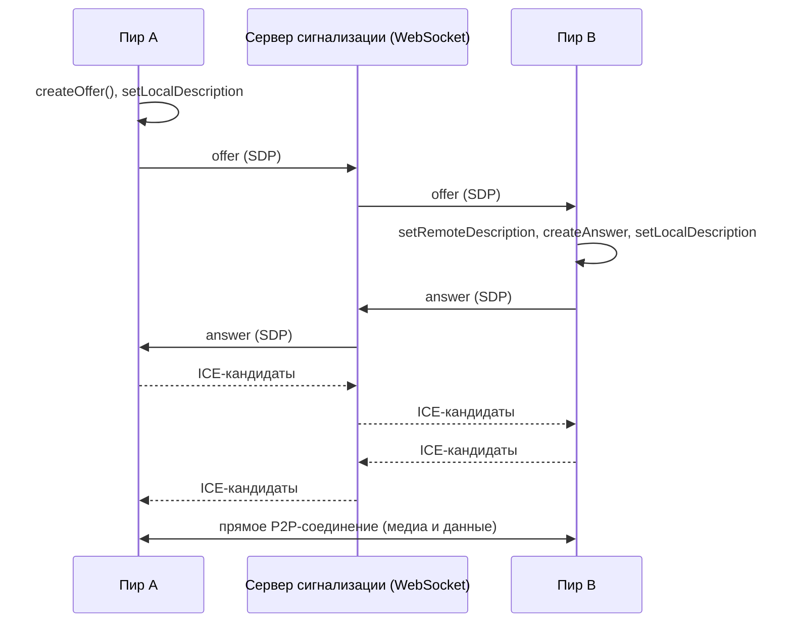
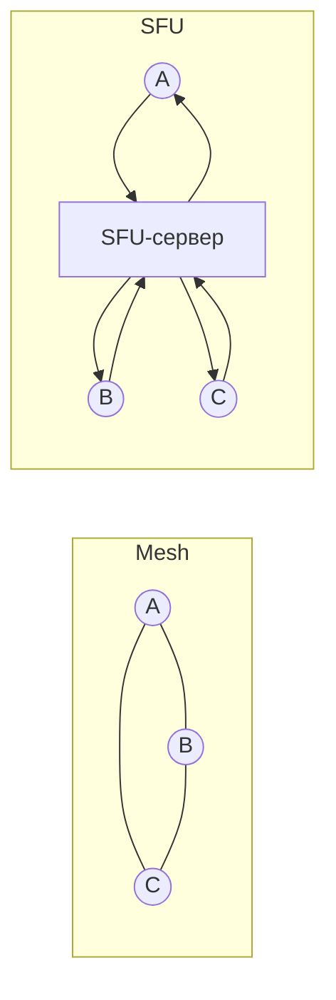

# WebRTC: P2P-соединение, сигнализация, STUN и TURN

↑ [[FE 7.4 Browser API|7.4 Browser API]] · ← [[FE 7.4.11 WebAssembly — когда нужен, как загрузить и вызвать из JS|Предыдущая]]

<!-- meta:start -->
<div class="meta-strip"><span class="badge should">Желательно</span><span class="chip">~10 мин чтения</span><span class="chip">Уровень: senior</span></div>
<!-- meta:end -->

> [!info] Зачем это на собесе
> «Как сделать видеозвонок в браузере?» и «Чем WebRTC отличается от WebSocket?» Ответ включает три части: медиа и данные идут напрямую между браузерами, но для установки соединения нужен **сервер сигнализации**, а для прохода через NAT нужны **STUN/TURN**.

## Подтемы
- [ ] Что такое WebRTC и чем отличается от WebSocket
- [ ] RTCPeerConnection, offer и answer
- [ ] Сигнализация
- [ ] ICE, STUN и TURN
- [ ] Медиа и каналы данных
- [ ] Масштабирование: mesh, SFU, MCU

## Объяснение

### Что такое WebRTC
**WebRTC** — набор API браузера для передачи аудио, видео и произвольных данных **напрямую между участниками** (peer-to-peer) с низкой задержкой. Используется в видеозвонках, демонстрации экрана, играх, передаче файлов, чатах.

| | WebSocket | WebRTC |
|---|---|---|
| Топология | клиент ↔ сервер | пир ↔ пир (часто напрямую) |
| Транспорт | TCP | UDP (SRTP для медиа, SCTP для данных), шифрование обязательно |
| Задержка | низкая | очень низкая |
| Сервер | нужен всегда | нужен для установки связи (сигнализация) |
| Применение | чат, уведомления, обмен с сервером | звонки, стриминг, P2P-данные |

См. также [[FE 5.4.8 WebSocket|WebSocket]].

### Основные объекты
- **`RTCPeerConnection`** — соединение с другим пиром.
- **`MediaStream`, `getUserMedia`** — доступ к камере и микрофону.
- **`RTCDataChannel`** — канал для произвольных данных (как WebSocket, но P2P).

### Как устанавливается соединение
Браузеры должны договориться о параметрах (кодеки, адреса). Они обмениваются описаниями сеанса **SDP**: **offer** от инициатора и **answer** от ответившего, а также кандидатами **ICE** (возможными сетевыми адресами). Передать эти данные друг другу WebRTC **не умеет**: нужен ваш канал, **сервер сигнализации** (обычно WebSocket).



### ICE, STUN и TURN
Большинство устройств находятся за NAT и не знают своего внешнего адреса. **ICE** (Interactive Connectivity Establishment) перебирает варианты подключения:

| Тип кандидата | Как получается | Когда работает |
|---|---|---|
| host | локальный адрес | оба в одной сети |
| srflx (через **STUN**) | STUN-сервер сообщает внешний адрес и порт | большинство домашних NAT |
| relay (через **TURN**) | трафик идёт через сервер-ретранслятор | строгие корпоративные сети и симметричный NAT |

**STUN** дешёвый (только сообщает адрес). **TURN** пропускает через себя весь трафик, поэтому стоит трафика и ресурсов, но гарантирует связь, когда прямой путь невозможен. В продакшене TURN обязателен (у части пользователей прямой путь не сработает). Популярный сервер: coturn.

### Масштабирование: mesh, SFU, MCU

| Схема | Идея | Подходит |
|---|---|---|
| **Mesh** | каждый с каждым напрямую | 2–4 участника, нагрузка растёт квадратично |
| **SFU** (Selective Forwarding Unit) | каждый отправляет поток серверу, тот пересылает другим без перекодирования | конференции на десятки и сотни участников (mediasoup, Janus, LiveKit) |
| **MCU** | сервер микширует потоки в один | устаревает: высокая нагрузка на сервер |

## Примеры

### Обмен данными между двумя пирами (в одной странице, для демонстрации)
```js
const a = new RTCPeerConnection();
const b = new RTCPeerConnection();

// в реальном приложении кандидаты передаются через сервер сигнализации
a.onicecandidate = (e) => e.candidate && b.addIceCandidate(e.candidate);
b.onicecandidate = (e) => e.candidate && a.addIceCandidate(e.candidate);

const channel = a.createDataChannel('chat');
channel.onopen = () => channel.send('привет');

b.ondatachannel = (ev) => {
  ev.channel.onmessage = (m) => console.log('B получил:', m.data);   // привет
};

const offer = await a.createOffer();
await a.setLocalDescription(offer);
await b.setRemoteDescription(offer);

const answer = await b.createAnswer();
await b.setLocalDescription(answer);
await a.setRemoteDescription(answer);
```

### Видео с камеры
```js
const stream = await navigator.mediaDevices.getUserMedia({ video: true, audio: true });
const pc = new RTCPeerConnection({
  iceServers: [
    { urls: 'stun:stun.example.com:3478' },
    { urls: 'turn:turn.example.com:3478', username: 'user', credential: 'secret' },
  ],
});
stream.getTracks().forEach((track) => pc.addTrack(track, stream));   // дорожки уйдут собеседнику

pc.ontrack = (e) => { document.querySelector('video#remote').srcObject = e.streams[0]; };
```
Доступ к камере возможен только на странице по HTTPS (или `localhost`) и после разрешения пользователя.

### Сигнализация через WebSocket (схема)
```js
const ws = new WebSocket('wss://example.com/signal');
ws.onmessage = async ({ data }) => {
  const msg = JSON.parse(data);
  if (msg.type === 'offer') { await pc.setRemoteDescription(msg); /* создать answer и отправить */ }
  if (msg.type === 'answer') await pc.setRemoteDescription(msg);
  if (msg.candidate) await pc.addIceCandidate(msg.candidate);
};
pc.onicecandidate = (e) => e.candidate && ws.send(JSON.stringify({ candidate: e.candidate }));
```

## Нюансы и подводные камни
- **Сигнализация не входит в WebRTC.** Её нужно сделать самому (WebSocket, SignalR и т. п.), и защитить (аутентификация, комнаты).
- **TURN обязателен в продакшене.** Без него у части пользователей звонок не установится. Защитите TURN учётными данными с коротким сроком.
- **HTTPS обязателен** для доступа к камере и микрофону.
- **Порядок ICE-кандидатов.** Кандидаты могут прийти раньше, чем установлен `remoteDescription`: буферизуйте их.
- **Mesh не масштабируется.** Для больше 4–5 участников нужен SFU.
- **Разрешения и отзыв доступа.** Обрабатывайте отказ пользователя и отключение устройств.
- **Приватность.** Кандидаты ICE раскрывают IP-адреса участников; учитывайте это в политике приватности.
- **Совместимость браузеров.** Различия в кодеках и особенностях, проверяйте на целевых браузерах.

## Вопросы с ответами
> [!question]- Чем WebRTC отличается от WebSocket?
> WebSocket это двусторонний канал клиент-сервер по TCP. WebRTC передаёт аудио, видео и данные напрямую между браузерами по UDP с очень низкой задержкой, но для установки соединения нуждается в сервере сигнализации.

> [!question]- Что такое сервер сигнализации и зачем он?
> Сервер (чаще WebSocket), через который пиры обмениваются SDP (offer и answer) и ICE-кандидатами до установки P2P-соединения. WebRTC не определяет способ передачи этих данных.

> [!question]- Чем STUN отличается от TURN?
> STUN лишь сообщает клиенту его внешний адрес и порт, трафик идёт напрямую. TURN ретранслирует весь трафик через сервер и нужен, когда прямое соединение невозможно (строгие NAT и файрволы).

> [!question]- Что такое ICE?
> Процедура подбора рабочего сетевого пути между пирами: собираются кандидаты (host, srflx через STUN, relay через TURN) и проверяются по приоритету.

> [!question]- Как масштабировать видеоконференцию?
> Mesh подходит для 2–4 участников. Для больших групп используют SFU: каждый отправляет один поток на сервер, а тот пересылает его остальным без перекодирования.

> [!question]- Зачем нужен `RTCDataChannel`?
> Для передачи произвольных данных P2P (чат, файлы, игровые события) с настраиваемой надёжностью и упорядоченностью, без сервера для каждого сообщения.

## Связанные темы
- WebSocket: [[FE 5.4.8 WebSocket|WebSocket]]
- Long polling и SSE: [[FE 5.4.9 Long polling и SSE|Long polling и SSE]]
- Web Workers: [[FE 7.4.7 Web Workers|Web Workers]]
- Доступ к устройствам и безопасность: [[FE 7.3 Безопасность фронтенда|Безопасность фронтенда]]
- TCP и UDP: [[BE 1.1.1 Модель OSI и TCP-IP, TCP и UDP|TCP и UDP]]
