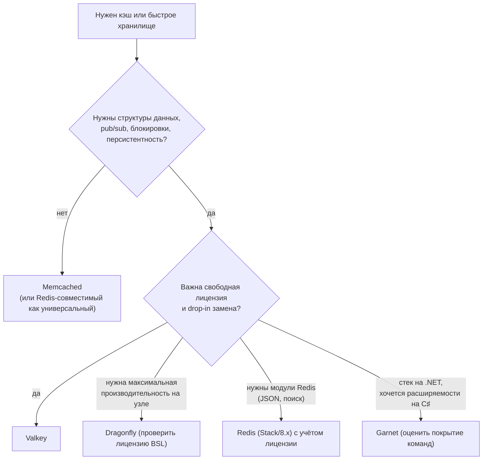

# Аналоги Redis: Valkey, Dragonfly, KeyDB, Garnet и Memcached

↑ [[DB 4.1 Redis и MongoDB|4.1 Redis и MongoDB]] · ← [[DB 4.1.6 SQL или NoSQL — как выбрать|Предыдущая]]

<!-- meta:start -->
<div class="meta-strip"><span class="badge should">Желательно</span><span class="chip">~7 мин чтения</span><span class="chip">Уровень: middle</span></div>
<!-- meta:end -->

> [!info] Зачем это на собесе
> «Redis сменил лицензию, чем его заменить?» и «Redis или Memcached?» Ответ должен показывать, что вы отличаете протокол от реализации: приложение говорит по RESP и обычно не замечает подмены сервера, а вот расширенные модули, персистентность и кластер ведут себя по-разному.

## Подтемы
- [ ] Почему появились форки и альтернативы
- [ ] Valkey, Dragonfly, KeyDB, Garnet
- [ ] Memcached: когда достаточно простого кэша
- [ ] Совместимость и что проверить перед заменой

## Объяснение

### Что случилось с лицензией Redis
До 2024 года Redis распространялся под свободной лицензией BSD. В марте 2024 компания Redis сменила лицензию на двойную RSALv2/SSPLv1, которые не считаются открытыми по определению OSI и ограничивают облачные сервисы. В ответ Linux Foundation объявил форк **Valkey** на основе Redis 7.2.4 под лицензией BSD, его поддержали AWS, Google Cloud, Oracle и другие. В 2025 году Redis добавил лицензию AGPLv3 как третий вариант для версии 8. Для вас как разработчика это значит: протокол остался тем же, а выбор сервера стал вопросом лицензии, поддержки и возможностей.

### Протокол общий
Клиенты говорят с сервером по протоколу RESP (текстовый протокол, см. [[BE 1.1.7 Запрос по TCP руками — nc, telnet, openssl s_client, HTTP и Redis|пример ручного запроса]]). Поэтому `StackExchange.Redis` и другие клиенты работают с совместимыми серверами без изменений кода, меняется только адрес.

### Сравнение

| Решение | Кто делает, лицензия | Особенность | На что смотреть |
|---|---|---|---|
| **Redis** | Redis Ltd, RSALv2/SSPLv1/AGPLv3 (8.x) | эталон, модули (JSON, поиск, time series), самое широкое сообщество | лицензия, часть возможностей в коммерческих редакциях |
| **Valkey** | Linux Foundation, BSD | форк Redis, drop-in замена, поддержка крупных облаков, улучшения многопоточного ввода-вывода | модули Redis не все доступны; дорожные карты расходятся с Redis |
| **Dragonfly** | Dragonfly, BSL | многопоточная архитектура «ничего общего», высокая производительность на одном узле, меньше потребление памяти | лицензия BSL, не все команды и сценарии кластера совместимы |
| **KeyDB** | Snap, BSD | форк с многопоточностью, активно-активная репликация | развитие заметно медленнее, проверяйте актуальность проекта |
| **Garnet** | Microsoft Research, MIT | написан на C♯ и .NET, совместим с RESP, высокая производительность | молодой проект, подмножество команд Redis |
| **Memcached** | сообщество, BSD | очень простой кэш «ключ — значение», многопоточный | нет структур данных, нет персистентности, нет репликации |

### Redis или Memcached
| Критерий | Redis и совместимые | Memcached |
|---|---|---|
| Типы данных | строки, хэши, списки, множества, сортированные множества, потоки | только строки (байты) |
| Персистентность | RDB, AOF | нет |
| Репликация и кластер | да (Sentinel, Cluster) | нет встроенной (шардирование на клиенте) |
| Pub/sub, блокировки, rate limit | да | нет |
| Простота | богаче, сложнее | проще, меньше сюрпризов |
| Многопоточность | ядро однопоточное (ввод-вывод частично многопоточный) | многопоточный |

Memcached достаточно, когда нужен только кэш значений и нет потребности в структурах, очередях и блокировках. Всё остальное чаще решает Redis-совместимый сервер.



## Примеры

### Запуск Valkey как замены Redis
```bash
docker run -d --name valkey -p 6379:6379 valkey/valkey:8
redis-cli -p 6379 ping        # PONG: те же клиенты и команды
```

### Подключение из .NET: код не меняется
```csharp
// Подходит для Redis, Valkey, Dragonfly, KeyDB, Garnet
var mux = await ConnectionMultiplexer.ConnectAsync("localhost:6379");
var db = mux.GetDatabase();
await db.StringSetAsync("greeting", "hello", TimeSpan.FromMinutes(5));
Console.WriteLine(await db.StringGetAsync("greeting"));
```
Замена сервера сводится к строке подключения. Проверять нужно команды и возможности, а не сам клиент.

### Чек-лист совместимости перед заменой
```text
1. Какие команды и структуры использует приложение (скрипты Lua, Streams, модули)
2. Нужен ли кластер: Redis Cluster совместим не везде одинаково
3. Персистентность: RDB/AOF и поведение при перезапуске
4. Eviction и maxmemory: политики вытеснения
5. Метрики и экспортёры: redis_exporter работает не со всеми
6. Нагрузочный тест на реальных профилях запросов
```

## Нюансы и подводные камни
- **Совместимость по протоколу не равна совместимости по поведению.** Lua-скрипты, модули, `WAIT`, кластерные команды и нюансы eviction могут различаться.
- **Модули Redis** (RedisJSON, RediSearch и другие) есть не у всех форков; ищите аналоги или пересматривайте схему.
- **Не смешивайте версии в кластере.** Обновляйте серверы по очереди, сначала реплики.
- **Кэш может быть единственной копией.** Если вы держите там нереплицируемые данные (сессии, очереди), учитывайте персистентность и отказоустойчивость. См. [[DB 4.1.4 Redis — persistence, репликация, Sentinel, Cluster|персистентность и кластер]].
- **Лицензии меняются.** Перед внедрением сверьтесь с актуальным текстом лицензии выбранного продукта.
- **Управляемые сервисы.** Облака предлагают Redis-совместимые сервисы (ElastiCache и MemoryDB для Valkey и Redis, Memorystore и другие): часто проще не эксплуатировать самому.

## Вопросы с ответами
> [!question]- Почему появился Valkey?
> Redis в 2024 году сменил лицензию на RSALv2/SSPLv1, не считающиеся свободными. Linux Foundation при поддержке крупных облачных компаний сделал форк Redis 7.2.4 под лицензией BSD. Valkey остаётся drop-in заменой для большинства приложений.

> [!question]- Нужно ли менять код приложения при переходе с Redis на Valkey?
> Обычно нет: протокол тот же, клиент (`StackExchange.Redis`) работает без изменений. Проверяют используемые модули, Lua-скрипты, кластерные возможности и метрики.

> [!question]- Когда Memcached, а когда Redis?
> Memcached достаточно для простого кэша значений без структур и персистентности. Redis нужен, когда требуются структуры данных, pub/sub, блокировки, rate limiting, потоки или хранение данных с сохранением на диск.

> [!question]- Чем Dragonfly отличается от Redis?
> Dragonfly спроектирован как многопоточный сервер («ничего общего» между потоками) и лучше использует многоядерные машины, тогда как ядро Redis исполняет команды в одном потоке. Он совместим с протоколом, но не со всеми командами и сценариями кластера.

> [!question]- Что такое Garnet?
> Redis-совместимое хранилище от Microsoft Research на C♯ и .NET под лицензией MIT. Подходит тем, кому важны .NET-стек и производительность, но поддерживает подмножество команд Redis.

> [!question]- Как безопасно заменить Redis на другой сервер?
> Составить список используемых команд и возможностей, поднять новый сервер рядом, прогнать тесты и нагрузку, проверить мониторинг, затем переключать трафик постепенно (сначала чтение или часть сервисов) и держать возможность отката.

## Связанные темы
- Основы: [[DB 4.1.1 Redis — структуры данных и команды|Redis: структуры данных и команды]]
- Кэш: [[DB 4.1.2 Redis как кэш — TTL, eviction, стратегии cache-aside, write-through|Redis как кэш]]
- Персистентность и кластер: [[DB 4.1.4 Redis — persistence, репликация, Sentinel, Cluster|Redis: persistence, репликация, Sentinel, Cluster]]
- Выбор хранилища: [[DB 4.1.6 SQL или NoSQL — как выбрать|SQL или NoSQL]]
- Кэш в .NET: [[BE 7.1.4 Кэширование — IMemoryCache, IDistributedCache, HybridCache, output caching|Кэширование в .NET]]
