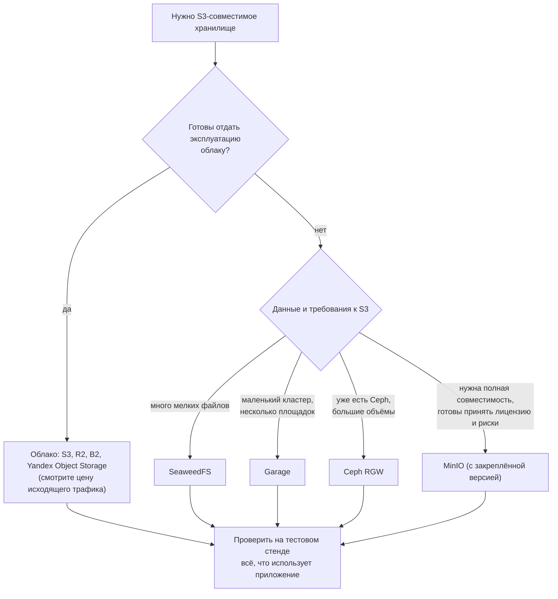

# Аналоги MinIO: SeaweedFS, Garage, Ceph RGW и облачные S3

↑ [[DB 4.2 Объектное хранилище — MinIO и S3|4.2 Объектное хранилище: MinIO и S3]] · ← [[DB 4.2.6 Файлы в БД или в объектном хранилище — связь метаданных и объектов|Предыдущая]] · → [[DB 4.2.8 Переносимость S3 и миграция между хранилищами — rclone, mc mirror|Следующая]]

<!-- meta:start -->
<div class="meta-strip"><span class="badge should">Желательно</span><span class="chip">~11 мин чтения</span><span class="chip">Уровень: middle</span></div>
<!-- meta:end -->

> [!info] Зачем это на собесе
> «Чем заменить MinIO?» и «Как выбрать S3-совместимое хранилище?» спрашивают всё чаще: у MinIO AGPL-лицензия и меняющаяся политика проекта. Сильный ответ не называет одно «лучшее» хранилище, а сравнивает по критериям: полнота S3 API, модель надёжности, эксплуатационная сложность, лицензия, цена и зрелость проекта.

## Подтемы
- [ ] Почему вообще ищут замену MinIO
- [ ] Что значит «S3-совместимый»
- [ ] SeaweedFS, Garage, Ceph RGW, RustFS
- [ ] Облачные S3-совместимые сервисы
- [ ] Критерии и схема выбора

## Объяснение

### Почему ищут замену MinIO
MinIO долго был стандартом для self-hosted S3: один бинарник, быстрый, простой старт. Причины смотреть на альтернативы:
- **Лицензия AGPLv3** (с 2021 года). Если вы встраиваете MinIO в свой продукт или предоставляете его как сервис, юристы задают вопросы; для обычного внутреннего использования ограничения мягче, но их надо понимать.
- **Политика проекта.** В 2025 году MinIO урезал управление из веб-консоли в бесплатной версии (часть функций осталась в коммерческой линейке AIStor), затем прекратил публиковать готовые образы и бинарники сообщества, а репозиторий перешёл в режим поддержки без новых возможностей. Точное состояние на сегодня проверяйте в репозитории и объявлениях проекта: оно менялось быстро.
- **Функции под лицензией.** Для крупных кластеров и поддержки нужна платная подписка.

Из этого не следует, что существующий MinIO надо срочно выбрасывать. Вопрос в планировании: как закреплять версии, откуда брать образы и какой у вас план миграции.

### Что значит «S3-совместимый»
У S3 нет открытого стандарта. Есть документация AWS и де-факто поведение. Каждый продукт реализует **часть** API, поэтому «совместим с S3» нужно проверять по конкретным возможностям:

| Возможность | Зачем нужна |
|---|---|
| PUT/GET/DELETE/HEAD/LIST | базовые операции, есть везде |
| Multipart upload | большие файлы, докачка |
| Presigned URL | прямая загрузка и скачивание из браузера |
| Versioning | откат, защита от удаления |
| Lifecycle | автоматическое удаление и переезд по возрасту |
| Object Lock | WORM, защита от изменений по требованиям регуляторов |
| Server-side encryption | шифрование на стороне хранилища |
| События и уведомления | реакция на загрузку (webhook, очередь) |
| Политики и IAM | разграничение доступа по бакетам и префиксам |

Перед выбором составьте список того, что **реально использует ваше приложение**, и проверьте каждый пункт на тестовом стенде.

### Кандидаты для self-hosted

| Решение | Язык и лицензия | Сильные стороны | Ограничения |
|---|---|---|---|
| **SeaweedFS** | Go, Apache 2.0 | очень быстро с миллионами мелких файлов, отдельные volume-серверы, гибкая топология, S3-шлюз, есть FUSE-монтирование | больше компонентов (master, volume, filer, S3), S3-совместимость не полная |
| **Garage** | Rust, AGPLv3 | лёгкий, рассчитан на небольшие кластеры и географически разнесённые узлы, репликация по зонам, простой запуск | реплики вместо erasure coding, часть функций S3 не реализована (в частности, нет Object Lock и части lifecycle), AGPL |
| **Ceph RGW** | C++, LGPL | зрелый, промышленный, S3 и Swift, erasure coding, огромные кластеры | тяжёлая эксплуатация (RADOS, мониторы, OSD), нужна команда |
| **RustFS** | Rust, Apache 2.0 | позиционируется как замена MinIO, простой запуск | молодой проект, смотрите зрелость и покрытие S3 на момент выбора |
| **MinIO** | Go, AGPLv3 | самая полная совместимость среди простых решений, erasure coding, зрелость | лицензия и политика проекта |

**SeaweedFS** хранит данные в больших volume-файлах по схеме «Haystack», поэтому мелкие объекты не раздувают метаданные файловой системы. Подходит, когда файлов очень много (миниатюры, вложения).

**Garage** проектировали для маленьких кластеров на обычном железе и слабых каналах. Данные реплицируются в несколько зон (например, 3 копии в 3 площадках). Хорош для домашней лаборатории, малых команд и бэкапов.

**Ceph RGW** выбирают, когда в инфраструктуре уже есть Ceph (часто вместе с Kubernetes через Rook) и нужен единый слой хранения для блочных, файловых и объектных данных.

### Облачные S3-совместимые сервисы
| Сервис | Особенность |
|---|---|
| Amazon S3 | эталон, полный набор возможностей, платный трафик наружу |
| Cloudflare R2 | нет платы за исходящий трафик, S3 API, подходит для раздачи контента |
| Backblaze B2 | дёшево хранить, S3-совместимый API |
| Wasabi | фиксированная цена за хранение, S3 API |
| Yandex Object Storage, VK Cloud, Selectel | S3 API, данные в российских дата-центрах |
| Hetzner, DigitalOcean Spaces | простые и недорогие S3-хранилища |

Главное отличие от self-hosted: вы платите деньгами и зависимостью от провайдера вместо собственного времени на эксплуатацию. Цены, лимиты и тарифы меняются, сверяйтесь с прайсом поставщика.

### Схема выбора


## Примеры

### Запуск SeaweedFS с S3-шлюзом
```bash
docker run -d --name seaweed -p 8333:8333 -p 9333:9333 \
  -v seaweed-data:/data chrislusf/seaweedfs \
  server -dir=/data -s3
```
S3-эндпоинт будет на `http://localhost:8333`. Для проверки подойдёт `mc`, `aws s3` или `rclone`. В боевой конфигурации ключи и политики настраивают через файл конфигурации S3.

### Garage: минимальный конфиг и первый бакет
```toml
# garage.toml (один узел для теста; в проде replication_factor = 3 на разных узлах)
metadata_dir = "/var/lib/garage/meta"
data_dir = "/var/lib/garage/data"
db_engine = "sqlite"
replication_factor = 1
rpc_bind_addr = "[::]:3901"
rpc_public_addr = "127.0.0.1:3901"
rpc_secret = "<openssl rand -hex 32>"

[s3_api]
s3_region = "garage"
api_bind_addr = "[::]:3900"
```
```bash
garage status                                   # узнать идентификатор узла
garage layout assign -z dc1 -c 10G <node_id>    # зона и ёмкость
garage layout apply --version 1
garage key create app-key                       # ключ доступа
garage bucket create files
garage bucket allow --read --write --owner files --key app-key
```
Команды и параметры могут отличаться между версиями Garage, сверяйтесь с документацией своей версии.

### Подключение из .NET: один код для любого S3
```csharp
var config = new AmazonS3Config
{
    ServiceURL = "http://localhost:8333",       // адрес вашего хранилища
    ForcePathStyle = true,                      // http://host/bucket/key, а не http://bucket.host/key
    AuthenticationRegion = "us-east-1",         // многие хранилища требуют регион, даже фиктивный
    RequestChecksumCalculation = RequestChecksumCalculation.WHEN_REQUIRED,
    ResponseChecksumValidation = ResponseChecksumValidation.WHEN_REQUIRED,
};
var s3 = new AmazonS3Client(new BasicAWSCredentials(accessKey, secretKey), config);
```
Две настройки решают большинство проблем совместимости: `ForcePathStyle` (иначе SDK пойдёт на `bucket.localhost`) и отключение обязательных контрольных сумм. Новые версии AWS SDK по умолчанию добавляют CRC-заголовки и особое кодирование тела, которые не все сторонние хранилища понимают.

## Нюансы и подводные камни
- **«Совместим» не значит «одинаков».** Проверяйте мультичасти, presigned URL, версионирование и lifecycle на своём наборе запросов, а не по таблице на сайте проекта.
- **Replication или erasure coding.** Реплики (Garage, SeaweedFS) проще, но тратят место ×3; erasure coding (MinIO, Ceph) экономнее, но сложнее и требует больше узлов.
- **Лицензия AGPL заразна для форков и сервисов.** Если вы модифицируете исходники AGPL-продукта и предоставляете его по сети, обязаны открыть изменения. Для неизменённого внутреннего использования ограничений меньше. При сомнениях консультируйтесь с юристом.
- **Один узел не отказоустойчив.** Любое хранилище с одним узлом теряет данные вместе с диском, для продакшена нужны реплики и бэкапы (см. [[DB 4.2.5 Multipart upload, версионирование, lifecycle, репликация|репликацию и версионирование]]).
- **Закрепляйте версии образов.** Не используйте `latest`: поведение и лицензии меняются, а образ могут перестать публиковать.
- **Эгресс-трафик.** Для облачных хранилищ главная статья расходов часто не хранение, а исходящий трафик. Это причина, по которой смотрят на R2 и подобные сервисы.
- **Тесты.** Для интеграционных тестов поднимайте лёгкое S3-совместимое хранилище в Testcontainers, а не мокайте клиент: так ловятся ошибки подписи и путей.

## Вопросы с ответами
> [!question]- Почему компании ищут замену MinIO?
> Главные причины: лицензия AGPLv3, изменения политики проекта в 2025 году (урезанная веб-консоль в бесплатной версии, прекращение публикации готовых образов и бинарников сообщества, режим поддержки без новых функций) и необходимость платной подписки для серьёзных кластеров. Это повод составить план миграции и закрепить версии, а не паниковать.

> [!question]- Что значит «S3-совместимое хранилище»?
> Оно реализует нужную часть S3 API, так что клиенты вроде AWS SDK, `aws cli`, `rclone`, `mc` работают с ним сменой `endpoint`. Стандарта нет, поэтому полнота разная: нужно проверять multipart, presigned URL, версионирование, lifecycle, Object Lock, события и политики.

> [!question]- Когда SeaweedFS, а когда Garage?
> SeaweedFS выбирают для огромного числа мелких файлов и гибкой топологии, когда готовы поддерживать несколько компонентов. Garage подходит для небольших кластеров и нескольких площадок, где важны простота и лёгкость, а нестандартные функции S3 не нужны.

> [!question]- Когда подходит Ceph RGW?
> Когда уже есть или планируется Ceph как общий слой хранения (блоки, файлы, объекты), большие объёмы и команда, готовая его эксплуатировать. Для небольшого проекта Ceph чрезмерно тяжёл.

> [!question]- Чем self-hosted S3 отличается от облачного?
> В self-hosted вы платите временем и железом и отвечаете за надёжность, обновления и бэкапы, зато контролируете данные и стоимость трафика. Облако даёт готовую надёжность и полный набор функций за деньги и с зависимостью от провайдера (и платой за исходящий трафик, кроме сервисов вроде R2).

> [!question]- Что нужно настроить в AWS SDK для стороннего S3?
> `ServiceURL` (адрес), `ForcePathStyle = true`, регион (`AuthenticationRegion`), при необходимости отключить обязательные контрольные суммы (`WHEN_REQUIRED`). Для presigned URL на `http`-эндпоинте указать `Protocol.HTTP`, иначе ссылка подпишется как `https`.

## Связанные темы
- Основы: [[DB 4.2.1 Объектное хранилище и S3 API — buckets, objects, keys, метаданные|Объектное хранилище и S3 API]]
- MinIO: [[DB 4.2.2 MinIO — развёртывание, mc, политики доступа|MinIO: развёртывание, mc, политики доступа]]
- Как переносить данные: [[DB 4.2.8 Переносимость S3 и миграция между хранилищами — rclone, mc mirror|Переносимость S3 и миграция между хранилищами]]
- Выбор хранилища под задачу: [[DB 6.1.6 Выбор хранилища под задачу — polyglot persistence|Polyglot persistence]]
