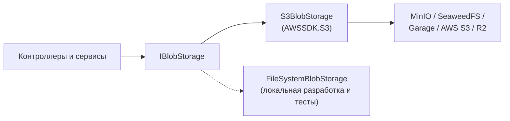
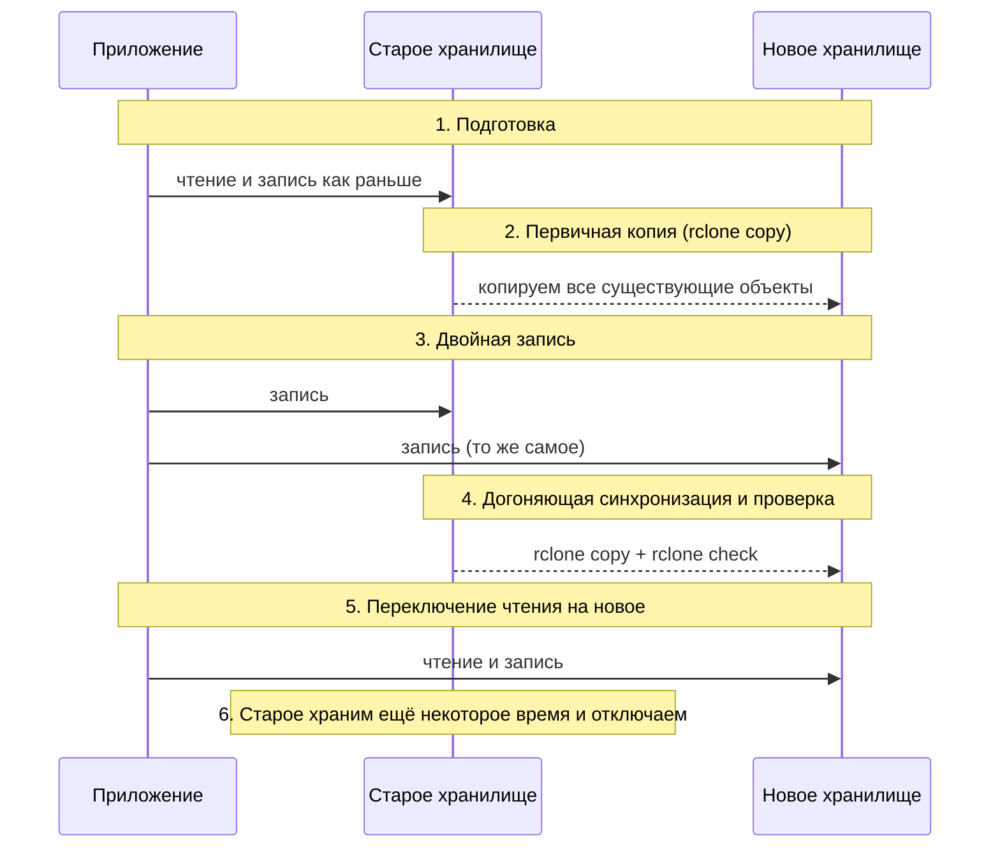

# Переносимость S3 и миграция между хранилищами: rclone, mc mirror

↑ [[DB 4.2 Объектное хранилище — MinIO и S3|4.2 Объектное хранилище: MinIO и S3]] · ← [[DB 4.2.7 Аналоги MinIO — SeaweedFS, Garage, Ceph RGW и облачные S3|Предыдущая]]

<!-- meta:start -->
<div class="meta-strip"><span class="badge should">Желательно</span><span class="chip">~12 мин чтения</span><span class="chip">Уровень: middle</span></div>
<!-- meta:end -->

> [!info] Зачем это на собесе
> «Как без простоя переехать с MinIO на другое хранилище?» и «Как не привязать приложение к одному провайдеру?» Хороший ответ включает абстракцию в коде, список мест, где S3-реализации расходятся, и пошаговый план: копирование, двойная запись, проверка, переключение.

## Подтемы
- [ ] Абстракция над хранилищем в коде
- [ ] Где S3-реализации расходятся
- [ ] Инструменты переноса: rclone и mc mirror
- [ ] План миграции без простоя
- [ ] Проверка целостности

## Объяснение

### Не привязывайтесь к конкретному хранилищу
Приложение не должно знать, что за S3 стоит под ним. Ключи объектов и метаданные храните в своей базе, а доступ к файлам прячьте за интерфейсом:



Смена хранилища тогда сводится к настройкам (`ServiceURL`, ключи, бакет) и, возможно, паре флагов совместимости.

### Где S3-реализации расходятся
| Место | В чём разница | Что делать |
|---|---|---|
| Стиль адреса | `http://host/bucket/key` (path-style) и `http://bucket.host/key` (virtual-hosted) | для self-hosted чаще `ForcePathStyle = true` |
| Регион | некоторые хранилища требуют строку региона | задайте фиктивный, например `us-east-1` |
| Контрольные суммы | новые SDK шлют CRC-заголовки по умолчанию | `RequestChecksumCalculation = WHEN_REQUIRED` |
| Presigned URL | SDK подписывает схему `https` по умолчанию | для `http` задайте `Protocol.HTTP` |
| ETag | для multipart это не MD5 содержимого | не сравнивайте ETag как хэш файла |
| Размеры частей multipart | лимиты и минимальный размер части разные | проверьте лимиты выбранного хранилища |
| Lifecycle, versioning, Object Lock | поддерживаются не везде и не полностью | сверяйте по списку используемых функций |
| CORS | нужен для прямой загрузки из браузера | настройте политику CORS бакета заново |

### Инструменты переноса
**rclone** умеет работать с любым S3 и сравнивать данные. Пример конфигурации `~/.config/rclone/rclone.conf`:
```ini
[old]
type = s3
provider = Minio
access_key_id = OLDKEY
secret_access_key = OLDSECRET
endpoint = http://minio:9000

[new]
type = s3
provider = Other
access_key_id = NEWKEY
secret_access_key = NEWSECRET
endpoint = http://seaweed:8333
```
```bash
# пробный прогон: что будет скопировано
rclone sync old:files new:files --dry-run

# копирование с проверкой по размеру и времени, 16 потоков
rclone sync old:files new:files --transfers 16 --checksum --progress

# проверка: все ли объекты источника есть в приёмнике
rclone check old:files new:files --one-way
```
`sync` **удаляет** в приёмнике лишнее, для безопасного копирования без удалений используйте `rclone copy`.

**mc mirror** делает то же для MinIO Client:
```bash
mc alias set old  http://minio:9000  OLDKEY OLDSECRET
mc alias set new  http://seaweed:8333 NEWKEY NEWSECRET
mc mirror --preserve old/files new/files
```

### План миграции без простоя

Порядок шагов:
1. Поднять новое хранилище, настроить бакеты, политики, CORS, lifecycle.
2. Сделать первичную копию.
3. Включить **двойную запись** (новые объекты пишутся в оба хранилища).
4. Повторить догоняющую синхронизацию, проверить `rclone check`.
5. Переключить чтение на новое хранилище, сначала для части трафика.
6. Оставить старое в режиме только чтения на период отката, потом отключить.

### Что не переезжает само
Копирование объектов не переносит политики доступа, правила lifecycle, настройки CORS, ключи доступа, а также версии объектов (по умолчанию копируется только последняя). Их нужно воссоздать и проверить отдельно. Presigned URL, выданные раньше, будут работать только до своего срока и только для старого адреса.

## Примеры

### Интерфейс и реализация
```csharp
public interface IBlobStorage
{
    Task PutAsync(string key, Stream content, string contentType, CancellationToken ct = default);
    Task<Stream> GetAsync(string key, CancellationToken ct = default);
    string PresignedGetUrl(string key, TimeSpan ttl);
}

public sealed class S3BlobStorage(IAmazonS3 s3, string bucket) : IBlobStorage
{
    public async Task PutAsync(string key, Stream content, string contentType, CancellationToken ct = default) =>
        await s3.PutObjectAsync(new PutObjectRequest
        {
            BucketName = bucket, Key = key, InputStream = content, ContentType = contentType,
            UseChunkEncoding = false,    // часть самодельных S3-серверов не понимает aws-chunked
        }, ct);

    public async Task<Stream> GetAsync(string key, CancellationToken ct = default) =>
        (await s3.GetObjectAsync(bucket, key, ct)).ResponseStream;

    public string PresignedGetUrl(string key, TimeSpan ttl) =>
        s3.GetPreSignedURL(new GetPreSignedUrlRequest
        {
            BucketName = bucket, Key = key, Verb = HttpVerb.GET, Expires = DateTime.UtcNow.Add(ttl),
            // по умолчанию SDK подписывает https, даже если ServiceURL начинается с http://
            Protocol = s3.Config.ServiceURL.StartsWith("http://") ? Protocol.HTTP : Protocol.HTTPS,
        });
}
```

### Двойная запись на время миграции
```csharp
public sealed class DualWriteBlobStorage(IBlobStorage old, IBlobStorage @new) : IBlobStorage
{
    public async Task PutAsync(string key, Stream content, string contentType, CancellationToken ct = default)
    {
        using var buffer = new MemoryStream();               // поток читается один раз, для больших файлов используйте временный файл
        await content.CopyToAsync(buffer, ct);

        buffer.Position = 0;
        await old.PutAsync(key, buffer, contentType, ct);    // источник истины пока старое
        buffer.Position = 0;
        await @new.PutAsync(key, buffer, contentType, ct);
    }

    public Task<Stream> GetAsync(string key, CancellationToken ct = default) => old.GetAsync(key, ct);
    public string PresignedGetUrl(string key, TimeSpan ttl) => old.PresignedGetUrl(key, ttl);
}
```
Запись в новое хранилище не должна валить запрос пользователя: на время миграции логируйте ошибку и добирайте пропуски синхронизацией.

## Нюансы и подводные камни
- **Большие хранилища копируются долго.** Терабайты идут часами и днями: считайте по пропускной способности канала, запускайте вне пиковых часов, ограничивайте скорость (`--bwlimit`).
- **Удаление при `sync`.** `rclone sync` делает приёмник идентичным источнику, включая удаление лишнего. Перед запуском всегда `--dry-run`.
- **Проверка по ETag ненадёжна** для multipart-объектов. Используйте сравнение по размеру и контрольной сумме (`rclone check`, `--checksum`).
- **Права и метаданные.** Content-Type и пользовательские метаданные `x-amz-meta-*` переносятся не всегда, проверьте выборочно.
- **Ссылки на файлы в базе.** Если вы храните полные URL, миграция ломает их. Храните ключ объекта и собирайте URL в коде.
- **Откат.** Пока идёт миграция, старое хранилище не отключайте, и держите возможность вернуть чтение на него одним переключателем конфигурации.

## Вопросы с ответами
> [!question]- Как не привязать приложение к одному S3-провайдеру?
> Скрыть хранилище за интерфейсом (`IBlobStorage`), хранить в базе ключи объектов, а не готовые URL, вынести адрес, ключи и флаги совместимости в настройки. Тогда смена провайдера сводится к конфигурации и миграции данных.

> [!question]- Чем rclone sync отличается от rclone copy?
> `copy` только добавляет и обновляет объекты, `sync` приводит приёмник к виду источника, удаляя лишнее. Для безопасной миграции используют `copy`, а `sync` запускают осознанно и после `--dry-run`.

> [!question]- Как перенести данные без простоя?
> Сделать первичную копию, включить двойную запись, догнать разницу повторной синхронизацией, проверить целостность, переключить чтение на новое хранилище (можно частью трафика), старое оставить на период отката.

> [!question]- Как проверить, что всё скопировалось?
> Сравнить списки и размеры, а лучше контрольные суммы: `rclone check`. ETag для multipart-объектов не равен MD5 и для сравнения не годится.

> [!question]- Что не переносится вместе с объектами?
> Политики доступа, lifecycle, CORS, ключи и пользователи, а также версии объектов (копируется последняя). Их воссоздают отдельно и проверяют.

> [!question]- Почему ломаются presigned URL после смены хранилища?
> Подпись привязана к адресу, ключу и секрету конкретного хранилища. Ссылки выдаются с коротким сроком: после переключения новые ссылки подписываются новыми ключами, а старые просто истекают.

## Связанные темы
- Аналоги MinIO: [[DB 4.2.7 Аналоги MinIO — SeaweedFS, Garage, Ceph RGW и облачные S3|Аналоги MinIO]]
- Presigned URL: [[DB 4.2.4 Presigned URL и прямая загрузка с фронта|Presigned URL и прямая загрузка с фронта]]
- Multipart и lifecycle: [[DB 4.2.5 Multipart upload, версионирование, lifecycle, репликация|Multipart, версионирование, lifecycle, репликация]]
- Деплой без простоя: [[DO 3.10 Стратегии деплоя — rolling, blue-green, canary, feature flags, откат|Стратегии деплоя]]
