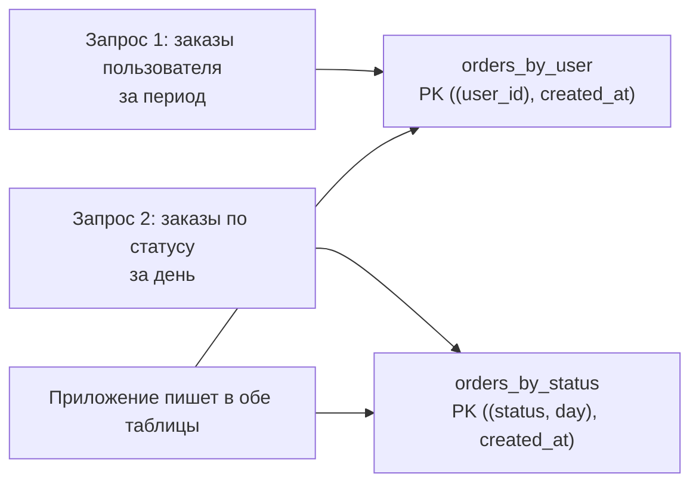

# Cassandra и ScyllaDB: широкие колонки и запись в масштабе

↑ [[DB 4.3 Поиск и специализированные БД|4.3 Поиск и специализированные БД]] · ← [[DB 4.3.1 Elasticsearch и OpenSearch — полнотекстовый поиск|Предыдущая]] · → [[DB 4.3.3 Временные ряды — TimescaleDB, InfluxDB, VictoriaMetrics|Следующая]]

<!-- meta:start -->
<div class="meta-strip"><span class="badge should">Желательно</span><span class="chip">~8 мин чтения</span><span class="chip">Уровень: senior</span></div>
<!-- meta:end -->

> [!info] Зачем это на собесе
> Cassandra появляется в вопросах про системы с огромным потоком записей и высокой доступностью (события, сообщения, IoT, истории действий). Интервьюер проверяет, понимаете ли вы главное отличие: таблицы проектируют под запросы, а не под нормализацию, и платят за это отсутствием JOIN и гибких выборок.

## Подтемы
- [ ] Модель данных: partition key и clustering key
- [ ] Проектирование «от запросов»
- [ ] Согласованность: уровни консистентности
- [ ] Внутреннее устройство: LSM-дерево, tombstones
- [ ] Антипаттерны
- [ ] ScyllaDB

## Объяснение

### Идея
Cassandra — распределённая база «широких колонок» без единого главного узла. Любой узел принимает запись, данные делятся по узлам кольца хэшем **ключа партиции**, каждая запись реплицируется на несколько узлов. Главные свойства: линейное масштабирование записи, отсутствие единой точки отказа, работа в нескольких датацентрах.

### Модель данных
Первичный ключ состоит из двух частей:

```text
PRIMARY KEY ((user_id), created_at, order_id)
             └ partition key ┘ └ clustering key ┘
```
- **Partition key** определяет, на каких узлах лежит строка. Все строки с одним ключом партиции хранятся вместе.
- **Clustering key** задаёт порядок строк внутри партиции. По нему быстро выбираются диапазоны.

Запрос эффективен, если он указывает **ключ партиции целиком** (и опционально диапазон по clustering key).

### Проектирование «от запросов»
В реляционной модели сначала проектируют сущности, потом пишут запросы. В Cassandra наоборот: перечисляют запросы и под каждый создают свою таблицу, дублируя данные.



### Согласованность настраивается на запрос
`N` реплик хранят данные. Для операции задают, сколько реплик должны ответить:

| Уровень | Смысл |
|---|---|
| `ONE` | достаточно одной реплики, быстро, слабее гарантии |
| `QUORUM` | большинство реплик (`N/2 + 1`) |
| `LOCAL_QUORUM` | большинство в локальном датацентре |
| `ALL` | все реплики, медленно и не переносит отказа узла |

Если `R + W > N` (сумма узлов чтения и записи больше числа реплик), чтение видит последнюю запись. Для `N = 3`: запись и чтение в `QUORUM` дают строгую картину. Это модель из [[DB 6.1.3 CAP, PACELC и модели согласованности|CAP и PACELC]]: Cassandra чаще выбирает доступность.

### Внутреннее устройство
Запись попадает в журнал коммитов и память (memtable), затем периодически сбрасывается в неизменяемые файлы **SSTable** (LSM-дерево). Фоновая **компактификация** сливает файлы. Поэтому запись очень быстрая (последовательная), а чтение может обращаться к нескольким SSTable.

**Удаление** — это запись маркера **tombstone**. Маркеры живут определённое время (`gc_grace_seconds`), и их большое число замедляет чтение.

### Антипаттерны
- Запросы без ключа партиции и `ALLOW FILTERING`: сканирование кластера.
- Огромные партиции («широкие» десятки мегабайт и более) и «горячие» партиции с перекосом нагрузки.
- Очередь на Cassandra: много удалений создаёт tombstone.
- Ожидание транзакций и JOIN: есть только лёгкие транзакции (LWT) на отдельные строки, и они дорогие.
- Частые обновления одной строки и счётчики вместо точного учёта.

### ScyllaDB
ScyllaDB — совместимая с Cassandra база на C++ с архитектурой «ядро на поток» («shard-per-core»): меньше задержки и лучше использование железа на тех же запросах. Использует тот же язык CQL и драйверы. Выбирают, когда нужно выжать максимум из узлов.

## Примеры

### CQL: таблица под запрос
```sql
CREATE KEYSPACE shop
  WITH replication = {'class': 'NetworkTopologyStrategy', 'dc1': 3};

CREATE TABLE shop.orders_by_user (
  user_id    uuid,
  created_at timestamp,
  order_id   uuid,
  total      decimal,
  PRIMARY KEY ((user_id), created_at, order_id)
) WITH CLUSTERING ORDER BY (created_at DESC);

-- эффективно: ключ партиции + диапазон по clustering key
SELECT order_id, total FROM shop.orders_by_user
WHERE user_id = ? AND created_at > '2026-01-01' LIMIT 20;
```

### Драйвер для .NET
```csharp
using Cassandra;

var cluster = Cluster.Builder()
    .AddContactPoint("127.0.0.1")
    .WithDefaultKeyspace("shop")
    .WithQueryOptions(new QueryOptions().SetConsistencyLevel(ConsistencyLevel.LocalQuorum))
    .Build();
using var session = await cluster.ConnectAsync();

var insert = await session.PrepareAsync(
    "INSERT INTO orders_by_user (user_id, created_at, order_id, total) VALUES (?, ?, ?, ?)");
await session.ExecuteAsync(insert.Bind(userId, DateTimeOffset.UtcNow, Guid.NewGuid(), 199.90m));

var select = await session.PrepareAsync(
    "SELECT order_id, total FROM orders_by_user WHERE user_id = ? AND created_at > ? LIMIT 20");
var rows = await session.ExecuteAsync(select.Bind(userId, DateTimeOffset.UtcNow.AddDays(-7)));
foreach (var row in rows) Console.WriteLine($"{row.GetValue<Guid>("order_id")} {row.GetValue<decimal>("total")}");
```
Используйте подготовленные запросы (`PrepareAsync`): они разбираются один раз и маршрутизируются на нужный узел.

## Нюансы и подводные камни
- **Сначала запросы, потом таблицы.** Неверный ключ партиции исправить можно только пересозданием таблицы и миграцией данных.
- **Размер партиции.** Держите партиции в пределах десятков мегабайт, добавляйте в ключ время (например, день), чтобы ограничить рост.
- **Удаления и TTL создают tombstone.** Проектируйте модель так, чтобы массовое удаление не было основным сценарием.
- **Время на узлах.** Разрешение конфликтов строится на метках времени: нужна синхронизация часов (NTP).
- **Восстановление.** Регулярный `repair` нужен для согласования реплик.
- **Эксплуатация не тривиальна.** Cassandra требует опыта: компактификация, repair, мониторинг. Часто берут управляемый сервис.
- **Не заменяет PostgreSQL.** Для обычных приложений с транзакциями и разнообразными запросами реляционная БД проще.

## Вопросы с ответами
> [!question]- Что такое partition key и clustering key?
> Partition key определяет, на каких узлах хранится строка (по хэшу), clustering key задаёт порядок строк внутри партиции. Эффективные запросы указывают partition key целиком и, при необходимости, диапазон по clustering key.

> [!question]- Почему в Cassandra нет JOIN и таблицы делают под запросы?
> Данные распределены по узлам, а JOIN потребовал бы обращаться ко многим узлам. Поэтому для каждого запроса создают отдельную таблицу и допускают дублирование данных. Это цена за предсказуемую скорость и масштабирование.

> [!question]- Что значит «настраиваемая согласованность»?
> Для каждого запроса выбирают, сколько реплик должны подтвердить операцию (`ONE`, `QUORUM`, `ALL`). При `R + W > N` чтение видит последнюю запись, меньшие значения дают скорость и доступность ценой возможной устаревшести.

> [!question]- Почему запись в Cassandra быстрая?
> Запись идёт в журнал и память (memtable) последовательно, без поиска и перезаписи на диске, затем сбрасывается в неизменяемые SSTable. Обслуживание сводится к фоновой компактификации.

> [!question]- Что такое tombstone?
> Маркер удаления. Данные физически удаляются позже при компактификации. Большое число tombstone замедляет чтение, поэтому массовые удаления и очереди на Cassandra считаются антипаттерном.

> [!question]- Чем ScyllaDB отличается от Cassandra?
> Это совместимая по CQL и драйверам база на C++ с архитектурой «shard-per-core», которая даёт меньшие задержки и лучше использует ресурсы узла. Модель данных и принципы те же.

## Связанные темы
- CAP и согласованность: [[DB 6.1.3 CAP, PACELC и модели согласованности|CAP, PACELC и модели согласованности]]
- Шардирование: [[DB 6.1.2 Шардирование и выбор ключа шардирования|Шардирование и ключ]]
- Выбор хранилища: [[DB 6.1.6 Выбор хранилища под задачу — polyglot persistence|Polyglot persistence]]
- SQL или NoSQL: [[DB 4.1.6 SQL или NoSQL — как выбрать|SQL или NoSQL]]
