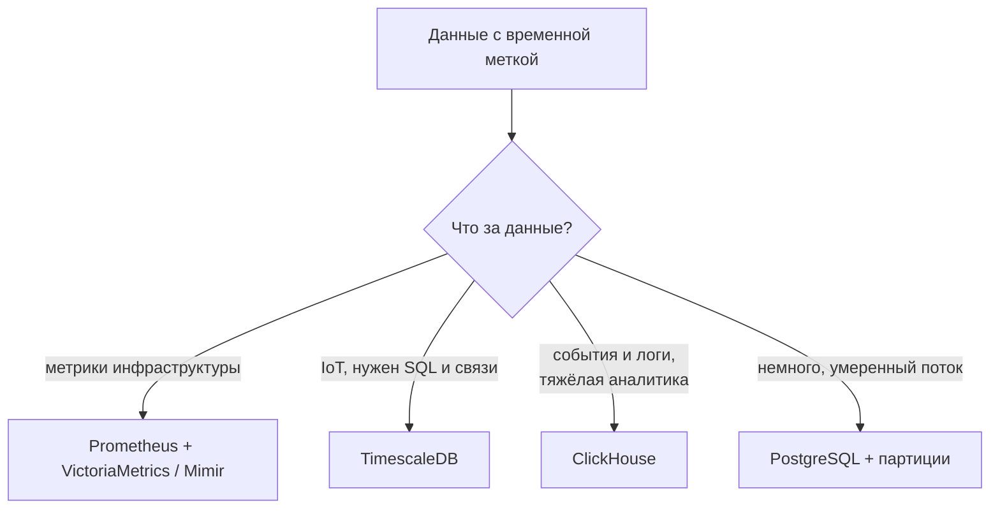

# Временные ряды: TimescaleDB, InfluxDB, VictoriaMetrics

↑ [[DB 4.3 Поиск и специализированные БД|4.3 Поиск и специализированные БД]] · ← [[DB 4.3.2 Cassandra и ScyllaDB — широкие колонки и запись в масштабе|Предыдущая]] · → [[DB 4.3.4 Векторные БД — embeddings, pgvector, Qdrant и RAG|Следующая]]

<!-- meta:start -->
<div class="meta-strip"><span class="badge should">Желательно</span><span class="chip">~6 мин чтения</span><span class="chip">Уровень: middle</span></div>
<!-- meta:end -->

> [!info] Зачем это на собесе
> Метрики, датчики, события и финансовые котировки — данные, где запись идёт непрерывным потоком, а запросы почти всегда «за период с агрегацией». Вопрос «где хранить метрики или IoT-данные» проверяет знание специализированных движков и понимание кардинальности, retention и downsampling.

## Подтемы
- [ ] Особенности временных рядов
- [ ] Кардинальность, retention, downsampling
- [ ] TimescaleDB
- [ ] InfluxDB и VictoriaMetrics
- [ ] ClickHouse и партиции PostgreSQL как альтернативы

## Объяснение

### Что такое временной ряд
Последовательность значений с временной меткой: температура раз в секунду, загрузка процессора, цена акции. Характер нагрузки:
- данные почти только **добавляются** и почти не меняются;
- запросы берут **диапазон по времени** и агрегируют (среднее, максимум, квантили);
- старые данные теряют ценность и подлежат сжатию или удалению.

### Понятия
| Понятие | Смысл |
|---|---|
| Метрика и теги (labels) | имя измерения и набор меток (host, region, service) |
| Кардинальность | число уникальных комбинаций меток; её рост главная причина проблем |
| Retention | срок хранения данных |
| Downsampling | хранение старых данных с меньшей детализацией (минутные вместо секундных) |
| Continuous aggregate | заранее посчитанная агрегация, которая обновляется автоматически |

**Высокая кардинальность** (например, метка `user_id` или `request_id`) создаёт миллионы рядов и убивает производительность большинства TSDB. В метки кладут ограниченные значения, а уникальные идентификаторы держат в логах или трассах.

### TimescaleDB
Расширение PostgreSQL. Обычная таблица превращается в **hypertable**, которая автоматически делится на «чанки» по времени. Остаётся SQL, транзакции и все инструменты PostgreSQL.

```sql
CREATE TABLE metrics (
  time   timestamptz NOT NULL,
  device text        NOT NULL,
  value  double precision
);
SELECT create_hypertable('metrics', 'time');

-- агрегация по 5-минутным окнам
SELECT time_bucket('5 minutes', time) AS bucket, device, avg(value)
FROM metrics
WHERE time > now() - interval '1 day'
GROUP BY bucket, device
ORDER BY bucket;
```
Поддерживает сжатие старых чанков, политики retention и continuous aggregates. Подходит, когда нужны SQL и связь с обычными таблицами.

### InfluxDB и VictoriaMetrics
| Система | Особенности |
|---|---|
| InfluxDB | специализированная TSDB, язык Flux и SQL-подобный InfluxQL (в новых версиях добавлен SQL), отдельная экосистема сбора данных |
| VictoriaMetrics | хранилище совместимо с Prometheus (PromQL), хорошо сжимает, экономно по памяти, просто масштабируется |
| Prometheus TSDB | локальное хранилище Prometheus, хорошее для одного узла и короткого срока |

Для инфраструктурных метрик обычно связка Prometheus (сбор) и VictoriaMetrics (долгое хранение) или Thanos и Mimir ([[DO 7.10 Долгое хранение метрик — Thanos, Mimir, VictoriaMetrics|долгое хранение метрик]]).

### Альтернативы без специализированной TSDB
- **PostgreSQL с партиционированием по времени** ([[DB 2.1.9 Партиционирование таблиц|партиционирование]]) подходит для умеренных объёмов.
- **ClickHouse** ([[DB 3.1 ClickHouse|ClickHouse]]) справляется с миллиардами строк и аналитикой, часто выбирают для событий и логов.



## Нюансы и подводные камни
- **Кардинальность.** Не используйте в метках `user_id`, `url`, идентификаторы запросов.
- **Retention и downsampling планируйте сразу.** Хранить секундные данные годами дорого и не нужно.
- **Время.** Храните в UTC, следите за часами источников и задержкой доставки (запаздывающие данные).
- **Пакетная вставка.** Пишите пачками, а не по одной строке.
- **Запросы по диапазону времени.** Всегда ограничивайте период, иначе читается весь ряд.
- **Подсчёт квантилей** (p95, p99) по агрегированным данным неточен: храните гистограммы, если нужны точные перцентили.

## Вопросы с ответами
> [!question]- Чем временные ряды отличаются от обычных данных?
> Почти только добавляются, запрашиваются по диапазону времени с агрегацией и со временем устаревают. Поэтому специализированные движки оптимизируют запись, сжатие и удаление старых данных.

> [!question]- Что такое кардинальность и чем она опасна?
> Число уникальных комбинаций меток ряда. Высокая кардинальность (метки вроде `user_id`) создаёт миллионы рядов, растут память, индекс и время запросов. Уникальные значения не кладут в метки.

> [!question]- Зачем downsampling?
> Старые данные нужны реже и с меньшей детализацией. Хранение агрегатов (минутные, часовые) вместо сырых значений экономит место и ускоряет запросы по длинным периодам.

> [!question]- Что такое hypertable в TimescaleDB?
> Таблица, которая автоматически делится на чанки по времени. Запросы по диапазону читают только нужные чанки, старые чанки можно сжимать и удалять по политике.

> [!question]- Когда TimescaleDB, а когда ClickHouse?
> TimescaleDB, если нужны SQL, транзакции и связь с обычными таблицами PostgreSQL при умеренных объёмах. ClickHouse, когда счёт идёт на миллиарды строк и важна быстрая аналитика.

> [!question]- Чем VictoriaMetrics отличается от Prometheus?
> Prometheus хранит данные локально на одном узле и рассчитан на короткий срок. VictoriaMetrics совместим с PromQL, лучше сжимает данные и подходит для долгого хранения и масштабирования.

## Связанные темы
- ClickHouse: [[DB 3.1 ClickHouse|ClickHouse]]
- Партиционирование: [[DB 2.1.9 Партиционирование таблиц|Партиционирование таблиц]]
- Метрики и Prometheus: [[DO 7.1 Метрики — Prometheus, типы метрик, PromQL|Метрики и Prometheus]]
- Долгое хранение метрик: [[DO 7.10 Долгое хранение метрик — Thanos, Mimir, VictoriaMetrics|Thanos, Mimir, VictoriaMetrics]]
