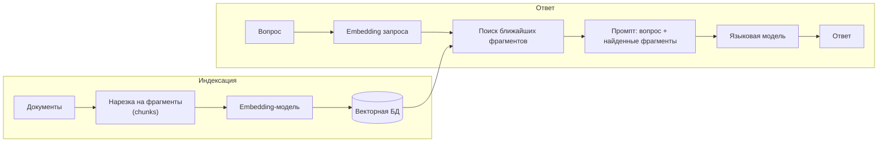

# Векторные БД: embeddings, pgvector, Qdrant и RAG

↑ [[DB 4.3 Поиск и специализированные БД|4.3 Поиск и специализированные БД]] · ← [[DB 4.3.3 Временные ряды — TimescaleDB, InfluxDB, VictoriaMetrics|Предыдущая]] · → [[DB 4.3.5 Графовые БД — Neo4j, Cypher и когда хватает рекурсивных запросов|Следующая]]

<!-- meta:start -->
<div class="meta-strip"><span class="badge should">Желательно</span><span class="chip">~8 мин чтения</span><span class="chip">Уровень: middle</span></div>
<!-- meta:end -->

> [!info] Зачем это на собесе
> Семантический поиск и RAG (ответы на вопросы по документам с помощью языковых моделей) стали обычной задачей бэкенда. На собеседовании ждут, что вы объясните, что такое embedding, почему нужен приближённый поиск (ANN), когда хватит расширения `pgvector` и когда нужна отдельная векторная БД.

## Подтемы
- [ ] Embeddings и векторное сходство
- [ ] Метрики расстояния
- [ ] Приближённый поиск: HNSW и IVFFlat
- [ ] pgvector
- [ ] Специализированные БД: Qdrant, Milvus, Weaviate
- [ ] RAG и гибридный поиск

## Объяснение

### Embedding
**Embedding** — числовой вектор (обычно сотни или тысячи чисел), который модель строит по тексту, изображению или звуку. Близкие по смыслу объекты получают близкие векторы: «кошка» и «собака» ближе друг к другу, чем «кошка» и «ракета». Поиск по смыслу превращается в поиск ближайших векторов.

### Метрики близости
| Метрика | Что измеряет | Оператор pgvector |
|---|---|---|
| Косинусное расстояние | угол между векторами (направление) | `<=>` |
| Евклидово расстояние (L2) | длина отрезка между точками | `<->` |
| Скалярное произведение | проекция, для нормализованных векторов эквивалентно косинусу | `<#>` (отрицательное) |

Для текстовых embeddings чаще берут косинусную метрику. Метрику выбирают так, как обучена модель (смотрите документацию модели).

### Точный и приближённый поиск
Точный поиск сравнивает запрос со всеми векторами: на больших объёмах медленно. **ANN** (approximate nearest neighbours) использует индекс и находит **почти** ближайших соседей быстро, жертвуя долей точности (recall).

| Индекс | Идея | Особенности |
|---|---|---|
| **HNSW** | многослойный граф «малого мира» | высокий recall и скорость, больше памяти, дороже построение |
| **IVFFlat** | кластеризация (списки), поиск в ближайших кластерах | быстрее строится, нужны данные для обучения кластеров, параметр `probes` |

### pgvector
Расширение PostgreSQL: тип `vector`, операторы расстояния и индексы HNSW/IVFFlat. Плюсы: одна база, транзакции, JOIN и фильтры по обычным колонкам.

```sql
CREATE EXTENSION IF NOT EXISTS vector;

CREATE TABLE docs (
  id serial PRIMARY KEY,
  title text,
  embedding vector(3)          -- в реальности размерность модели: 384, 768, 1536...
);
INSERT INTO docs (title, embedding) VALUES
  ('кошка',  '[0.9, 0.1, 0.0]'),
  ('собака', '[0.8, 0.2, 0.1]'),
  ('ракета', '[0.0, 0.1, 0.9]');

-- ближайшие соседи по косинусному расстоянию
SELECT title, embedding <=> '[0.85, 0.15, 0.05]' AS dist
FROM docs ORDER BY embedding <=> '[0.85, 0.15, 0.05]' LIMIT 2;

CREATE INDEX ON docs USING hnsw (embedding vector_cosine_ops);
```

### Специализированные векторные БД
| Решение | Особенности |
|---|---|
| **Qdrant** | на Rust, фильтрация по метаданным (payload), HNSW, простая эксплуатация |
| **Milvus** | масштабируемая распределённая архитектура, разные типы индексов |
| **Weaviate** | встроенные модули векторизации и гибридный поиск |
| **Elasticsearch / OpenSearch** | kNN-поиск рядом с полнотекстовым |

Выбирают отдельную БД, когда векторов десятки миллионов и больше, нужна быстрая фильтрация по метаданным на большом объёме или отдельное масштабирование. Для небольших и средних объёмов `pgvector` проще.

### RAG
**RAG** (retrieval-augmented generation) отвечает на вопрос модели по вашим документам: из базы достаются релевантные фрагменты и подставляются в запрос к модели.



Качество RAG зависит от нарезки (размер и перекрытие фрагментов), модели embeddings, фильтров и от **гибридного поиска**: векторный поиск хорошо находит смысл, а полнотекстовый (BM25) точные термины и названия. Результаты объединяют и при необходимости переранжируют.

## Примеры

### Запрос из .NET через Npgsql и Pgvector
```csharp
using Npgsql;
using Pgvector;

var dsb = new NpgsqlDataSourceBuilder("Host=localhost;Database=app;Username=app;Password=secret");
dsb.UseVector();                                  // регистрирует тип vector
await using var ds = dsb.Build();

await using var cmd = ds.CreateCommand("SELECT title FROM docs ORDER BY embedding <=> $1 LIMIT 3");
cmd.Parameters.AddWithValue(new Vector(new float[] { 0.85f, 0.15f, 0.05f }));

await using var reader = await cmd.ExecuteReaderAsync();
while (await reader.ReadAsync()) Console.WriteLine(reader.GetString(0));
```
Пакет `Pgvector` добавляет тип `Vector`, для EF Core есть `Pgvector.EntityFrameworkCore`.

### Фильтр по метаданным плюс векторный поиск
```sql
SELECT title FROM docs
WHERE category = 'faq'
ORDER BY embedding <=> $1
LIMIT 5;
```
С фильтром по сильно отсекающей колонке планировщик может не использовать ANN-индекс. Проверяйте `EXPLAIN` и пробуйте составные стратегии (партиции, отдельные индексы).

## Нюансы и подводные камни
- **Размерность и модель фиксированы.** Все векторы и запросы должны быть получены одной моделью; смена модели требует пересчёта всех embeddings.
- **ANN даёт приближённый результат.** Подбирайте параметры (`hnsw.ef_search`, `probes`), измеряйте recall на своих данных.
- **Память.** HNSW-индекс хранится в памяти, ёмкость считают заранее (число векторов × размерность × 4 байта плюс накладные расходы).
- **Обновления.** Частые вставки и удаления ухудшают индекс, иногда нужна перестройка.
- **Нарезка текста** сильно влияет на качество RAG: слишком длинные фрагменты размывают смысл, слишком короткие теряют контекст.
- **Безопасность.** Не подмешивайте в RAG документы без проверки прав доступа: фильтруйте выдачу по правам пользователя до подстановки в промпт.
- **Не всегда нужна векторная БД.** Для точных названий, артикулов и кодов лучше полнотекстовый или обычный индекс.

## Вопросы с ответами
> [!question]- Что такое embedding?
> Числовой вектор, который модель строит по тексту или другому объекту так, что близкие по смыслу объекты получают близкие векторы. Поэтому смысловой поиск превращается в поиск ближайших соседей в векторном пространстве.

> [!question]- Зачем нужен приближённый поиск (ANN)?
> Точный перебор всех векторов слишком медленный на больших объёмах. ANN-индексы (HNSW, IVFFlat) находят почти ближайших соседей значительно быстрее, немного жертвуя точностью (recall).

> [!question]- Чем HNSW отличается от IVFFlat?
> HNSW строит граф и обеспечивает высокий recall и скорость ценой памяти и времени построения. IVFFlat делит данные на кластеры и ищет в ближайших, строится быстрее, но требует обученных кластеров и настройки `probes`.

> [!question]- Когда хватит pgvector, а когда нужен Qdrant или Milvus?
> pgvector подходит для небольших и средних объёмов, когда важны одна база, транзакции и JOIN. Отдельная векторная БД нужна при десятках и сотнях миллионов векторов, жёстких требованиях к задержке и фильтрации или отдельном масштабировании.

> [!question]- Что такое RAG и из чего он состоит?
> Индексация (нарезка документов, embeddings, хранение в векторной БД) и ответ (embedding вопроса, поиск ближайших фрагментов, подстановка в промпт, генерация ответа моделью). Качество зависит от нарезки, модели и поиска.

> [!question]- Зачем гибридный поиск?
> Векторный поиск находит смысл, но может промахнуться на точных терминах, кодах и именах. Полнотекстовый (BM25) точен в терминах. Объединение результатов даёт лучшее качество.

## Связанные темы
- Полнотекстовый поиск: [[DB 4.3.1 Elasticsearch и OpenSearch — полнотекстовый поиск|Elasticsearch и OpenSearch]]
- Индексы PostgreSQL: [[DB 2.1.2 Индексы — B-tree, Hash, GIN, GiST, BRIN, составные, частичные, covering|Индексы PostgreSQL]]
- Выбор хранилища: [[DB 6.1.6 Выбор хранилища под задачу — polyglot persistence|Polyglot persistence]]
