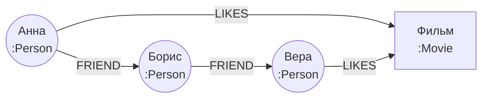

# Графовые БД: Neo4j, Cypher и когда хватает рекурсивных запросов

↑ [[DB 4.3 Поиск и специализированные БД|4.3 Поиск и специализированные БД]] · ← [[DB 4.3.4 Векторные БД — embeddings, pgvector, Qdrant и RAG|Предыдущая]] · → [[DB 4.3.6 NewSQL — CockroachDB, YugabyteDB, TiDB и распределённый SQL|Следующая]]

<!-- meta:start -->
<div class="meta-strip"><span class="badge should">Желательно</span><span class="chip">~6 мин чтения</span><span class="chip">Уровень: middle</span></div>
<!-- meta:end -->

> [!info] Зачем это на собесе
> «Рекомендации друзей», «цепочка подчинения», «зависимости сервисов», «поиск мошеннических связей» — задачи про связи. Интервьюер хочет услышать, когда граф действительно нужен, а когда достаточно рекурсивного запроса в PostgreSQL.

## Подтемы
- [ ] Модель графа: узлы, рёбра, свойства
- [ ] Cypher
- [ ] Когда граф выигрывает
- [ ] Рекурсивные запросы в SQL как альтернатива
- [ ] Neo4j, Apache AGE и другие

## Объяснение

### Модель
Граф состоит из **узлов** (вершин), **рёбер** (связей) и **свойств** на тех и других. В property graph у ребра есть направление и тип, у узла метки.



В реляционной модели связи многие-ко-многим это таблицы и JOIN. Чем глубже обход (друзья друзей друзей), тем больше JOIN и тем дороже запрос. Графовая БД хранит ссылки на соседей прямо в узле, обход не зависит от общего размера данных, а от числа затронутых связей.

### Cypher
Язык запросов Neo4j, который описывает узор «рисунком»:

```cypher
// друзья друзей Анны, которых она ещё не знает
MATCH (a:Person {name: 'Анна'})-[:FRIEND]->(:Person)-[:FRIEND]->(fof:Person)
WHERE NOT (a)-[:FRIEND]->(fof) AND fof <> a
RETURN DISTINCT fof.name;

// кратчайший путь между двумя людьми
MATCH p = shortestPath((a:Person {name: 'Анна'})-[:FRIEND*..6]-(b:Person {name: 'Вера'}))
RETURN p;
```

### Когда граф действительно нужен
- Рекомендации («люди, которые лайкали это, лайкали и то»).
- Антифрод: кольца связанных аккаунтов и карт.
- Зависимости и влияние: кто затронут, если упадёт сервис.
- Знания и онтологии, связи сущностей в поиске.
- Маршруты и сети.

Если запросы редко уходят дальше одного-двух шагов, хватает обычной реляционной модели.

### Рекурсивные запросы в SQL
PostgreSQL умеет обходить иерархии и графы через `WITH RECURSIVE`:

```sql
CREATE TABLE emp (id int PRIMARY KEY, name text, boss_id int REFERENCES emp(id));
INSERT INTO emp VALUES (1,'Директор',NULL),(2,'Техлид',1),(3,'Бэкендер',2),(4,'Фронтендер',2),(5,'Стажёр',3);

-- цепочка руководителей снизу вверх
WITH RECURSIVE chain AS (
  SELECT id, name, boss_id, 0 AS depth FROM emp WHERE id = 5
  UNION ALL
  SELECT e.id, e.name, e.boss_id, c.depth + 1
  FROM emp e JOIN chain c ON e.id = c.boss_id
)
SELECT depth, name FROM chain ORDER BY depth;
-- 0 Стажёр, 1 Бэкендер, 2 Техлид, 3 Директор

-- все подчинённые техлида сверху вниз
WITH RECURSIVE tree AS (
  SELECT id, name, 0 AS depth FROM emp WHERE id = 2
  UNION ALL
  SELECT e.id, e.name, t.depth + 1 FROM emp e JOIN tree t ON e.boss_id = t.id
)
SELECT depth, name FROM tree ORDER BY depth, name;
```
Для графов с циклами в запрос добавляют массив посещённых узлов или ограничение глубины, иначе рекурсия не остановится.

### Варианты
| Решение | Особенности |
|---|---|
| **Neo4j** | самая известная графовая БД, язык Cypher, сообщество и инструменты |
| **Apache AGE** | расширение PostgreSQL с запросами Cypher поверх таблиц |
| **Amazon Neptune, JanusGraph, ArangoDB** | облачный сервис, распределённый граф, мультимодельная БД |
| **PostgreSQL `WITH RECURSIVE`** | иерархии и небольшие графы без новой системы |

## Нюансы и подводные камни
- **Граф не заменяет основную БД.** Часто он живёт рядом как специализированный индекс связей, наполняемый из основной базы.
- **Суперузлы.** Узел с миллионами связей (знаменитость, общий тег) замедляет обход. Ограничивайте степень и направление обхода.
- **Глубина обхода растёт экспоненциально.** Всегда ограничивайте длину пути (`*..6`).
- **Масштабирование.** Шардировать графы сложнее, чем таблицы; многие решения лучше масштабируются вверх, чем вширь.
- **Циклы.** В SQL защищайтесь от зацикливания (`UNION` вместо `UNION ALL`, массив посещённых, лимит глубины).
- **Модель данных.** Неверное разделение на узлы и рёбра (свойство вместо узла) усложняет запросы.

## Вопросы с ответами
> [!question]- Чем графовая БД лучше реляционной для связей?
> Связи хранятся как ссылки между узлами, и обход на несколько шагов не требует цепочки JOIN. Время запроса определяется числом пройденных связей, а не размером всех данных.

> [!question]- Когда достаточно PostgreSQL?
> Когда иерархии небольшой глубины и запросы редко выходят за один-два шага: подойдёт внешний ключ на родителя и `WITH RECURSIVE`. Граф нужен при глубоких и разнообразных обходах, поиске путей и рекомендациях.

> [!question]- Что такое Cypher?
> Декларативный язык запросов Neo4j, описывающий искомый узор символами: `(a)-[:FRIEND]->(b)`. Поддерживается также расширением Apache AGE для PostgreSQL.

> [!question]- Как обойти иерархию в SQL?
> Рекурсивным общим табличным выражением `WITH RECURSIVE`: стартовый запрос плюс рекурсивная часть, которая присоединяет следующие уровни. Для защиты от циклов добавляют ограничение глубины или список посещённых узлов.

> [!question]- Что такое суперузел и чем он опасен?
> Узел с очень большим числом связей. Обход через него затрагивает огромное число рёбер и замедляет запросы; его ограничивают, разбивают или исключают из обхода.

## Связанные темы
- Рекурсивные запросы и CTE: [[DB 1.1 Реляционная модель и SQL|Реляционная модель и SQL]]
- Выбор хранилища: [[DB 6.1.6 Выбор хранилища под задачу — polyglot persistence|Polyglot persistence]]
- Зависимости в архитектуре: [[BE 8.3.2 Декомпозиция сервисов и database per service|Декомпозиция сервисов]]
