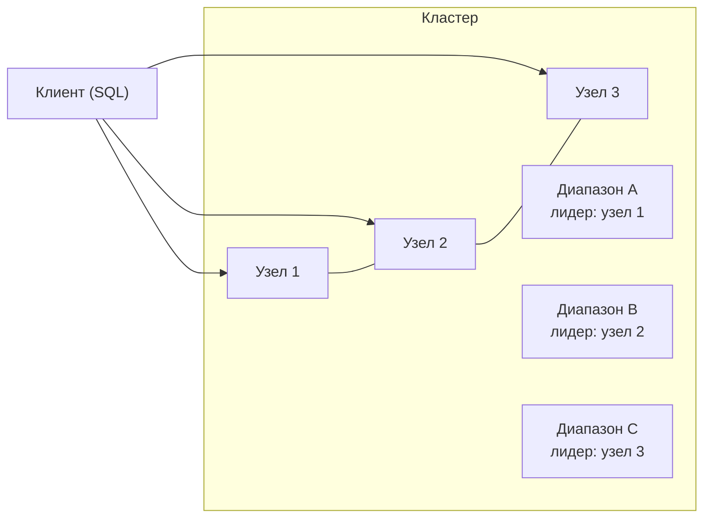
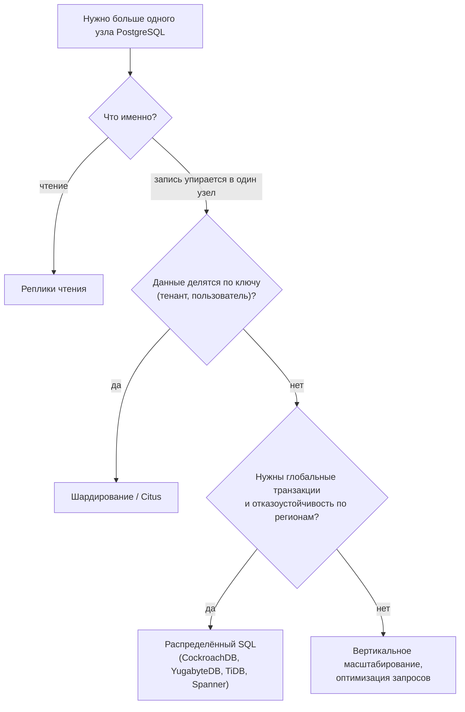

# NewSQL: CockroachDB, YugabyteDB, TiDB и распределённый SQL

↑ [[DB 4.3 Поиск и специализированные БД|4.3 Поиск и специализированные БД]] · ← [[DB 4.3.5 Графовые БД — Neo4j, Cypher и когда хватает рекурсивных запросов|Предыдущая]]

<!-- meta:start -->
<div class="meta-strip"><span class="badge should">Желательно</span><span class="chip">~7 мин чтения</span><span class="chip">Уровень: senior</span></div>
<!-- meta:end -->

> [!info] Зачем это на собесе
> На уровне senior спрашивают: «Что делать, когда PostgreSQL на одном узле не хватает, а отказ от SQL не вариант?» Ответ строится вокруг выбора: вертикальное масштабирование, реплики, шардирование, либо распределённый SQL со своими компромиссами.

## Подтемы
- [ ] Что такое NewSQL
- [ ] Как это устроено: Raft и диапазоны данных
- [ ] CockroachDB, YugabyteDB, TiDB, Spanner
- [ ] Цена распределённости
- [ ] Когда выбирать

## Объяснение

### Идея
**NewSQL** (распределённый SQL) стремится сочетать SQL и ACID-транзакции реляционных баз с горизонтальным масштабированием и отказоустойчивостью NoSQL. Данные автоматически делятся на диапазоны (ranges, tablets), каждый диапазон реплицируется на несколько узлов алгоритмом консенсуса **Raft**.



Каждый диапазон имеет лидера и реплики. Запись подтверждается, когда большинство реплик записали её. Потеря узла не останавливает кластер: лидерство переходит к другой реплике.

### Представители
| Система | Совместимость | Особенности |
|---|---|---|
| **CockroachDB** | протокол PostgreSQL (с отличиями), собственный SQL | строгая сериализуемость по умолчанию, геораспределение, автоматическое перебалансирование |
| **YugabyteDB** | слой YSQL на коде PostgreSQL и YCQL в стиле Cassandra | высокая совместимость с PostgreSQL, Raft |
| **TiDB** | протокол MySQL | разделение вычислений и хранения (TiKV), аналитика через TiFlash |
| **Google Spanner** | облачный сервис | глобально согласованные транзакции (TrueTime), управляемый сервис |

### Цена распределённости
- **Задержка.** Транзакция требует подтверждения большинством реплик, часто по сети: запись заметно медленнее, чем на одном PostgreSQL.
- **Распределённые транзакции** дороже: охватывают несколько диапазонов и узлов.
- **Повторы транзакций.** Конфликты приводят к ошибкам сериализации (SQLSTATE `40001`), приложение должно повторять транзакцию.
- **Совместимость не стопроцентная.** Расширения, типы, хранимые процедуры и планы запросов отличаются от PostgreSQL.
- **Стоимость и сложность эксплуатации.** Минимум три узла, мониторинг, сетевые требования.

### Когда выбирать

Распределённый SQL оправдан, когда нужны горизонтальное масштабирование записи, автоматическая отказоустойчивость и транзакции на разных данных, и команда готова принять задержки и эксплуатацию.

## Примеры

### Повтор транзакции при ошибке сериализации
```csharp
async Task<T> RetryAsync<T>(Func<NpgsqlTransaction, Task<T>> work, NpgsqlDataSource ds, int attempts = 5)
{
    for (var i = 1; ; i++)
    {
        await using var conn = await ds.OpenConnectionAsync();
        await using var tx = await conn.BeginTransactionAsync();
        try
        {
            var result = await work(tx);
            await tx.CommitAsync();
            return result;
        }
        catch (PostgresException ex) when (ex.SqlState == "40001" && i < attempts)
        {
            await tx.RollbackAsync();
            await Task.Delay(TimeSpan.FromMilliseconds(50 * i * i));   // нарастающая пауза
        }
    }
}
```
Так работают с CockroachDB и любыми системами со строгой изоляцией: ошибка `40001` это нормальный сигнал «повторите», а не сбой.

### Запуск CockroachDB для экспериментов
```bash
docker run -d --name crdb -p 26257:26257 -p 8080:8080 \
  cockroachdb/cockroach start-single-node --insecure
docker exec -it crdb ./cockroach sql --insecure -e "CREATE DATABASE shop;"
```
Это одиночный узел для обучения, в продакшене нужен кластер из трёх и более узлов с TLS.

## Нюансы и подводные камни
- **Выбор первичного ключа.** Монотонно растущие ключи создают «горячий» диапазон. Используйте UUID, составные ключи или хэш-шардированные индексы.
- **Проверяйте совместимость.** Перед миграцией прогоните тесты на реальных запросах и расширениях.
- **Транзакции должны быть короткими** и идемпотентными: они повторяются.
- **Геораспределение.** Данные и лидеры привязывают к регионам, иначе задержка между регионами убьёт скорость.
- **Не нужен «на всякий случай».** Для большинства приложений реплики, партиционирование и хороший индекс решают задачу дешевле.
- **Лицензии.** У продуктов разные лицензии и ограничения бесплатных версий, проверяйте актуальные условия.

## Вопросы с ответами
> [!question]- Что такое NewSQL?
> Класс баз с SQL и ACID-транзакциями, которые масштабируются горизонтально и реплицируются автоматически (обычно через Raft). Примеры: CockroachDB, YugabyteDB, TiDB, Spanner.

> [!question]- Чем распределённый SQL отличается от PostgreSQL с репликами?
> Реплики PostgreSQL масштабируют чтение, запись идёт на один главный узел. Распределённый SQL делит данные между узлами и масштабирует запись, автоматически переживая отказ узлов, ценой задержки и сложности.

> [!question]- Зачем повторять транзакции при ошибке `40001`?
> При конкурентных конфликтах в сериализуемой изоляции система откатывает одну из транзакций. Это штатная ситуация: приложение должно повторить транзакцию с нарастающей паузой.

> [!question]- Почему монотонный ключ плох для распределённой БД?
> Все новые записи попадают в конец диапазона ключей, то есть на один узел. Возникает «горячая точка», и запись не масштабируется. Используют UUID, составные или хэш-ключи.

> [!question]- Когда не стоит использовать NewSQL?
> Когда данных и нагрузки умеренно и хватает одного PostgreSQL с репликами и оптимизацией. Распределённый SQL добавляет задержку, стоимость и эксплуатационную сложность.

## Связанные темы
- Шардирование: [[DB 6.1.2 Шардирование и выбор ключа шардирования|Шардирование]]
- CAP: [[DB 6.1.3 CAP, PACELC и модели согласованности|CAP, PACELC и модели согласованности]]
- Уровни изоляции: [[DB 2.1.5 Уровни изоляции и аномалии — dirty read, non-repeatable, phantom, serialization|Уровни изоляции]]
- Репликация: [[DB 6.1.1 Репликация — master-replica, синхронная и асинхронная, read replicas|Репликация]]
