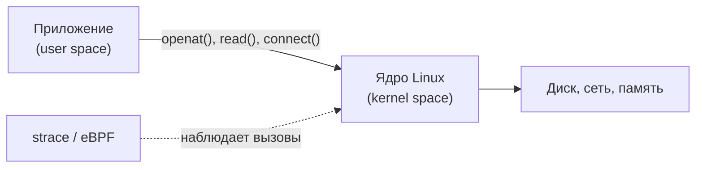
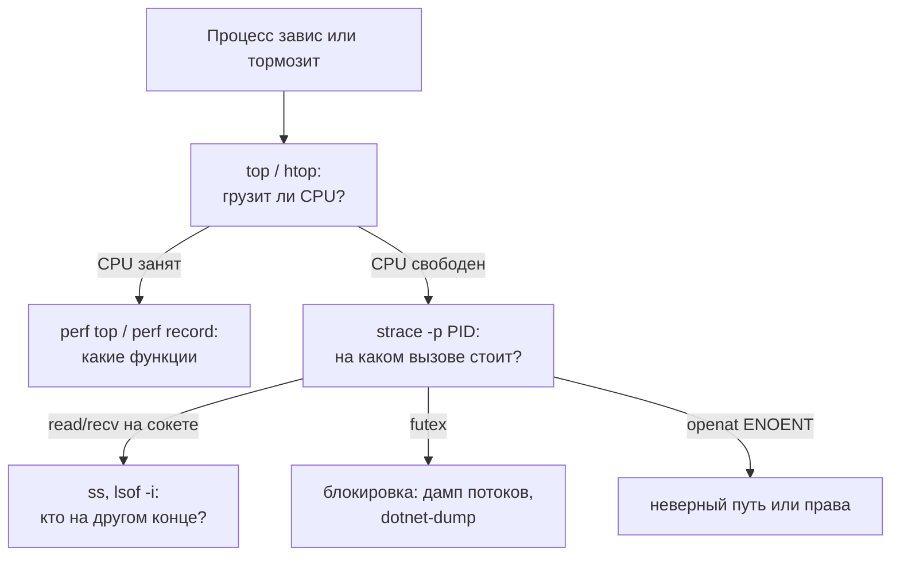

# Диагностика процессов: strace, lsof, perf и eBPF

↑ [[DO Этап 1 · Фундамент — Linux, Bash, сети|Этап 1 · Фундамент: Linux, Bash, сети]]

<!-- meta:start -->
<div class="meta-strip"><span class="badge should">Желательно</span><span class="chip">~7 мин чтения</span><span class="chip">Уровень: middle</span></div>
<!-- meta:end -->

> [!info] Зачем это на собесе
> «Программа зависла / не находит файл / тормозит, а логов нет. Что делаете?» Ждут последовательность: посмотреть, что процесс делает прямо сейчас (`strace`), какие файлы и сокеты открыты (`lsof`, `ss`), куда уходит процессор (`perf`), и знать, что современная замена всему этому eBPF.

## Подтемы
- [ ] Системные вызовы: как программа общается с ядром
- [ ] strace
- [ ] lsof и ss
- [ ] perf и профилирование
- [ ] eBPF: bpftrace и готовые утилиты
- [ ] Диагностика внутри контейнеров

## Объяснение

### Системные вызовы
Программа в пользовательском пространстве не может сама читать файлы, открывать сокеты или создавать процессы. Она просит об этом ядро через **системные вызовы** (`openat`, `read`, `write`, `connect`, `accept`, `futex`). Если видеть, какие вызовы делает процесс и чем они заканчиваются, поведение программы становится понятным без исходников.



### strace
Показывает системные вызовы процесса и их результат.

```bash
strace -f -o trace.txt ./app          # запустить и писать в файл, -f: следить за потоками и дочерними процессами
strace -p 1234                        # подключиться к работающему процессу
strace -e trace=openat,connect -p 1234  # только нужные вызовы
strace -c ./app                       # сводка: сколько вызовов и времени на каждый
strace -tt -T -p 1234                 # метки времени и длительность каждого вызова
```
Пример поиска причины «не находит файл»:

```text
$ strace -e trace=openat cat /nonexistent
openat(AT_FDCWD, "/nonexistent", O_RDONLY) = -1 ENOENT (No such file or directory)
```
`ENOENT` означает «файла нет»; `EACCES` «нет прав»; `ECONNREFUSED` «порт никто не слушает»; `ETIMEDOUT` «нет ответа». Зависшую программу видно по последнему вызову: `futex(...)` ожидание блокировки, `read(3, ...)` ожидание данных из сокета 3, `poll/epoll_wait` ожидание событий.

> [!warning] Накладные расходы
> `strace` заметно замедляет процесс, потому что перехватывает каждый вызов. На нагруженном продакшене используйте его кратко или берите eBPF-инструменты.

### lsof и ss
```bash
lsof -p 1234                 # открытые файлы и сокеты процесса
lsof -i :8080                # кто держит порт 8080
lsof +L1                     # удалённые, но ещё открытые файлы (типичная причина «диск полон, а du показывает мало»)
ss -tlnp                     # слушающие TCP-порты и процессы
ss -tnp state established    # установленные соединения
```
Подробнее о сокетах: [[BE 1.1.7 Запрос по TCP руками — nc, telnet, openssl s_client, HTTP и Redis|запрос по TCP руками]].

### perf: куда уходит процессор
```bash
perf top                          # живой список «горячих» функций в системе
perf record -g -p 1234 -- sleep 30   # снять профиль процесса за 30 секунд
perf report                       # посмотреть результат
```
С `-g` собираются стеки вызовов, по ним строят **flame graph**: ширина блока равна доле времени. Для .NET есть свои инструменты ([[BE 7.1.1 Профилирование — dotnet-counters, dotnet-trace, dotnet-dump, PerfView|dotnet-trace и dotnet-counters]]).

### eBPF
**eBPF** позволяет безопасно запускать небольшие программы внутри ядра и собирать данные о событиях (системные вызовы, сеть, планировщик) с малыми накладными расходами и без остановки процесса.

```bash
# bpftrace: печатать, какие процессы открывают какие файлы
bpftrace -e 'tracepoint:syscalls:sys_enter_openat { printf("%s %s\n", comm, str(args->filename)); }'
```
Готовые утилиты из набора BCC и bpftrace-инструментов:

| Утилита | Что показывает |
|---|---|
| `opensnoop` | какие файлы открываются |
| `execsnoop` | какие процессы запускаются |
| `tcpconnect`, `tcpaccept` | исходящие и входящие TCP-соединения |
| `biolatency` | распределение задержек дисковых операций |
| `runqlat` | задержки планировщика процессора |

Требуют root, достаточно новое ядро и установленных инструментов. Это основа современных средств наблюдаемости и безопасности (Cilium, Falco, Tetragon), см. [[DO 5.20 CNI в Kubernetes — Calico, Cilium и eBPF|eBPF в Kubernetes]].

### Внутри контейнеров
```bash
docker run --cap-add SYS_PTRACE ...          # разрешить strace внутри контейнера
kubectl debug -it pod/app --image=busybox --target=app   # эфемерный контейнер в поде
nsenter -t <pid-контейнера> -n ss -tlnp      # зайти в сетевое пространство имён контейнера с хоста
```
По умолчанию в контейнере нет `strace`; безопаснее подключаться с хоста или через эфемерный контейнер с нужными инструментами.

## Примеры

### Алгоритм «процесс завис»


### Почему диск «полон», хотя файлов мало
```bash
df -h /var                      # раздел заполнен
du -sh /var/* | sort -h | tail  # а файлов на такой объём нет
lsof +L1 | grep /var            # процесс держит удалённый файл (например, лог)
# решение: перезапустить процесс, чтобы он отпустил файл, или очистить его через /proc/PID/fd/N
```

## Нюансы и подводные камни
- **Права.** `strace -p` чужого процесса требует root или `CAP_SYS_PTRACE`; в части систем запрещено настройкой `ptrace_scope`.
- **Накладные расходы strace.** Заметное замедление, не запускайте на горячем продакшене надолго.
- **Шум.** Фильтруйте вызовы (`-e trace=`), иначе вывод не прочитать.
- **Стеки без символов.** Для `perf` нужны символы отладки, для JIT-языков (.NET, Java) нужны дополнительные настройки.
- **Безопасность.** Трассировка может показать пароли и токены из буферов (`read`, `write`): не публикуйте сырые дампы.
- **eBPF требует новых ядер и прав.** На старых и сильно ограниченных системах недоступен.

## Вопросы с ответами
> [!question]- Что такое системный вызов?
> Запрос программы к ядру на операцию, недоступную в пользовательском режиме: чтение и запись файлов, работа с сетью, создание процессов. Примеры: `openat`, `read`, `connect`.

> [!question]- Как с помощью strace найти, почему программа не стартует?
> Запустить `strace -f ./app` и смотреть последние вызовы перед падением: `openat(...) = -1 ENOENT` покажет отсутствующий файл, `EACCES` нехватку прав, `connect(...) = -1 ECONNREFUSED` недоступный сервис.

> [!question]- Чем strace отличается от eBPF-трассировки?
> strace перехватывает вызовы через ptrace и сильно замедляет процесс. eBPF-программы работают в ядре, собирают данные с малыми накладными расходами и подходят для продакшена.

> [!question]- Как узнать, кто занимает порт 8080?
> `ss -tlnp | grep 8080` или `lsof -i :8080`: покажет процесс и PID.

> [!question]- Почему `df` показывает полный диск, а `du` нет?
> Процесс держит открытым удалённый файл (часто лог): место не освобождается, пока файл открыт. Найти: `lsof +L1`; решение: перезапустить процесс.

> [!question]- Как диагностировать процесс в контейнере?
> С хоста через `nsenter` или `strace -p` по PID процесса контейнера, либо эфемерным контейнером `kubectl debug` с нужными инструментами, не ставя их в рабочий образ.

## Связанные темы
- Ресурсы Linux: [[DO 1.2 Диагностика ресурсов Linux — CPU, память, load average, swap, OOM|Диагностика ресурсов Linux]]
- Процессы и systemd: [[DO 1.7 Процессы, systemd, сервисы, journalctl|Процессы, systemd, journalctl]]
- Диагностика сети: [[DO 1.17 Диагностика сети — ping, traceroute, dig, nc, tcpdump|Диагностика сети]]
- Утилиты: [[DO 1.8 Утилиты — grep, sed, awk, find, curl, jq, htop, ss, lsof|Утилиты Linux]]
