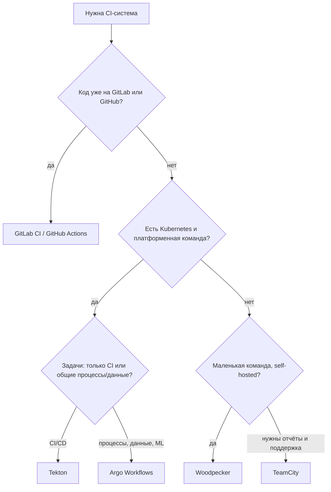

# Альтернативные CI-CD системы: Tekton, Argo Workflows, Woodpecker и Dagger

↑ [[DO Этап 3 · CI-CD|Этап 3 · CI-CD]]

<!-- meta:start -->
<div class="meta-strip"><span class="badge must">Обязательно</span><span class="chip">~11 мин чтения</span><span class="chip">Уровень: middle</span></div>
<!-- meta:end -->

> [!info] Зачем это на собесе
> «А если не GitLab CI и не GitHub Actions?» Проверяют, что вы понимаете идеи, а не один синтаксис: пайплайн как код, изолированные шаги в контейнерах, артефакты, секреты, runners. Умение сказать, чем Tekton отличается от Jenkins, показывает кругозор.

## Подтемы
- [ ] Что общего у всех CI-систем
- [ ] Kubernetes-нативные: Tekton и Argo Workflows
- [ ] Лёгкие self-hosted: Woodpecker и Drone
- [ ] TeamCity и Jenkins
- [ ] Dagger: пайплайн как код, независимый от CI
- [ ] Как выбрать

## Объяснение

### Общая модель
У любой CI-системы одни и те же части: **триггер** (push, pull request, расписание), **пайплайн** из стадий и шагов, **исполнитель** (runner, агент, под), **артефакты и кэш**, **секреты**, **окружения**. Различается то, где работает исполнитель и как описывается пайплайн.

### Сравнение

| Система | Где исполняется | Как описывается | Особенности |
|---|---|---|---|
| GitLab CI, GitHub Actions | runners | YAML в репозитории | встроены в платформу |
| **Jenkins** | агенты | Jenkinsfile (Groovy) | гибкость и плагины, требует ухода ([[DO 3.5 Jenkins — обзор для собеса|обзор Jenkins]]) |
| **TeamCity** | агенты | интерфейс и Kotlin DSL | коммерческий продукт JetBrains, удобные отчёты |
| **Tekton** | поды в Kubernetes | CRD: Task, Pipeline, PipelineRun | конструктор для собственной CI-платформы |
| **Argo Workflows** | поды в Kubernetes | CRD: Workflow (DAG) | общие рабочие процессы: CI, данные, ML |
| **Woodpecker / Drone** | контейнеры на хосте или в Kubernetes | YAML в репозитории | лёгкие, простые, каждый шаг в контейнере |
| **Dagger** | контейнеры (движок) | код на Go, Python, TypeScript и других | один пайплайн запускается и локально, и в любой CI |

### Tekton
Набор ресурсов Kubernetes для CI/CD. **Task** — последовательность шагов (каждый шаг контейнер), **Pipeline** — граф задач, **PipelineRun** — конкретный запуск. Всё хранится как объекты кластера, запускается подами, удобно для GitOps и платформенных команд. Есть готовые задачи (Tekton Hub), но требуется настройка триггеров и интерфейса.

### Argo Workflows
Движок рабочих процессов в Kubernetes: описываются **шаблоны** и зависимости между ними (DAG или шаги), каждый шаг выполняется подом. Подходит для CI, но ещё чаще для пакетных задач и ML-конвейеров. Часто используется вместе с Argo CD, см. [[DO 8.4 GitOps — ArgoCD и Flux|GitOps]].

### Woodpecker и Drone
Простая CI: каждый шаг выполняется в контейнере, конфигурация в `.woodpecker.yaml` (у Drone `.drone.yml`). Woodpecker это сообщественный форк Drone. Легко разворачивается на одном сервере, хорошо подходит небольшим командам и self-hosted.

### Dagger
Подход «пайплайн как программа»: вы пишете шаги на языке программирования с помощью SDK, а движок запускает их в контейнерах с кэшированием. Тот же пайплайн запускается на ноутбуке и в любой CI-системе, поэтому вы не привязаны к YAML конкретной платформы и можете отлаживать пайплайн локально.

### Как выбрать


## Примеры

### Woodpecker: тесты и сборка образа
```yaml
# .woodpecker.yaml
when:
  - event: [push, pull_request]

steps:
  - name: test
    image: mcr.microsoft.com/dotnet/sdk:10.0
    commands:
      - dotnet test

  - name: build-image
    image: woodpeckerci/plugin-docker-buildx
    settings:
      repo: registry.example.com/team/app
      tags: latest
    when:
      - branch: main
```

### Tekton: задача и пайплайн
```yaml
apiVersion: tekton.dev/v1
kind: Task
metadata:
  name: dotnet-test
spec:
  workspaces:
    - name: source
  steps:
    - name: test
      image: mcr.microsoft.com/dotnet/sdk:10.0
      workingDir: $(workspaces.source.path)
      script: |
        dotnet test
---
apiVersion: tekton.dev/v1
kind: Pipeline
metadata:
  name: ci
spec:
  workspaces:
    - name: shared
  tasks:
    - name: test
      taskRef:
        name: dotnet-test
      workspaces:
        - name: source
          workspace: shared
```

### Argo Workflows: зависимости шагов
```yaml
apiVersion: argoproj.io/v1alpha1
kind: Workflow
metadata:
  generateName: ci-
spec:
  entrypoint: main
  templates:
    - name: main
      dag:
        tasks:
          - name: build
            template: run
            arguments:
              parameters: [{ name: cmd, value: "dotnet build" }]
          - name: test
            dependencies: [build]
            template: run
            arguments:
              parameters: [{ name: cmd, value: "dotnet test" }]
    - name: run
      inputs:
        parameters:
          - name: cmd
      container:
        image: mcr.microsoft.com/dotnet/sdk:10.0
        command: [sh, -c]
        args: ["{{inputs.parameters.cmd}}"]
```
Шаблон `run` переиспользуется с разными параметрами, а шаг `test` запустится только после успешного `build`.

## Нюансы и подводные камни
- **Не выбирайте инструмент ради новизны.** Для большинства команд встроенные GitLab CI или GitHub Actions проще и дешевле в поддержке.
- **Kubernetes-нативные системы требуют платформенной работы:** триггеры, интерфейс, права, хранилище артефактов и кэша придётся собирать.
- **Воспроизводимость.** Какую бы систему вы ни взяли, фиксируйте версии образов шагов, не `latest`.
- **Секреты.** Доступ к секретам только у доверенных веток и шагов, не из pull request чужих форков ([[DO 3.8 Секреты и окружения — dev, staging, prod|секреты и окружения]]).
- **Портируемость.** Логику сборки выносите в скрипты (`Makefile`, `dotnet`, Dagger), а CI оставляйте тонкой оболочкой: миграция между системами станет простой.
- **Безопасность исполнителей.** Self-hosted агенты с доступом к Docker socket эквивалентны root на хосте.

## Вопросы с ответами
> [!question]- Чем Tekton отличается от Jenkins?
> Tekton работает как набор ресурсов Kubernetes: каждый шаг контейнер в поде, пайплайны описываются манифестами. У Jenkins центральный сервер с агентами и плагинами и Jenkinsfile на Groovy. Tekton удобнее для платформ на Kubernetes, Jenkins гибче и привычнее, но требует ухода.

> [!question]- Что такое Argo Workflows?
> Движок рабочих процессов для Kubernetes: описание шагов и зависимостей как DAG, каждый шаг выполняется подом. Применяется для CI, пакетных задач и ML-конвейеров.

> [!question]- Зачем нужен Dagger?
> Чтобы описывать пайплайн кодом на языке программирования и запускать его одинаково локально и в любой CI. Это снижает привязку к YAML конкретной платформы и упрощает отладку.

> [!question]- Когда подходит Woodpecker?
> Для небольших команд и self-hosted установок: лёгкий сервер, шаги в контейнерах, простой YAML.

> [!question]- Как не привязаться к одной CI-системе?
> Держать логику сборки и тестов в скриптах или инструментах (Makefile, `dotnet`, Dagger), а CI использовать как тонкий триггер, плюс фиксировать версии образов и использовать переносимые понятия (артефакты, кэш, секреты).

## Связанные темы
- Принципы CI-CD: [[DO 3.1 CI-CD — принципы, пайплайн, стадии, артефакты|CI-CD: принципы и стадии]]
- GitLab CI: [[DO 3.3 GitLab CI — .gitlab-ci.yml, stages, jobs, rules, runners, кэш|GitLab CI]]
- GitHub Actions: [[DO 3.4 GitHub Actions — workflows, jobs, matrix, secrets|GitHub Actions]]
- Jenkins: [[DO 3.5 Jenkins — обзор для собеса|Jenkins]]
- GitOps: [[DO 8.4 GitOps — ArgoCD и Flux|GitOps: ArgoCD и Flux]]
