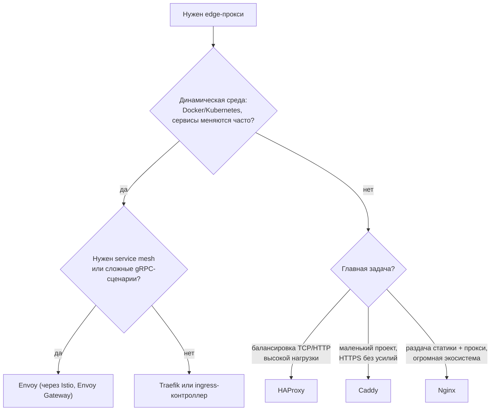

# Альтернативы Nginx: Traefik, Caddy, HAProxy и Envoy

↑ [[DO Этап 4 · Веб-серверы и сеть в проде — Nginx, TLS|Этап 4 · Веб-серверы и сеть в проде: Nginx, TLS]]

<!-- meta:start -->
<div class="meta-strip"><span class="badge should">Желательно</span><span class="chip">~9 мин чтения</span><span class="chip">Уровень: middle</span></div>
<!-- meta:end -->

> [!info] Зачем это на собесе
> «Почему Nginx, а не Traefik или Caddy?» и «Чем HAProxy отличается от Nginx?» Ответ не «что модно», а сравнение по задачам: автоматическое обнаружение сервисов, автоматический TLS, балансировка L4/L7, динамическая конфигурация и экосистема.

## Подтемы
- [ ] Что делает edge-прокси
- [ ] Traefik
- [ ] Caddy
- [ ] HAProxy
- [ ] Envoy
- [ ] Как выбрать

## Объяснение

### Что общего
Все они принимают соединения снаружи и решают похожие задачи: TLS-терминацию, reverse proxy, балансировку, маршрутизацию по хосту и пути, ограничения и метрики. Различаются философией конфигурации и сильными сторонами.

| | Nginx | Traefik | Caddy | HAProxy | Envoy |
|---|---|---|---|---|---|
| Конфигурация | статический файл, перезагрузка | динамическая из Docker, Kubernetes, файлов | Caddyfile или JSON, API | статический файл, runtime API | динамическая по API (xDS) |
| Автоматический TLS (Let's Encrypt) | нужен certbot или модуль | встроено | включено по умолчанию | нужны внешние инструменты | через систему управления |
| Сильная сторона | раздача статики, reverse proxy, экосистема | автообнаружение контейнеров | простота и HTTPS «из коробки» | высокопроизводительная балансировка L4/L7 | современный L7-прокси, основа service mesh |
| Типичный сценарий | универсальный веб-сервер и прокси | Docker и Kubernetes с частыми изменениями | небольшие проекты, сайты | балансировщик перед кластером | API-шлюзы, service mesh, gRPC |

### Traefik
Прокси, который **сам читает конфигурацию** из провайдеров: Docker (по меткам контейнеров), Kubernetes (Ingress, CRD, Gateway API), файлов. Запустили новый контейнер с нужными метками, и маршрут появился без перезагрузки. Умеет автоматически получать сертификаты Let's Encrypt, middleware (ограничение запросов, аутентификация, редиректы), есть панель.

### Caddy
Веб-сервер с **автоматическим HTTPS по умолчанию**: достаточно указать имя домена, сертификат выпустится и продлится сам. Очень короткий конфиг. Подходит для небольших проектов и быстрого старта.

### HAProxy
Специализированный балансировщик: L4 (TCP) и L7 (HTTP), проверки здоровья, ACL, sticky-сессии, stick tables для ограничения запросов. Очень высокая производительность и предсказуемость. Не раздаёт статику как веб-сервер.

### Envoy
Современный L7-прокси для динамических сред: конфигурация приходит по API (xDS), богатая телеметрия, первоклассная поддержка HTTP/2 и gRPC, фильтры. На нём построены многие service mesh и ingress-контроллеры (Istio, Envoy Gateway, Contour). Вручную настраивать Envoy в YAML неудобно, его обычно используют через надстройки.

### Как выбрать


## Примеры

### Traefik в Docker Compose: маршрут по меткам
```yaml
services:
  traefik:
    image: traefik:v3
    command:
      - --providers.docker=true
      - --providers.docker.exposedbydefault=false
      - --entrypoints.web.address=:80
    ports: ["80:80"]
    volumes: ["/var/run/docker.sock:/var/run/docker.sock:ro"]

  app:
    image: myapp:1.0
    labels:
      - traefik.enable=true
      - traefik.http.routers.app.rule=Host(`app.example.com`)
      - traefik.http.routers.app.entrypoints=web
      - traefik.http.services.app.loadbalancer.server.port=8080
```
Доступ Traefik к `docker.sock` даёт серьёзные права на хосте: ограничивайте его (прокси для сокета, режим чтения).

### Caddyfile: SPA и API с автоматическим HTTPS
```text
example.com {
    encode gzip zstd
    reverse_proxy /api/* app:8080

    root * /srv/www
    try_files {path} /index.html
    file_server
}
```
Для домена `example.com` Caddy сам получит и обновит сертификат (нужны открытые порты 80 и 443 и DNS-запись).

### HAProxy: балансировка с проверкой здоровья
```text
global
    daemon
defaults
    mode http
    timeout connect 5s
    timeout client  30s
    timeout server  30s

frontend web
    bind :80
    default_backend app

backend app
    balance roundrobin
    option httpchk GET /healthz
    server app1 10.0.0.11:8080 check
    server app2 10.0.0.12:8080 check backup   # запасной сервер
```
Проверить конфигурацию перед запуском: `haproxy -c -f haproxy.cfg`.

## Нюансы и подводные камни
- **Автоматический TLS требует доступности 80/443 и корректного DNS.** При лимитах Let's Encrypt частые пересоздания тестовых стендов ведут к блокировке: используйте staging-окружение.
- **`docker.sock` даёт почти root на хосте.** Не открывайте панель Traefik наружу без защиты.
- **Поведение по умолчанию различается:** таймауты, размеры буферов, заголовки `X-Forwarded-*`. Проверяйте при миграции (см. [[DO 4.9 HTTP-1.1, HTTP-2 и HTTP-3 — keep-alive, таймауты, буферы|HTTP-1.1, HTTP-2 и HTTP-3: keep-alive, таймауты, буферы]]).
- **WebSocket и gRPC** требуют явной настройки в каждом прокси.
- **Мигрируйте постепенно.** Поставьте новый прокси рядом и переключайте трафик частями.
- **Конфигурация в репозитории.** Независимо от инструмента храните её в git и проверяйте в CI (`nginx -t`, `haproxy -c`, `caddy validate`).

## Вопросы с ответами
> [!question]- Чем Traefik отличается от Nginx?
> Traefik динамически читает конфигурацию из Docker или Kubernetes и сам получает сертификаты, поэтому подходит для сред, где сервисы появляются и исчезают. Nginx использует статический конфиг с перезагрузкой и лучше раздаёт статику.

> [!question]- Почему Caddy называют «HTTPS из коробки»?
> Для домена в конфиге он сам выпускает и продлевает сертификат Let's Encrypt и включает HTTPS без дополнительных модулей и скриптов.

> [!question]- Когда HAProxy, а не Nginx?
> Когда главная задача балансировка TCP и HTTP под большой нагрузкой с проверками здоровья, ACL и детальной статистикой. Раздача статики и роль веб-сервера у Nginx удобнее.

> [!question]- Что такое Envoy и почему он так распространён?
> L7-прокси с динамической конфигурацией по API (xDS), хорошей поддержкой HTTP/2 и gRPC и богатой телеметрией. На нём построены Istio, Envoy Gateway и другие системы.

> [!question]- Как безопасно мигрировать с Nginx на другой прокси?
> Поднять новый прокси рядом, воспроизвести маршруты, таймауты и заголовки, проверить на тестовом трафике (WebSocket, gRPC, большие запросы), затем постепенно переключать трафик (DNS или балансировщик) с возможностью отката.

## Связанные темы
- Основы Nginx: [[DO 4.1 Nginx — конфигурация, server, location, upstream|Nginx: конфигурация, server, location, upstream]]
- Балансировка: [[DO 4.5 Балансировка L4 и L7, CDN|Балансировка L4 и L7, CDN]]
- TLS в проде: [[DO 4.4 TLS в проде — Let's Encrypt, certbot, HSTS|TLS в проде]]
- Kubernetes Gateway API: [[DO 5.18 Gateway API и вывод из поддержки ingress-nginx|Gateway API]]
