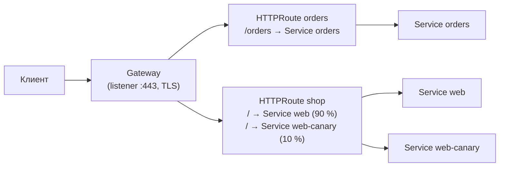

# Gateway API и вывод из поддержки ingress-nginx

↑ [[DO Этап 5 · Kubernetes|Этап 5 · Kubernetes]]

<!-- meta:start -->
<div class="meta-strip"><span class="badge should">Желательно</span><span class="chip">~9 мин чтения</span><span class="chip">Уровень: senior</span></div>
<!-- meta:end -->

> [!info] Зачем это на собесе
> Ingress долго был стандартным способом выставить сервис наружу, но у него тесные рамки, а популярный контроллер ingress-nginx, по объявлению сообщества Kubernetes, выводится из поддержки. Интервьюеры всё чаще спрашивают: «Чем Gateway API лучше Ingress и как мигрировать?»

## Подтемы
- [ ] Ограничения Ingress
- [ ] Ресурсы Gateway API
- [ ] Реализации
- [ ] Миграция с Ingress
- [ ] Статус ingress-nginx

## Объяснение

### Ограничения Ingress
`Ingress` описывает только простую HTTP-маршрутизацию по хосту и пути. Всё остальное (перезапись, таймауты, аутентификация, канареечные релизы, gRPC) контроллеры выражают через **аннотации**, которые у каждого контроллера свои. Манифесты получаются непереносимыми, а единый ресурс смешивает ответственность администратора кластера и разработчика приложения.

### Gateway API
Набор ресурсов Kubernetes, который разделяет роли и делает маршрутизацию выразительной и переносимой:

| Ресурс | Кто управляет | Что описывает |
|---|---|---|
| `GatewayClass` | поставщик платформы | тип реализации (Envoy Gateway, Istio, Cilium и т. д.) |
| `Gateway` | администратор кластера | точки входа: порты, протоколы, TLS, какие пространства имён могут подключать маршруты |
| `HTTPRoute` | команда приложения | правила маршрутизации по хосту, пути, заголовкам, весам, перезаписи |
| `GRPCRoute`, `TLSRoute`, `TCPRoute` | команда приложения | маршруты для других протоколов (часть ресурсов на разных стадиях зрелости) |


Gateway API вышел в GA в 2023 году (ресурсы `Gateway`, `GatewayClass` и `HTTPRoute`), остальные ресурсы развиваются по стадиям (experimental, standard). Функции вроде весов, перезаписи заголовков и редиректов описываются в самих ресурсах, а не аннотациях.

### Реализации
Envoy Gateway, Istio, Cilium, NGINX Gateway Fabric, Traefik, Kong, HAProxy и облачные контроллеры провайдеров. Все читают одни и те же ресурсы, поэтому манифесты маршрутов переносимы между реализациями в пределах поддерживаемых возможностей.

### Статус ingress-nginx
Сообщество Kubernetes (SIG Network) объявило о выводе ingress-nginx из поддержки: после срока, объявленного проектом (март 2026 года), новые релизы и исправления безопасности не планируются. Для кластеров, которые на него опираются, нужен план: выбрать новый контроллер или реализацию Gateway API и мигрировать. Точные даты и рекомендации смотрите в объявлении проекта Kubernetes.

> [!warning] Проверьте актуальное состояние
> Статус проектов и сроки вывода из поддержки меняются. Перед планированием миграции сверьтесь с официальным объявлением и репозиторием проекта.

### Миграция

Инструмент `ingress2gateway` конвертирует часть ресурсов Ingress и распространённые аннотации ingress-nginx в ресурсы Gateway API. Результат всё равно проверяют вручную.

## Примеры

### Gateway и HTTPRoute с весами
```yaml
apiVersion: gateway.networking.k8s.io/v1
kind: Gateway
metadata:
  name: public
  namespace: infra
spec:
  gatewayClassName: envoy              # имя класса зависит от установленной реализации
  listeners:
    - name: https
      protocol: HTTPS
      port: 443
      hostname: shop.example.com
      tls:
        mode: Terminate
        certificateRefs:
          - name: shop-tls
      allowedRoutes:
        namespaces:
          from: All
---
apiVersion: gateway.networking.k8s.io/v1
kind: HTTPRoute
metadata:
  name: shop
  namespace: shop
spec:
  parentRefs:
    - name: public
      namespace: infra
  hostnames: ["shop.example.com"]
  rules:
    - matches:
        - path: { type: PathPrefix, value: / }
      backendRefs:
        - name: web
          port: 80
          weight: 90
        - name: web-canary
          port: 80
          weight: 10
```
Канареечная раскатка весами описывается самим ресурсом, без аннотаций контроллера.

### Проверка статуса
```bash
kubectl get gateway -A
kubectl describe httproute shop -n shop     # смотрите блок Status: Accepted / ResolvedRefs
```

## Нюансы и подводные камни
- **Реализации поддерживают разный набор возможностей.** Проверяйте таблицу conformance выбранного проекта.
- **Права и namespace.** `allowedRoutes` решает, какие пространства имён могут подключать маршруты к Gateway: настраивайте осознанно.
- **Аннотации ingress-nginx не переносятся автоматически.** Перезаписи, `configuration-snippet` и rate limit потребуют ручного переноса.
- **TLS и cert-manager.** Для Gateway API у cert-manager есть поддержка, но настраивается иначе, чем для Ingress ([[DO 5.5 Ingress-контроллеры, cert-manager и TLS в кластере|Ingress-контроллеры, cert-manager и TLS]]).
- **Не мигрируйте в последний момент.** Параллельная работа двух входов и постепенный перенос безопаснее резкого переключения.

## Вопросы с ответами
> [!question]- Чем Gateway API лучше Ingress?
> Он разделяет роли (GatewayClass, Gateway для администратора, Route для команд приложений), описывает веса, перезаписи, заголовки и другие протоколы самими ресурсами, а не аннотациями контроллера, и переносим между реализациями.

> [!question]- Что такое HTTPRoute?
> Ресурс Gateway API, который описывает правила маршрутизации HTTP (хост, путь, заголовки, веса, перезапись) и привязывается к Gateway через `parentRefs`.

> [!question]- Почему встал вопрос про ingress-nginx?
> Сообщество Kubernetes объявило о его выводе из поддержки: после объявленного срока новых релизов и исправлений безопасности не будет. Поэтому нужен план миграции на другой контроллер или на Gateway API.

> [!question]- Как мигрировать с Ingress на Gateway API?
> Инвентаризировать Ingress и аннотации, выбрать реализацию Gateway API, сконвертировать (`ingress2gateway`) и проверить вручную, запустить параллельно со старым входом, переносить трафик частями и затем отключить старый контроллер.

> [!question]- Кто что настраивает в Gateway API?
> Поставщик платформы задаёт GatewayClass, администратор кластера Gateway (порты, TLS, допустимые пространства имён), разработчики Route-ресурсы для своих приложений.

## Связанные темы
- Service и Ingress: [[DO 5.4 Service, Ingress, DNS внутри кластера|Service, Ingress, DNS]]
- Ingress-контроллеры и TLS: [[DO 5.5 Ingress-контроллеры, cert-manager и TLS в кластере|Ingress-контроллеры, cert-manager и TLS]]
- Альтернативы Nginx: [[DO 4.11 Альтернативы Nginx — Traefik, Caddy, HAProxy и Envoy|Альтернативы Nginx]]
- Service mesh: [[DO 5.19 Service mesh — Istio, Linkerd, Cilium и когда он нужен|Service mesh]]
