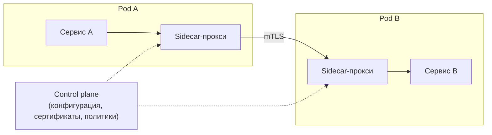
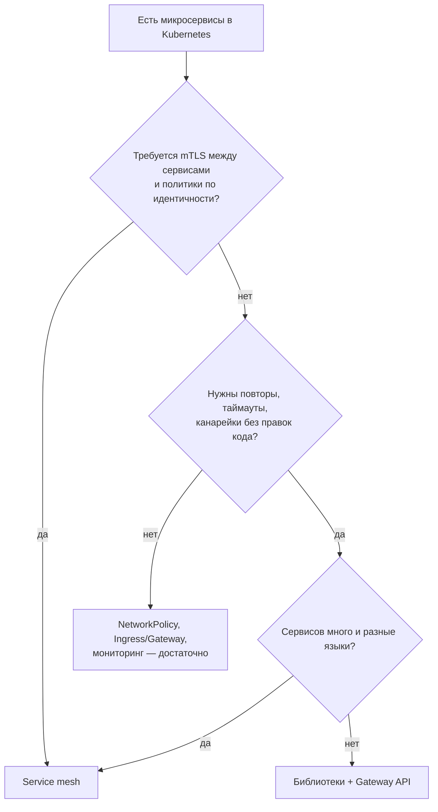

# Service mesh: Istio, Linkerd, Cilium и когда он нужен

↑ [[DO Этап 5 · Kubernetes|Этап 5 · Kubernetes]]

<!-- meta:start -->
<div class="meta-strip"><span class="badge should">Желательно</span><span class="chip">~8 мин чтения</span><span class="chip">Уровень: senior</span></div>
<!-- meta:end -->

> [!info] Зачем это на собесе
> «Что такое service mesh и нужен ли он нам?» Хороший ответ перечисляет, что он даёт (mTLS между сервисами, повторы, таймауты, канареечные релизы, телеметрию), что стоит (ресурсы, задержка, сложность) и предлагает альтернативы: библиотеки, Gateway API, NetworkPolicy.

## Подтемы
- [ ] Зачем нужна сервисная сетка
- [ ] Архитектура: sidecar и ambient
- [ ] Istio, Linkerd, Cilium
- [ ] Что даёт: mTLS, трафик, наблюдаемость
- [ ] Цена и альтернативы

## Объяснение

### Зачем
В микросервисах каждый вызов между сервисами должен быть зашифрован, иметь таймаут и повторы, маршрутизироваться (канареечные релизы), давать метрики и трейсы. Если делать это в каждом сервисе библиотекой (Polly, gRPC-интерсепторы), логика дублируется на разных языках. **Service mesh** выносит её в инфраструктуру.

### Как устроено
Классическая схема: рядом с каждым подом работает **sidecar-прокси** (чаще всего Envoy), весь трафик проходит через него, а **control plane** раздаёт конфигурацию и сертификаты.


Альтернатива sidecar: **ambient / sidecarless** режим. Прокси работает на уровне узла (и при необходимости отдельными прокси для L7), поэтому поды не раздуваются лишними контейнерами. Так устроен ambient mode в Istio и сетка Cilium, опирающаяся на eBPF.

### Варианты
| Решение | Особенности |
|---|---|
| **Istio** | самый функциональный, на Envoy, sidecar и ambient режимы, богатые политики трафика и безопасности, сложнее в эксплуатации |
| **Linkerd** | лёгкий собственный прокси на Rust, простота и низкие накладные расходы, меньше функций |
| **Cilium Service Mesh** | на eBPF и Envoy, без sidecar, совмещён с сетевым плагином |
| **Consul Connect, Kuma** | сетки с упором на мультиплатформенность и виртуальные машины |

### Что даёт
- **mTLS** между сервисами автоматически, с ротацией сертификатов и идентичностью сервисов.
- **Управление трафиком:** таймауты, повторы, circuit breaker, канареечные релизы по весам, зеркалирование трафика.
- **Наблюдаемость:** метрики, трейсы и топология вызовов без правки кода.
- **Политики безопасности:** кто с кем может разговаривать на уровне идентичности сервисов.

### Цена
- Дополнительные ресурсы (память и CPU на каждый sidecar) и добавочная задержка на хопах.
- Новая сложная система: обновления, отладка «почему запрос не дошёл», совместимость с приложениями.
- Кривая обучения команды.

### Нужен ли он

Для небольшого числа сервисов сетка часто избыточна.

## Примеры

### Istio: канареечная раскатка по весам
```yaml
apiVersion: networking.istio.io/v1
kind: VirtualService
metadata:
  name: orders
spec:
  hosts: ["orders"]
  http:
    - route:
        - destination: { host: orders, subset: v1 }
          weight: 90
        - destination: { host: orders, subset: v2 }
          weight: 10
      timeout: 3s
      retries: { attempts: 2, perTryTimeout: 1s, retryOn: "5xx" }
---
apiVersion: networking.istio.io/v1
kind: DestinationRule
metadata:
  name: orders
spec:
  host: orders
  subsets:
    - name: v1
      labels: { version: v1 }
    - name: v2
      labels: { version: v2 }
```

### Istio: обязательный mTLS в пространстве имён
```yaml
apiVersion: security.istio.io/v1
kind: PeerAuthentication
metadata:
  name: default
  namespace: shop
spec:
  mtls:
    mode: STRICT
```
Режим `STRICT` отвергает обычный трафик без mTLS. Включайте его после того, как все сервисы сетки подключены (`PERMISSIVE` на переходный период).

## Нюансы и подводные камни
- **Повторы на двух уровнях.** Если повторяют и приложение (Polly), и сетка, число запросов умножается. Определите, кто отвечает за повторы.
- **Идемпотентность.** Автоматические повторы безопасны только для идемпотентных запросов.
- **Sidecar и Jobs.** Контейнер sidecar может мешать завершению Jobs и стартовым проверкам: следите за порядком запуска и остановки.
- **Проверки здоровья и порты.** Перехват трафика меняет поведение probes и некоторых протоколов (серверные протоколы, где сервер говорит первым).
- **Обновление сетки.** Обновляйте control plane и proxies по очереди и с проверкой.
- **Мониторинг самой сетки.** Её сбои ломают весь трафик: метрики и алерты обязательны.

## Вопросы с ответами
> [!question]- Что такое service mesh?
> Инфраструктурный слой для связи между сервисами: прокси (sidecar или на узле) перехватывает трафик и обеспечивает mTLS, повторы, таймауты, маршрутизацию по весам и телеметрию, а control plane раздаёт им конфигурацию.

> [!question]- Чем Istio отличается от Linkerd?
> Istio богаче по функциям (Envoy, гибкие политики трафика и безопасности, ambient режим), но сложнее и тяжелее. Linkerd проще, легче и быстрее в освоении, функций меньше.

> [!question]- Что такое ambient или sidecarless режим?
> Вариант сетки без sidecar в каждом поде: прокси работает на уровне узла (и отдельных L7-прокси), что снижает накладные расходы и упрощает жизненный цикл подов.

> [!question]- Когда service mesh не нужен?
> Когда сервисов немного, требования к mTLS и политикам трафика можно закрыть NetworkPolicy, Gateway API и библиотеками. Сетка добавляет сложность и расход ресурсов.

> [!question]- Как service mesh даёт mTLS?
> Control plane выдаёт каждому сервису сертификат с его идентичностью и ротирует его, прокси на обоих концах устанавливают взаимно аутентифицированное TLS-соединение автоматически, без правок кода.

## Связанные темы
- NetworkPolicy: [[DO 5.6 NetworkPolicy и сетевая модель Kubernetes|NetworkPolicy и сетевая модель]]
- Gateway API: [[DO 5.18 Gateway API и вывод из поддержки ingress-nginx|Gateway API]]
- Сетевые плагины: [[DO 5.20 CNI в Kubernetes — Calico, Cilium и eBPF|CNI: Calico, Cilium, eBPF]]
- Надёжность вызовов в коде: [[BE 7.3.3 Polly и Microsoft.Extensions.Resilience|Polly и Resilience]]
