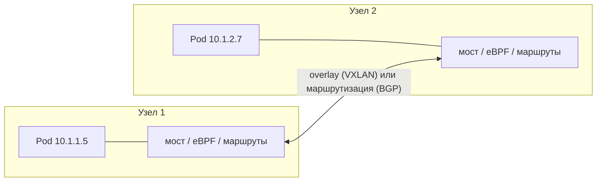

# CNI в Kubernetes: Calico, Cilium и eBPF

↑ [[DO Этап 5 · Kubernetes|Этап 5 · Kubernetes]]

<!-- meta:start -->
<div class="meta-strip"><span class="badge should">Желательно</span><span class="chip">~6 мин чтения</span><span class="chip">Уровень: senior</span></div>
<!-- meta:end -->

> [!info] Зачем это на собесе
> «Как поды общаются между узлами?» и «Чем Calico отличается от Cilium?» Вопросы проверяют понимание сетевой модели Kubernetes и того, что за сеть отвечает плагин, а не сам Kubernetes.

## Подтемы
- [ ] Сетевая модель Kubernetes
- [ ] Что такое CNI
- [ ] Flannel, Calico, Cilium
- [ ] eBPF
- [ ] Как выбрать

## Объяснение

### Сетевая модель
Kubernetes требует: каждый под получает свой IP, любой под может связаться с любым без NAT, узлы видят поды. Как именно это реализовано, определяет **CNI-плагин** (Container Network Interface): он выдаёт IP подам, настраивает маршруты и, часто, политики.



### Режимы передачи между узлами
| Режим | Как | Особенности |
|---|---|---|
| **Overlay** (VXLAN, Geneve) | пакеты подов упаковываются в пакеты узлов | работает везде, небольшие накладные расходы |
| **Маршрутизация** (BGP, прямая) | маршруты подов объявляются в сети | выше производительность, нужна поддержка сети |

### Сравнение плагинов
| Плагин | Особенности | NetworkPolicy |
|---|---|---|
| **Flannel** | простейший overlay, минимум настроек | нет (нужен дополнительный компонент) |
| **Calico** | маршрутизация (BGP) или overlay, зрелые политики, есть режим eBPF | да, богатые |
| **Cilium** | на eBPF, политики до L7, замена kube-proxy, наблюдаемость (Hubble), сетка без sidecar, мультикластер | да, включая L7 |
| Плагины облаков (AWS VPC CNI и др.) | поды получают адреса из сети облака | через облачные механизмы или Calico/Cilium |

Weave Net больше не развивается (компания-разработчик прекратила работу), для новых кластеров его не выбирают.

### eBPF
**eBPF** позволяет загружать в ядро Linux небольшие проверяемые программы, которые работают без модулей ядра. Для сети это даёт обработку пакетов раньше и быстрее, чем цепочки iptables: при тысячах сервисов правила iptables линейно замедляют, а eBPF использует хэш-таблицы.

- Замена kube-proxy: балансировка Service на eBPF.
- Политики и наблюдаемость на уровне сокетов и L7.
- Безопасность: обнаружение подозрительных системных вызовов (Tetragon, Falco на eBPF).

### Как выбрать
| Ситуация | Выбор |
|---|---|
| Учебный или небольшой кластер, нужна простота | Flannel или плагин по умолчанию в k3s |
| Нужны зрелые NetworkPolicy, BGP, гибкость | Calico |
| Нужны L7-политики, наблюдаемость, замена kube-proxy, сетка без sidecar | Cilium |
| Управляемый кластер облака | штатный плагин провайдера |

## Примеры

### CiliumNetworkPolicy на уровне HTTP
```yaml
apiVersion: cilium.io/v2
kind: CiliumNetworkPolicy
metadata:
  name: orders-allow-read
  namespace: shop
spec:
  endpointSelector:
    matchLabels: { app: orders }
  ingress:
    - fromEndpoints:
        - matchLabels: { app: web }
      toPorts:
        - ports: [{ port: "8080", protocol: TCP }]
          rules:
            http:
              - method: GET
                path: "/orders.*"
```
Политика пропускает только `GET /orders*` от подов `web`. Обычная `NetworkPolicy` работает на уровне IP и портов.

### Диагностика
```bash
kubectl get pods -n kube-system -o wide | grep -E "cilium|calico|flannel"   # какой плагин работает
kubectl exec -it pod-a -- ping <ip-пода-b>                                  # связность между подами
cilium status                                                                # состояние Cilium (нужен cilium CLI)
```

## Нюансы и подводные камни
- **Плагин выбирают при создании кластера.** Замена CNI в работающем кластере сложна и рискованна.
- **Перекрытие сетей.** CIDR подов и сервисов не должны пересекаться с сетями компании и VPN.
- **MTU.** При overlay уменьшайте MTU, иначе пакеты фрагментируются и ломаются «странными» таймаутами.
- **Версия ядра.** Возможности eBPF зависят от версии ядра узлов.
- **NetworkPolicy работает только при поддержке плагина.** Проверьте, что выбранный CNI её применяет ([[DO 5.6 NetworkPolicy и сетевая модель Kubernetes|NetworkPolicy]]).
- **Наблюдаемость.** Включайте Hubble или аналог до инцидента, а не после.

## Вопросы с ответами
> [!question]- Что такое CNI?
> Стандарт и плагины, которые настраивают сеть подов: выдают IP, создают интерфейсы и маршруты, часто реализуют NetworkPolicy. Kubernetes сам сеть не реализует, а делегирует плагину.

> [!question]- Чем Calico отличается от Cilium?
> Calico традиционно использует маршрутизацию (BGP) и iptables (есть режим eBPF), сильные сетевые политики. Cilium построен на eBPF, умеет L7-политики, заменяет kube-proxy, даёт наблюдаемость и сетку без sidecar.

> [!question]- Что такое eBPF?
> Механизм загрузки безопасных проверяемых программ в ядро Linux. В сетях позволяет быстро обрабатывать пакеты и применять политики без длинных цепочек iptables.

> [!question]- Чем overlay отличается от маршрутизации?
> Overlay упаковывает пакеты подов в пакеты между узлами (VXLAN) и работает в любой сети, с накладными расходами. Маршрутизация объявляет сети подов в инфраструктуре (BGP), быстрее, но требует поддержки сети.

> [!question]- Почему важен выбор CNI в начале?
> Замена сетевого плагина в работающем кластере требует пересоздания сетевых настроек подов и рискована, поэтому плагин выбирают при создании кластера.

## Связанные темы
- NetworkPolicy: [[DO 5.6 NetworkPolicy и сетевая модель Kubernetes|NetworkPolicy и сетевая модель]]
- Service mesh: [[DO 5.19 Service mesh — Istio, Linkerd, Cilium и когда он нужен|Service mesh]]
- Диагностика ядра и системных вызовов: [[DO 1.19 Диагностика процессов — strace, lsof, perf и eBPF|strace, lsof, perf и eBPF]]
- Service и DNS: [[DO 5.4 Service, Ingress, DNS внутри кластера|Service, Ingress, DNS]]
