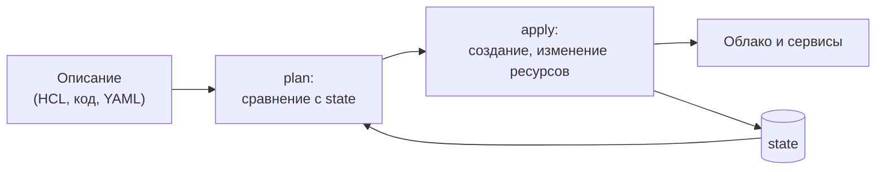
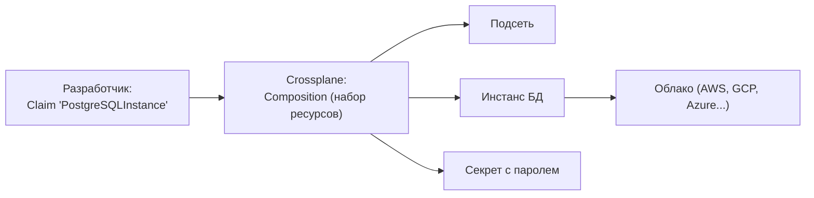
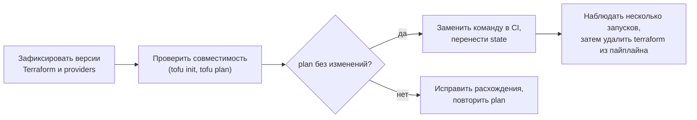

# Альтернативы Terraform: OpenTofu, Pulumi и Crossplane

↑ [[DO Этап 6 · Infrastructure as Code — Ansible, Terraform|Этап 6 · Infrastructure as Code: Ansible, Terraform]]

<!-- meta:start -->
<div class="meta-strip"><span class="badge nice">По желанию</span><span class="chip">~11 мин чтения</span><span class="chip">Уровень: senior</span></div>
<!-- meta:end -->

> [!info] Зачем это на собесе
> «Чем заменить Terraform?» стало вопросом после смены лицензии HashiCorp. Умение объяснить, что такое OpenTofu, зачем Pulumi (IaC на обычных языках) и что делает Crossplane (инфраструктура как ресурсы Kubernetes), показывает, что вы понимаете модель IaC, а не один инструмент.

## Подтемы
- [ ] Почему появились альтернативы
- [ ] OpenTofu
- [ ] Pulumi
- [ ] Crossplane
- [ ] Сравнение и выбор
- [ ] Миграция

## Объяснение

### Контекст
Terraform долго был де-факто стандартом декларативного IaC. В августе 2023 HashiCorp сменила лицензию своих продуктов с MPL 2.0 на Business Source License (BSL): использование ограничено для компаний, конкурирующих с HashiCorp. Сообщество создало форк **OpenTofu** под управлением Linux Foundation. Параллельно развивались другие подходы к тому же кругу задач.

### Модель IaC остаётся общей
Во всех инструментах есть **желаемое состояние**, **план изменений** (что будет создано, изменено, удалено), **применение** и **состояние** (state), которое связывает описание с реальными ресурсами. Подробнее: [[DO 6.1 IaC — зачем и принципы, декларативность и идемпотентность|принципы IaC]], [[DO 6.6 Terraform — providers, resources, state, modules, plan и apply|Terraform]].



### OpenTofu
Форк Terraform с лицензией MPL 2.0 под Linux Foundation. Команда `tofu` вместо `terraform`, тот же язык HCL, те же providers и modules (через собственный реестр). Совместим с Terraform примерно до версии 1.5, затем развивается самостоятельно и добавляет функции, например **шифрование state** (с версии 1.7).

```bash
tofu init
tofu plan
tofu apply
```

### Pulumi
IaC на **языках общего назначения**: C#, TypeScript, Python, Go, Java. Вместо HCL вы пишете обычный код с циклами, функциями, типами, тестами. State хранится в Pulumi Cloud или в собственном бэкенде (S3-совместимое хранилище, файлы). Подходит командам, которым удобнее C♯, чем отдельный язык описания.

### Crossplane
Расширяет Kubernetes: облачные ресурсы (базы, бакеты, сети) описываются как **объекты Kubernetes** и управляются контроллерами. Разработчик подаёт заявку (Claim) на «базу данных PostgreSQL», а платформенная команда в **Composition** определяет, как это создаётся в конкретном облаке.


Состояние хранится в самом Kubernetes, контроллеры постоянно приводят реальность к описанию (**непрерывное согласование**), хорошо сочетается с GitOps и Platform Engineering ([[DO 8.8 Platform Engineering — внутренние платформы, golden paths, self-service|Platform Engineering]]).

### Сравнение
| | Terraform / OpenTofu | Pulumi | Crossplane |
|---|---|---|---|
| Язык | HCL | C#, TypeScript, Python, Go и другие | YAML (манифесты Kubernetes) |
| State | файл или удалённый бэкенд | Pulumi Cloud или свой бэкенд | объекты Kubernetes |
| Модель запуска | по команде (plan, apply) | по команде (preview, up) | контроллеры работают постоянно |
| Сильная сторона | огромная экосистема и знания рынка | логика и тесты на обычном языке | платформа самообслуживания поверх Kubernetes |
| Порог входа | низкий | низкий для разработчиков | выше, нужен Kubernetes |
| Лицензия | Terraform BSL, OpenTofu MPL 2.0 | Apache 2.0 (ядро) | Apache 2.0 |

### Как выбрать
| Ситуация | Выбор |
|---|---|
| Уже на Terraform, важна свободная лицензия | OpenTofu |
| Команда на C♯ или TypeScript, нужна сложная логика | Pulumi |
| Платформа на Kubernetes, самообслуживание для команд | Crossplane |
| Минимальный риск и максимум готовых примеров | Terraform или OpenTofu |

## Примеры

### Terraform и OpenTofu: бакет
```hcl
terraform {
  required_providers {
    aws = { source = "hashicorp/aws", version = "~> 5.0" }
  }
}

resource "aws_s3_bucket" "files" {
  bucket = "app-files-prod"
  tags   = { env = "prod" }
}
```
Файл без изменений запускается и через `terraform`, и через `tofu`.

### OpenTofu: шифрование state
```hcl
terraform {
  encryption {
    key_provider "pbkdf2" "main" {
      passphrase = var.state_passphrase
    }
    method "aes_gcm" "default" {
      keys = key_provider.pbkdf2.main
    }
    state {
      method = method.aes_gcm.default
    }
  }
}
```
State часто содержит секреты, поэтому возможность его шифровать важна. Синтаксис зависит от версии OpenTofu, сверяйте с документацией.

### Pulumi на C♯
```csharp
using Pulumi;
using Pulumi.Aws.S3;

return await Deployment.RunAsync(() =>
{
    var config = new Config();
    var env = config.Require("env");

    var bucket = new BucketV2($"app-files-{env}", new BucketV2Args
    {
        Tags = { { "env", env } },
    });

    return new Dictionary<string, object?> { ["bucketName"] = bucket.Id };
});
```
```bash
pulumi stack init prod
pulumi config set env prod
pulumi preview      # аналог plan
pulumi up           # применить
```

### Crossplane: заявка на базу данных
```yaml
apiVersion: platform.example.org/v1alpha1
kind: PostgreSQLInstance
metadata:
  name: orders-db
  namespace: shop
spec:
  parameters:
    storageGB: 20
    version: "16"
  writeConnectionSecretToRef:
    name: orders-db-conn      # Crossplane положит сюда данные подключения
```
Группа `platform.example.org` и вид `PostgreSQLInstance` определяет платформенная команда через XRD и Composition, у вас они будут свои.

## Миграция с Terraform

Главный критерий готовности: `plan` на новом инструменте не предлагает изменений для неизменённой инфраструктуры.

## Нюансы и подводные камни
- **State нельзя терять.** Храните в удалённом бэкенде с блокировками и резервными копиями ([[DO 6.7 Terraform в команде — remote state, блокировки, модули, окружения, drift, CI для инфраструктуры|Terraform в команде]]).
- **Версии providers** фиксируйте: обновление меняет поведение.
- **Pulumi даёт свободу и риск.** На полноценном языке легко написать запутанный код; придерживайтесь декларативного стиля.
- **Crossplane сложен.** Нужны Kubernetes, XRD и Composition; окупается для платформ с многими командами.
- **Секреты в state.** Шифруйте state и ограничивайте доступ.
- **Лицензии меняются.** Перед внедрением проверяйте актуальные условия.

## Вопросы с ответами
> [!question]- Что такое OpenTofu и зачем он появился?
> Форк Terraform под управлением Linux Foundation с лицензией MPL 2.0. Появился после того, как HashiCorp в 2023 году сменила лицензию Terraform на BSL. Использует тот же язык HCL и providers.

> [!question]- Чем Pulumi отличается от Terraform?
> Pulumi описывает инфраструктуру обычным кодом (C#, TypeScript, Python, Go) с циклами, функциями и тестами, а Terraform использует декларативный HCL. Идеи plan, apply и state общие.

> [!question]- Что такое Crossplane?
> Расширение Kubernetes, которое управляет облачными ресурсами как объектами кластера. Платформенная команда описывает Composition, разработчики подают Claim, а контроллеры постоянно приводят реальность к описанию.

> [!question]- Как безопасно перейти с Terraform на OpenTofu?
> Зафиксировать версии, выполнить `tofu init` и `tofu plan` на существующем коде и state. Если plan не предлагает изменений, заменить команду в CI и наблюдать за несколькими запусками.

> [!question]- Зачем шифровать state?
> В нём могут храниться пароли, токены и другие секреты ресурсов. Шифрование (например, в OpenTofu 1.7 и новее) и контроль доступа к бэкенду снижают риск утечки.

> [!question]- Когда не стоит менять Terraform?
> Когда инструмент устраивает, нет юридических ограничений лицензии и нет потребностей, которые решают другие варианты. Миграция имеет цену, и её надо оправдывать.

## Связанные темы
- Принципы IaC: [[DO 6.1 IaC — зачем и принципы, декларативность и идемпотентность|IaC: принципы, декларативность, идемпотентность]]
- Terraform: [[DO 6.6 Terraform — providers, resources, state, modules, plan и apply|Terraform]]
- Terraform в команде: [[DO 6.7 Terraform в команде — remote state, блокировки, модули, окружения, drift, CI для инфраструктуры|Terraform в команде]]
- Platform Engineering: [[DO 8.8 Platform Engineering — внутренние платформы, golden paths, self-service|Platform Engineering]]
- Секреты: [[DO 8.10 Аналоги Vault — OpenBao, SOPS и External Secrets|Аналоги Vault]]
